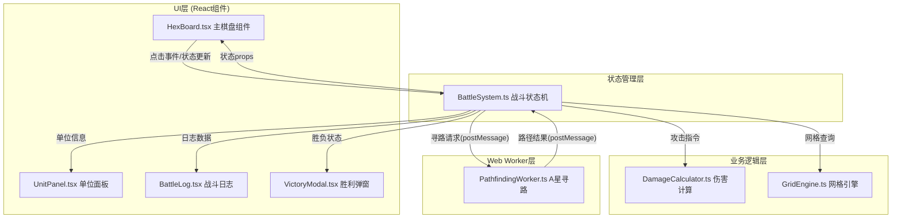

## 1. 架构设计



## 2. 技术描述

- **前端框架**：React 18 + TypeScript 5
- **构建工具**：Vite 5（启用Web Worker模式）
- **状态管理**：原生React useState/useReducer（轻量级，不需要额外状态库）
- **样式方案**：CSS Modules + 内联样式（SVG元素使用内联样式更方便）
- **异步计算**：Web Worker（A星寻路算法）
- **渲染方式**：SVG（六边形网格渲染精度高，交互方便）

## 3. 核心文件结构

```
src/
├── map/
│   ├── GridEngine.ts        # 六边形网格生成与坐标转换
│   └── PathfindingWorker.ts # Web Worker - A星寻路与可达范围
├── battle/
│   ├── BattleSystem.ts      # 战斗状态管理与回合制逻辑
│   └── DamageCalculator.ts  # 纯函数伤害计算公式
├── components/
│   ├── HexBoard.tsx         # 主棋盘组件（六边形+单位+高亮）
│   ├── UnitPanel.tsx        # 左侧单位属性面板
│   ├── BattleLog.tsx        # 右侧战斗日志栏
│   └── VictoryModal.tsx     # 胜利弹窗
├── types/
│   └── index.ts             # 全局类型定义
├── App.tsx                  # 根组件
├── main.tsx                 # 入口文件
└── index.css                # 全局样式
```

## 4. 类型定义

```typescript
// 六边形坐标（轴坐标系）
interface HexCoord {
  q: number; // 列
  r: number; // 行
}

// 职业类型
type UnitClass = 'warrior' | 'archer' | 'mage';

// 阵营
type Faction = 'blue' | 'red';

// 单位状态
interface Unit {
  id: string;
  name: string;
  faction: Faction;
  unitClass: UnitClass;
  position: HexCoord;
  hp: number;
  maxHp: number;
  attack: number;
  defense: number;
  moveRange: number;
  attackRange: number;
  energy: number;
  maxEnergy: number;
  skillCooldown: number;
  hasMoved: boolean;
  hasAttacked: boolean;
}

// 技能定义
interface Skill {
  id: string;
  name: string;
  description: string;
  energyCost: number;
  cooldown: number;
  effect: SkillEffect;
}

// 格子类型
interface HexCell {
  coord: HexCoord;
  terrain: 'plain';
  passable: boolean;
}

// 战斗日志条目
interface BattleLogEntry {
  id: number;
  turn: number;
  message: string;
  timestamp: number;
}

// 游戏状态
type GamePhase = 'idle' | 'deployed' | 'selecting_move' | 'selecting_attack' | 'selecting_skill_target' | 'game_over';

interface GameState {
  phase: GamePhase;
  currentTurn: number;
  currentFaction: Faction;
  currentUnitId: string | null;
  selectedUnitId: string | null;
  units: Unit[];
  logs: BattleLogEntry[];
  winner: Faction | null;
  highlightedCells: HexCoord[];
  attackableCells: HexCoord[];
}
```

## 5. 模块职责与调用关系

### 5.1 GridEngine.ts - 六边形网格引擎
- **职责**：网格生成、坐标系统转换、邻接计算、距离计算
- **输入**：行数、列数、六边形大小
- **输出**：网格对象数组、坐标转换函数
- **被调用**：BattleSystem、HexBoard组件

### 5.2 PathfindingWorker.ts - Web Worker寻路
- **职责**：A星寻路算法、可达范围计算
- **通信协议**：
  - 输入消息：`{ type: 'findPath', start, end, obstacles }` / `{ type: 'getReachable', start, range, obstacles }`
  - 输出消息：`{ type: 'path_result', path: HexCoord[] }` / `{ type: 'reachable_result', cells: HexCoord[] }`
- **被调用**：BattleSystem（通过postMessage）

### 5.3 BattleSystem.ts - 战斗系统核心
- **职责**：游戏状态管理、回合切换、移动/攻击/技能处理、胜负判定
- **核心方法**：
  - `deployUnits()` - 部署初始单位
  - `selectUnit(unitId)` - 选中单位
  - `moveUnit(unitId, targetCoord)` - 移动单位
  - `attackUnit(attackerId, defenderId)` - 普通攻击
  - `useSkill(attackerId, targetId, skillId)` - 使用技能
  - `endTurn()` - 结束当前单位回合
  - `resetGame()` - 重置游戏
- **依赖**：GridEngine、DamageCalculator、PathfindingWorker
- **被调用**：HexBoard、UnitPanel 组件

### 5.4 DamageCalculator.ts - 伤害计算器
- **职责**：纯函数计算伤害值
- **公式**：`最终伤害 = 攻击力 * (1 - 防御力/(防御力+100)) * 随机因子(0.9~1.1) + 技能加成`
- **输入**：攻击方属性、防御方属性、技能参数
- **输出**：最终伤害值、是否暴击
- **被调用**：BattleSystem

### 5.5 HexBoard.tsx - 棋盘组件
- **职责**：渲染六边形网格、单位棋子、高亮效果，处理用户点击
- **Props**：游戏状态、事件回调
- **交互**：点击格子/单位 → 调用BattleSystem方法 → 状态更新 → 重渲染

### 5.6 UnitPanel.tsx - 单位面板
- **职责**：显示选中单位属性、技能按钮、行动状态
- **交互**：点击技能按钮 → 切换技能选择模式

## 6. 性能优化策略

1. **Web Worker 寻路**：A星算法在Worker线程执行，不阻塞主线程渲染
2. **React memo优化**：HexCell组件使用React.memo避免不必要重渲染
3. **SVG批量渲染**：使用<g>分组减少DOM操作
4. **状态最小化**：只在必要时更新状态，避免频繁全量重渲染
5. **CSS动画优先**：伤害数字等动画使用CSS transform和opacity，触发GPU加速
6. **日志虚拟滚动**：战斗日志使用固定高度容器+transform实现滚动，减少重排

## 7. 职业数值配置

| 职业 | 生命值 | 攻击力 | 防御力 | 移动力 | 攻击距离 | 初始能量 | 技能 |
|------|--------|--------|--------|--------|----------|----------|------|
| 战士 | 120 | 25 | 40 | 3 | 1 | 2 | 重击（1.5倍伤害，冷却2回合） |
| 弓箭手 | 80 | 30 | 15 | 2 | 3 | 2 | 精准射击（无视30%防御，冷却3回合） |
| 法师 | 70 | 35 | 10 | 2 | 2 | 2 | 火球术（范围伤害，50%溅射，冷却4回合） |
