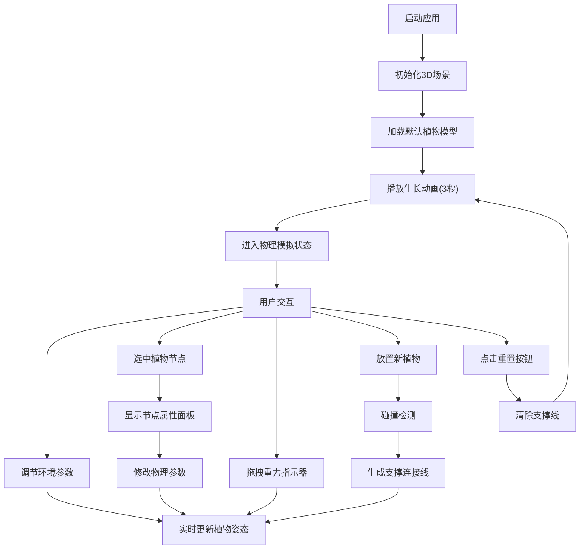

## 1. 产品概述

3D植物生长模拟系统，通过实时物理引擎模拟植物在风力、光照和重力作用下的生长弯曲与叶片摆动动态效果，提供交互式环境参数调节功能。主要解决植物学教育、动画场景设计中无法直观观察环境应力如何影响植物结构形态与运动规律的问题。

## 2. 核心功能

### 2.1 功能模块
1. **3D植物生长模拟**：程序化生成树木模型，支持生长动画与物理模拟
2. **环境参数实时调节**：风力强度、风向、光照强度滑块控制
3. **重力与生长方向调节**：重力方向拖拽、生长方向预设按钮
4. **碰撞与支撑检测**：多株植物间分支接触支撑与弹性连接线
5. **实时性能监测与重置**：帧率监测、自动降级、重置功能

### 2.2 页面详情
| 页面名称 | 模块名称 | 功能描述 |
|-----------|-------------|---------------------|
| 主场景 | 3D植物渲染 | 渲染植物主干、分支、叶片，支持点击选中高亮 |
| 主场景 | 生长动画 | 节点从根部向上逐级延伸生长，3秒总时长 |
| 主场景 | 物理模拟 | 弹性、阻尼、风力、重力实时计算 |
| 主场景 | 碰撞检测 | 分支间距离检测与支撑连接生成 |
| 参数面板 | 环境参数 | 风力强度、方向角、光照强度滑块调节 |
| 参数面板 | 重力控制 | 重力方向指示器拖拽，生长方向预设按钮 |
| 参数面板 | 节点属性 | 选中节点的弹性、阻尼、风力因子调节 |
| 性能监测 | 帧率显示 | 实时FPS与节点数显示，自动降级 |

## 3. 核心流程

用户打开应用后，自动加载默认植物模型并播放生长动画。生长完成后进入物理模拟状态，用户可：
1. 调节右上角参数面板的风力、光照参数
2. 拖拽场景中的重力指示器改变重力方向
3. 点击植物节点查看并修改其物理属性
4. 点击场景空白处放置新的植物（最多4株）
5. 观察植物间的碰撞支撑效果
6. 使用重置按钮恢复初始状态

## 4. 用户界面设计

### 4.1 设计风格
- **主色调**：深色科技感主题，背景色#1a1a2e，地面网格#2d2d5e
- **强调色**：亮青色#00d4aa（滑块、按钮）、绿色#4a9e4a（叶片）、红色#ff4444（选中高亮、风向箭头）、绿色#00ff88（重力指示器、支撑线）
- **卡片样式**：半透明毛玻璃效果（backdrop-filter: blur(10px)），背景#2a2a4a，圆角12px
- **交互反馈**：所有操作伴有CSS scale动画0.1s震感反馈

### 4.2 页面设计概述
| 页面名称 | 模块名称 | UI元素 |
|-----------|-------------|-------------|
| 主场景 | 3D视口 | 深色背景、半透明网格地面、发光指示器、发光阴影效果 |
| 主场景 | 参数面板 | 右上角悬浮卡片，自定义滑块（轨道#3d3d6e，滑块#00d4aa圆形） |
| 主场景 | 风向箭头 | 红色半透明，长度随风力变化，发光阴影#00ff88 |
| 主场景 | 重力指示器 | 绿色箭头，发光阴影#00ff88，支持拖拽旋转 |
| 主场景 | 植物叶片 | 绿色渐变（#4a9e4a→#7acf7a），随风力强度变化 |
| 主场景 | 支撑连接线 | 半透明#00ff88，线宽2px，弹簧动画 |
| 主场景 | 性能监测 | 左下角FPS与节点数显示 |
| 主场景 | 节点属性面板 | 右侧滑出，显示选中节点物理参数 |
| 主场景 | 预设按钮组 | 生长方向预设（向上、左倾30°、右倾30°、随机） |

### 4.3 响应式
- **桌面端**：参数面板右上角悬浮，节点属性面板右侧滑出
- **移动端**（宽度<768px）：参数面板变为底部滑出抽屉样式，优化触摸交互

### 4.4 3D场景设计
- **环境**：深色背景#1a1a2e，半透明网格地面（颜色#2d2d5e，线宽1px）
- **光照**：环境光+方向光，光照强度可调节（0.5-3.0）
- **相机**：PerspectiveCamera，OrbitControls支持环绕观察
- **动画**：生长动画（3秒）、叶片摆动（0.5-2Hz）、支撑线弹簧动画（阻尼0.8）
- **后期**：发光效果（bloom），阴影颜色#00ff88，模糊半径6px

## 5. 性能要求
- 5株植物、150个节点、45片叶片时帧率≥30FPS
- 叶片摆动物理更新频率≥30Hz
- 节点数>200时自动降级：双面渲染→单面，纹理256→128
- FPS<30时自动降低叶片计算精度：每帧→每两帧
