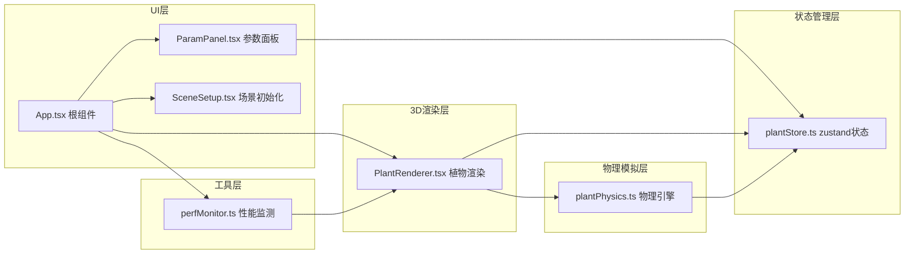

## 1. 架构设计



## 2. 技术描述

### 2.1 技术栈
- **前端框架**：React 18 + TypeScript 5
- **构建工具**：Vite 5
- **3D渲染**：Three.js 0.160 + @react-three/fiber 8.15 + @react-three/drei 9.92
- **状态管理**：zustand 4.4
- **CSS方案**：原生CSS + CSS变量（无Tailwind）

### 2.2 项目结构
```
src/
├── App.tsx                 # 根组件，组合所有模块
├── stores/
│   └── plantStore.ts       # zustand全局状态
├── physics/
│   └── plantPhysics.ts     # 物理模拟引擎
├── components/
│   ├── PlantRenderer.tsx   # 3D植物渲染组件
│   ├── ParamPanel.tsx      # UI参数面板
│   └── SceneSetup.tsx      # 场景初始化
└── utils/
    └── perfMonitor.ts      # 性能监测模块
```

### 2.3 核心文件说明

| 文件 | 职责 | 关键导出 |
|------|------|----------|
| [plantStore.ts](file:///d:/P/tasks/auto86/src/stores/plantStore.ts) | 管理环境参数、选中节点、支撑连接、生长状态 | usePlantStore |
| [plantPhysics.ts](file:///d:/P/tasks/auto86/src/physics/plantPhysics.ts) | 物理模拟：风力、重力、弹性、阻尼、碰撞 | initPlant, applyWind, applyGravity, detectCollision |
| [PlantRenderer.tsx](file:///d:/P/tasks/auto86/src/components/PlantRenderer.tsx) | 3D植物渲染，响应物理更新 | PlantRenderer, Plant, Branch, Leaf |
| [ParamPanel.tsx](file:///d:/P/tasks/auto86/src/components/ParamPanel.tsx) | UI参数面板，滑块、按钮、指示器 | ParamPanel, Slider, PresetButtons |
| [SceneSetup.tsx](file:///d:/P/tasks/auto86/src/components/SceneSetup.tsx) | 场景背景、光照、地面、相机 | SceneSetup |
| [perfMonitor.ts](file:///d:/P/tasks/auto86/src/utils/perfMonitor.ts) | 帧率监测、自动降级 | usePerfMonitor |
| [App.tsx](file:///d:/P/tasks/auto86/src/App.tsx) | 根组件，组合所有模块 | App |

## 3. 数据模型

### 3.1 植物节点数据结构
```typescript
interface PlantNode {
  id: string;
  type: 'trunk' | 'branch' | 'leaf';
  parentId: string | null;
  position: Vector3;
  rotation: Euler;
  baseRotation: Euler;
  length: number;
  radius: number;
  elasticity: number;      // 弹性系数 0.1-2.0
  damping: number;         // 阻尼系数 0.1-1.0
  windFactor: number;      // 风力承受因子 0-1.0
  currentBend: number;     // 当前弯曲角度
  angularVelocity: number; // 角速度
  children: string[];
  growthProgress: number;  // 生长进度 0-1
}

interface Plant {
  id: string;
  position: Vector3;
  nodes: Map<string, PlantNode>;
  rootNodeId: string;
}
```

### 3.2 环境参数
```typescript
interface EnvironmentParams {
  windStrength: number;     // 风力强度 0-20 (N)
  windDirection: number;    // 风向角 0-360度
  lightIntensity: number;   // 光照强度 0.5-3.0
  gravityDirection: Vector3; // 重力方向
  growthDirection: Vector3; // 生长顶芽朝向
}
```

### 3.3 支撑连接
```typescript
interface SupportConnection {
  id: string;
  plantAId: string;
  nodeAId: string;
  plantBId: string;
  nodeBId: string;
  tension: number;          // 拉力 0.5-2.0 (N)
  springLength: number;     // 弹簧原长
  damping: number;          // 阻尼 0.8
}
```

### 3.4 全局状态
```typescript
interface PlantState {
  plants: Plant[];
  environment: EnvironmentParams;
  selectedNodeId: string | null;
  selectedPlantId: string | null;
  supportConnections: SupportConnection[];
  isGrowthAnimating: boolean;
  growthStartTime: number;
  performanceLevel: 'high' | 'medium' | 'low';
  leafUpdateInterval: 1 | 2;
}
```

## 4. 核心算法

### 4.1 风力作用算法
```typescript
// 计算风力对节点的力矩
function calculateWindTorque(
  windStrength: number,
  windDirection: Vector3,
  node: PlantNode,
  normal: Vector3
): number {
  const windForce = windStrength * node.windFactor;
  const leverArm = node.length * 0.5;
  const angle = windDirection.angleTo(normal);
  return windForce * leverArm * Math.sin(angle);
}

// 简谐运动方程：角加速度 = -弹性*角度 - 阻尼*角速度 + 外力矩
function updateAngularMotion(node: PlantNode, torque: number, dt: number): void {
  const angularAcceleration = 
    -node.elasticity * node.currentBend 
    - node.damping * node.angularVelocity 
    + torque;
  
  node.angularVelocity += angularAcceleration * dt;
  node.currentBend += node.angularVelocity * dt;
  
  // 限制最大弯曲角度25度
  const maxBend = (25 * Math.PI) / 180;
  node.currentBend = Math.max(-maxBend, Math.min(maxBend, node.currentBend));
}
```

### 4.2 叶片摆动算法
```typescript
// 叶片周期性摆动：频率0.5-2Hz，幅度与风力成正比
function calculateLeafSwing(
  windStrength: number,
  time: number,
  baseFrequency: number = 1
): number {
  const amplitude = Math.min(windStrength * 0.02, 0.4); // 最大0.4弧度
  const frequency = baseFrequency + windStrength * 0.05; // 0.5-2Hz
  return amplitude * Math.sin(time * frequency * Math.PI * 2);
}
```

### 4.3 碰撞检测与支撑
```typescript
// 检测两节点距离，小于1.5单位时建立支撑
function detectAndCreateSupport(
  nodeA: PlantNode,
  nodeB: PlantNode,
  plantA: Plant,
  plantB: Plant
): SupportConnection | null {
  const distance = nodeA.position.distanceTo(nodeB.position);
  if (distance < 1.5 && distance > 0.1) {
    return {
      id: `${plantA.id}-${nodeA.id}-${plantB.id}-${nodeB.id}`,
      plantAId: plantA.id,
      nodeAId: nodeA.id,
      plantBId: plantB.id,
      nodeBId: nodeB.id,
      tension: Math.max(0.5, Math.min(2.0, 2.0 - distance * 0.5)),
      springLength: distance,
      damping: 0.8
    };
  }
  return null;
}

// 弹簧力计算：F = k * (当前长度 - 原长)
function calculateSpringForce(
  connection: SupportConnection,
  currentDistance: number
): number {
  const k = 2.0; // 弹性系数
  const displacement = currentDistance - connection.springLength;
  return k * displacement;
}
```

### 4.4 生长动画算法
```typescript
// 节点从根部向上逐级生长，总时长3秒
function calculateGrowthProgress(
  nodeDepth: number,
  maxDepth: number,
  elapsedTime: number,
  totalTime: number = 3
): number {
  const startTime = (nodeDepth / maxDepth) * totalTime * 0.7;
  const nodeGrowTime = totalTime * 0.3;
  const progress = Math.max(0, (elapsedTime - startTime) / nodeGrowTime);
  return Math.min(1, easeOutCubic(progress));
}

function easeOutCubic(t: number): number {
  return 1 - Math.pow(1 - t, 3);
}
```

## 5. 性能优化策略

### 5.1 自动降级机制
| 触发条件 | 降级措施 |
|---------|---------|
| FPS < 30 | 叶片计算从每帧→每两帧 |
| 节点数 > 200 | 叶片双面→单面，纹理256→128 |
| 内存占用过高 | 降低几何体分段数8→6 |

### 5.2 渲染优化
- 使用InstancedMesh渲染重复几何体（叶片）
- 矩阵更新分离：仅更新变化的节点
- 视锥体剔除：相机外的物体跳过渲染
- 几何体缓存：复用CylinderGeometry和PlaneGeometry

### 5.3 计算优化
- 物理计算与渲染分离到WebWorker（可选）
- 空间分区：四叉树优化碰撞检测
- 对象池：复用Vector3/Euler等数学对象
