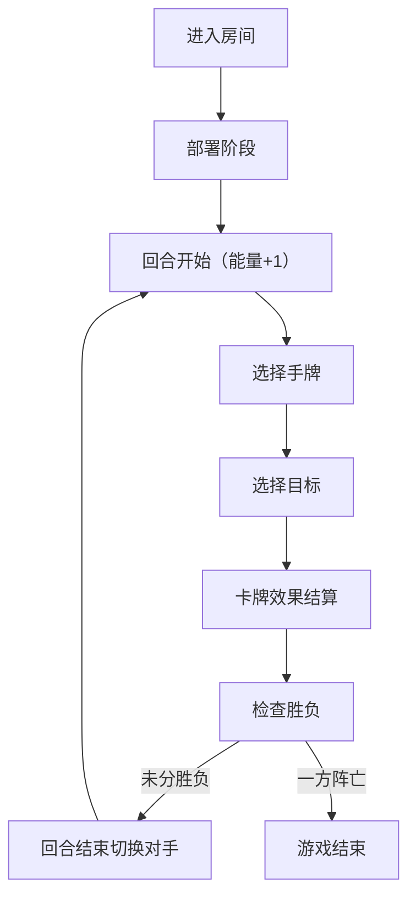

## 1. 产品概述

本产品是一款在线回合制卡牌战斗模拟应用，面向独立游戏开发者和卡牌游戏爱好者，用于快速验证和体验回合制卡牌战斗机制原型。玩家在 5x6 的方形网格上对战，每方拥有一个英雄和一组随从，通过消耗能量使用攻击、防御、治疗、增益、削弱等类型的卡牌进行博弈。

- **核心价值**：提供轻量级、浏览器可用的卡牌战斗原型验证工具，降低机制验证门槛
- **目标用户**：独立游戏开发者、卡牌游戏设计师、桌游玩家

## 2. 核心功能

### 2.1 用户角色
| 角色 | 登录方式 | 核心权限 |
|------|----------|----------|
| 玩家 | 房间号匹配 | 部署单位、使用卡牌、结束回合、查看日志 |

### 2.2 功能模块
1. **战场棋盘**：5x6 网格，显示双方英雄和随从位置及状态
2. **手牌管理**：展示手牌，支持卡牌选择和目标指定
3. **能量系统**：每回合恢复能量，消耗能量使用卡牌
4. **回合机制**：回合流转、胜负判定
5. **战斗日志**：记录所有操作和状态变化，支持复盘
6. **实时对战**：双人通过 Socket.IO 实时同步游戏状态

### 2.3 页面详情
| 页面名称 | 模块名称 | 功能描述 |
|----------|----------|----------|
| 战斗主界面 | 棋盘区域 | 5x6 网格渲染，单位位置与状态显示，目标选择交互 |
| 战斗主界面 | 手牌区域 | 7张扇形排列卡牌，悬浮效果，拖拽交互 |
| 战斗主界面 | 能量条 | 宝石样式能量显示，消耗与恢复动画 |
| 战斗主界面 | 日志面板 | 可滚动战斗日志，虚拟列表优化 |
| 战斗主界面 | 英雄面板 | 双方英雄生命值、护盾、攻击力显示 |

## 3. 核心流程

### 游戏流程
玩家进入房间 → 双方部署英雄与随从 → 回合开始（能量+1）→ 选择卡牌 → 选择目标 → 卡牌效果结算 → 回合结束 → 切换对手 → 循环直到一方英雄生命值归零 → 游戏结束

## 4. 用户界面设计

### 4.1 设计风格
- **设计主题**：深色魔幻风格，营造神秘战斗氛围
- **主背景色**：#1a1a2e（深紫蓝）
- **次要背景**：#16213e（深蓝灰）
- **棋盘格**：#2a2a4a（深蓝灰）配白色分割线
- **己方阵营**：蓝色系（#0f52ba 边框 / #5b8def 高亮）
- **敌方阵营**：红色系（#b22222 边框 / #e74c3c 高亮）
- **能量宝石**：#f1c40f（满）/ #555（空）
- **选中高亮**：金色脉冲光效
- **字体**：等宽字体（日志），现代无衬线字体（正文）

### 4.2 页面设计概览
| 页面 | 模块 | UI 元素 |
|------|------|---------|
| 战斗主界面 | 棋盘 | 5x6 网格、单位卡片、血条、攻击力图标、护盾环、选中脉冲动画 |
| 战斗主界面 | 手牌 | 扇形排列、悬浮弹起、发光边框、卡牌信息（名称/消耗/效果图标） |
| 战斗主界面 | 能量条 | 6个圆形宝石、消耗缩放消失动画 |
| 战斗主界面 | 日志 | 等宽字体、最新条目顶部、淡入效果、虚拟滚动 |

### 4.3 响应式设计
- **桌面端**（≥768px）：日志区在右侧，棋盘正常大小
- **移动端**（<768px）：日志区移至底部，棋盘缩小至 90%

### 4.4 动画与交互
- 卡牌悬浮：向上弹起 10px + 明亮边框 + box-shadow 光效
- 选中单位：金色脉冲光效（@keyframes pulse 1.5s infinite）
- 能量消耗：宝石从黄色渐变灰色 + scale(0.8) + opacity: 0 + transition 0.3s
- 目标确认：蓝色虚线圆环旋转动画
- 日志条目：opacity 0→1 transition 0.2s 淡入效果

## 5. 性能约束
- 状态更新与 UI 重绘：≤16ms（60FPS）
- 卡牌效果计算（含持续效果）：≤5ms/次
- 网络同步延迟：≤200ms
- 日志区：使用虚拟列表仅渲染可见条目
