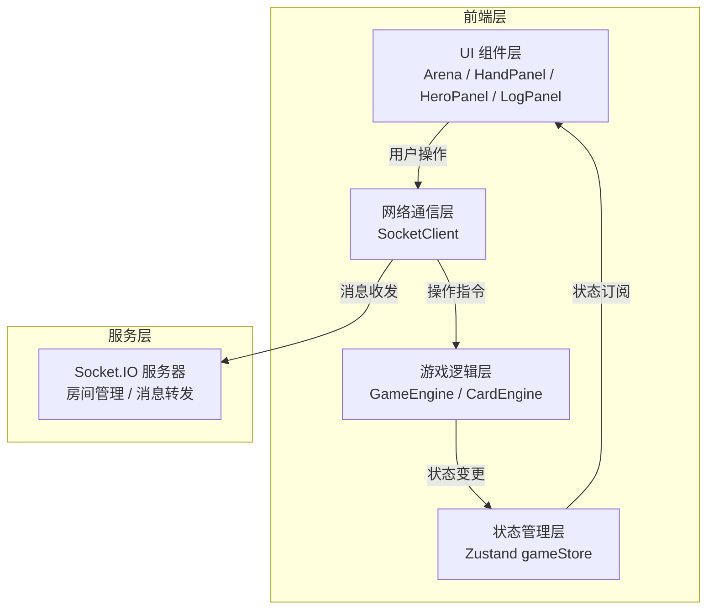
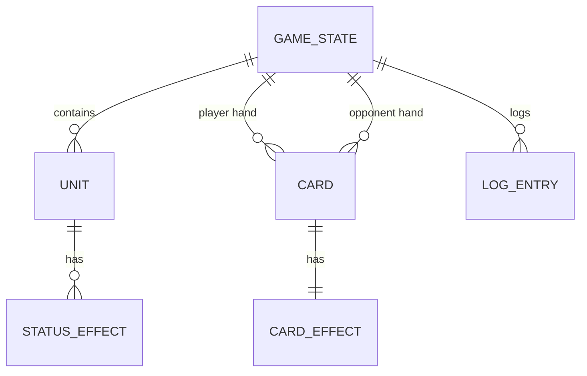

## 1. 架构设计

本应用采用前端 + 后端实时通信的架构。前端使用 React + TypeScript + Vite 构建，状态管理使用 Zustand，实时通信通过 Socket.IO 实现。游戏逻辑模块与 UI 渲染模块独立封装，通过 WebSocket 服务进行数据同步。



## 2. 技术栈说明

- **前端框架**：React 18 + TypeScript
- **构建工具**：Vite
- **状态管理**：Zustand
- **实时通信**：Socket.IO Client
- **后端服务**：Node.js + Socket.IO Server（用于房间管理与消息转发）
- **样式方案**：CSS Modules + 原生 CSS 动画

## 3. 文件结构与调用关系

```
src/
├── game/                    # 游戏逻辑模块
│   ├── GameEngine.ts       # 核心游戏引擎（回合流转、能量系统、战斗结算）
│   └── CardEngine.ts       # 卡牌效果引擎（卡牌定义解析、效果计算）
├── network/                 # 网络通信模块
│   └── SocketClient.ts     # Socket.IO 客户端封装
├── stores/                  # 状态管理
│   └── gameStore.ts        # Zustand 全局状态
├── components/              # UI 组件
│   ├── Arena.tsx           # 战场棋盘组件
│   ├── HandPanel.tsx       # 手牌区组件
│   ├── Card.tsx            # 单张卡牌组件
│   ├── UnitCard.tsx        # 单位卡片组件（英雄/随从）
│   ├── EnergyBar.tsx       # 能量条组件
│   ├── HeroPanel.tsx       # 英雄面板
│   └── LogPanel.tsx        # 日志面板（虚拟列表）
├── types/                   # 类型定义
│   └── game.ts             # 游戏相关类型
├── utils/                   # 工具函数
│   └── constants.ts        # 常量定义
├── App.tsx                  # 主应用组件
└── main.tsx                 # 入口文件

数据流向：
用户操作 → UI组件 → SocketClient.emit → 服务器 → SocketClient.on → GameEngine处理 → gameStore更新 → UI重渲染
```

## 4. 数据模型

### 4.1 核心类型定义

```typescript
// 单位类型
interface Unit {
  id: string;
  type: 'hero' | 'minion';
  name: string;
  hp: number;
  maxHp: number;
  attack: number;
  shield: number;
  position: { x: number; y: number };
  owner: 'player' | 'opponent';
  effects: StatusEffect[];
}

// 状态效果
interface StatusEffect {
  id: string;
  type: 'shield' | 'weakness' | 'buff';
  value: number;
  remainingTurns: number;
}

// 卡牌定义
interface Card {
  id: string;
  cardId: string;
  name: string;
  cost: number;
  type: 'attack' | 'heal' | 'shield' | 'debuff' | 'utility';
  description: string;
  targetType: 'single' | 'all_friendly' | 'all_enemy' | 'random_enemy' | 'self';
  effect: CardEffect;
}

interface CardEffect {
  damage?: number;
  heal?: number;
  shield?: number;
  attackModifier?: number;
  energyRestore?: number;
  ignoreShield?: boolean;
  duration?: number;
  targetCount?: number;
}

// 游戏状态
interface GameState {
  phase: 'deploy' | 'playing' | 'ended';
  currentTurn: 'player' | 'opponent';
  turnNumber: number;
  playerEnergy: number;
  opponentEnergy: number;
  maxEnergy: number;
  playerHand: Card[];
  opponentHand: Card[];
  playerDeck: Card[];
  opponentDeck: Card[];
  units: Unit[];
  selectedCard: Card | null;
  selectedTarget: Unit | null;
  winner: 'player' | 'opponent' | null;
  logs: LogEntry[];
}

// 日志条目
interface LogEntry {
  id: string;
  timestamp: number;
  message: string;
  type: 'attack' | 'heal' | 'shield' | 'system' | 'turn';
}
```

### 4.2 ER 图


## 5. 卡牌定义列表

| 卡牌ID | 名称 | 消耗 | 类型 | 效果描述 |
|--------|------|------|------|----------|
| fireball | 火球术 | 2 | attack | 对单体造成 4 点伤害 |
| heal_light | 治愈之光 | 2 | heal | 为友方单体恢复 3 点生命 |
| iron_shield | 铁甲护盾 | 2 | shield | 为友方单体增加 2 点护盾，持续 2 回合 |
| weakness_curse | 虚弱诅咒 | 1 | debuff | 使敌方单体攻击力 -2，持续 2 回合 |
| lightning_chain | 闪电链 | 3 | attack | 随机攻击 2 个敌方单位，各造成 2 点伤害 |
| group_heal | 群体治疗 | 3 | heal | 全体友方恢复 1 点生命 |
| precise_strike | 精准打击 | 3 | attack | 无视护盾造成 3 点伤害 |
| energy_surge | 能量涌动 | 0 | utility | 回复 2 点能量 |

## 6. 网络消息协议

| 事件名 | 方向 | 数据 | 说明 |
|--------|------|------|------|
| join_room | C→S | { roomId, playerId } | 加入房间 |
| room_joined | S→C | { roomId, playerSide } | 加入成功，分配阵营 |
| deploy_unit | C→S | { unitId, position } | 部署单位 |
| play_card | C→S | { cardId, targetId } | 使用卡牌 |
| end_turn | C→S | {} | 结束回合 |
| state_update | S→C | GameState | 状态同步 |
| log_entry | S→C | LogEntry | 日志条目 |
| game_over | S→C | { winner } | 游戏结束 |
