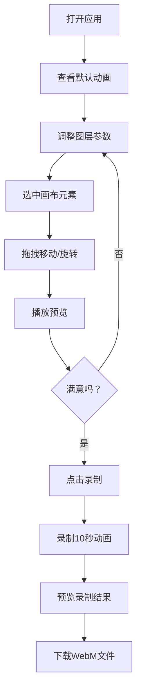

## 1. 产品概述

在线交互式动态壁纸生成器，用户可在浏览器中混合多种视觉图层并实时预览，导出循环播放的WebM视频或动态GIF。

- 主要目标：为创作者提供直观、高性能的动态视觉内容创作工具，无需专业软件即可生成精美的动态壁纸
- 目标用户：设计师、开发者、动态壁纸爱好者、内容创作者
- 市场价值：降低动态视觉内容的创作门槛，提供即开即用的在线创作体验

## 2. 核心功能

### 2.1 用户角色
| 角色 | 注册方式 | 核心权限 |
|------|----------|----------|
| 普通用户 | 无需注册，直接使用 | 创建、编辑、预览、录制和导出动态壁纸 |

### 2.2 功能模块
1. **画布预览区**：16:9画布、实时渲染、元素选择与拖拽
2. **图层控制面板**：图层列表、参数编辑、排序、可见性、混合模式
3. **动画控制条**：播放/暂停、时间轴、循环开关、录制导出

### 2.3 页面详情
| 页面名称 | 模块名称 | 功能描述 |
|----------|----------|----------|
| 主编辑器 | 画布预览区 | 16:9预览画布（1920x1080），支持图层元素点击选中、拖拽移动、旋转控制 |
| 主编辑器 | 图层控制面板 | 4类图层（粒子/几何/渐变/线条），每类可独立控制参数、可见性、混合模式、透明度，支持拖拽排序 |
| 主编辑器 | 动画控制条 | 播放/暂停按钮、进度条拖拽跳转、循环开关、录制按钮（最长10秒），导出WebM格式 |

## 3. 核心流程

用户打开应用 → 查看默认4图层动画效果 → 通过右侧面板调整各图层参数 → 在画布上拖拽选中元素调整位置/角度 → 点击播放预览动画效果 → 点击录制按钮录制10秒循环 → 预览录制结果并下载WebM文件

## 4. 用户界面设计

### 4.1 设计风格
- **主背景色**：#1a1a2e（深靛蓝紫）
- **次背景色**：#16213e（深蓝紫）
- **强调色**：淡蓝色发光边框（#4fc3f7 / rgba(79, 195, 247, 0.6)）
- **磨砂玻璃卡片**：backdrop-filter: blur(8px)，半透明背景
- **按钮样式**：圆角8px，悬停时轻微缩放1.02倍，过渡150ms
- **字体**：现代无衬线字体，标题16px加粗，正文13px常规
- **布局**：Flexbox布局，画布居中占70%，右侧面板25%，底部控制条30px全宽
- **图标风格**：简洁线性图标

### 4.2 页面设计概览
| 页面名称 | 模块名称 | UI元素 |
|----------|----------|--------|
| 主编辑器 | 画布预览区 | 16:9画布、选中元素发光边框、8个控制手柄+旋转手柄 |
| 主编辑器 | 图层控制面板 | 可折叠卡片（高度过渡250ms ease-out）、眼睛图标、混合模式下拉、透明度滑块、参数编辑控件 |
| 主编辑器 | 动画控制条 | 播放/暂停按钮、时间轴进度条、循环开关、录制按钮 |

### 4.3 响应式
- Desktop-first设计，画布区域固定16:9比例
- 右侧面板最小宽度300px，可滚动
- 触控设备支持触屏拖拽操作

### 4.4 动画效果
- 卡片展开/收起：高度过渡250ms ease-out
- 选中元素发光边框：box-shadow渐变闪烁动画
- 滑块/颜色拾取器悬停：transform: scale(1.02) 过渡150ms
- 画布渲染：60fps流畅动画，双缓冲减少闪烁
