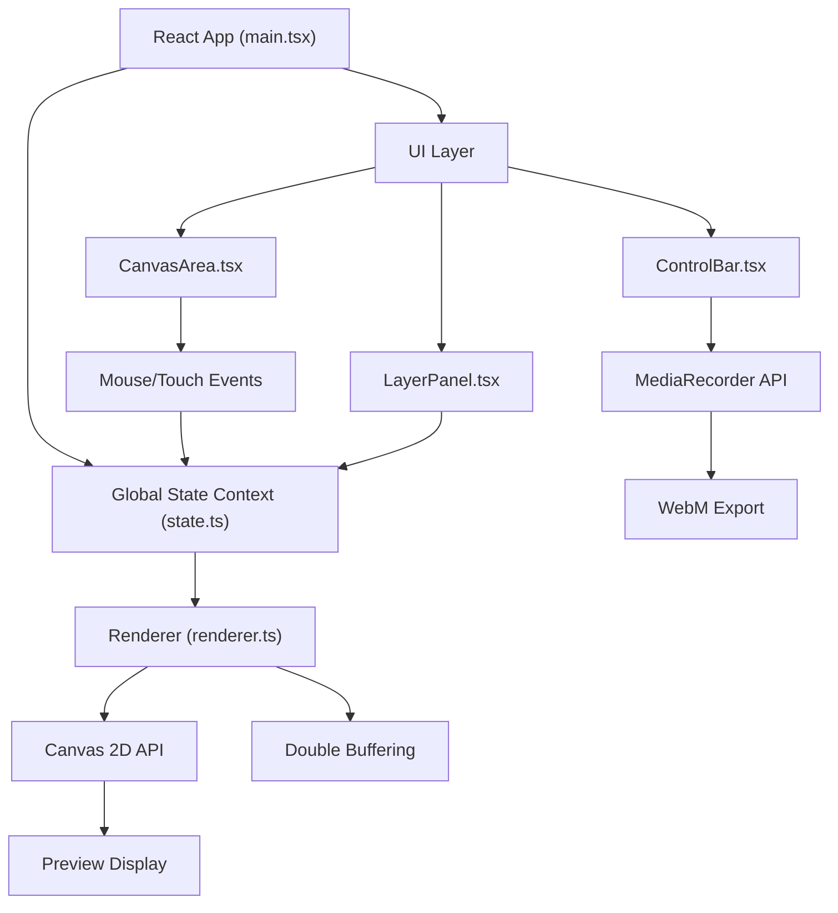

## 1. 架构设计



## 2. 技术描述

- **前端框架**：React 18 + TypeScript
- **构建工具**：Vite
- **状态管理**：React Context + useReducer
- **渲染引擎**：Canvas 2D API + 双缓冲技术
- **视频录制**：MediaRecorder API
- **样式方案**：原生CSS（CSS变量 + Flexbox）

## 3. 目录结构

```
auto88/
├── package.json
├── index.html
├── tsconfig.json
├── vite.config.js
└── src/
    ├── types.ts          # 类型定义
    ├── state.ts          # 全局状态管理
    ├── renderer.ts       # 画布渲染引擎
    ├── main.tsx          # 应用入口
    └── ui/
        ├── CanvasArea.tsx    # 画布预览组件
        ├── LayerPanel.tsx    # 图层控制面板
        └── ControlBar.tsx    # 动画控制条
```

## 4. 数据模型

### 4.1 图层类型

```typescript
type LayerType = 'particles' | 'geometry' | 'gradient' | 'lines';
type BlendMode = 'normal' | 'multiply' | 'screen' | 'overlay' | 'darken' | 'lighten' | 'color-dodge' | 'color-burn';

interface BaseLayer {
  id: string;
  type: LayerType;
  name: string;
  visible: boolean;
  opacity: number;
  blendMode: BlendMode;
}

interface Particle {
  id: string;
  x: number;
  y: number;
  vx: number;
  vy: number;
  size: number;
  color: string;
}

interface ParticleLayer extends BaseLayer {
  type: 'particles';
  particles: Particle[];
  speed: number;
  direction: number;
}

interface Polygon {
  id: string;
  x: number;
  y: number;
  sides: number;
  radius: number;
  rotation: number;
  rotationSpeed: number;
  strokeColor: string;
  fillColor: string;
  fillOpacity: number;
}

interface GeometryLayer extends BaseLayer {
  type: 'geometry';
  polygons: Polygon[];
}

interface GradientStop {
  position: number;
  color: string;
}

interface GradientLayer extends BaseLayer {
  type: 'gradient';
  gradientType: 'linear' | 'radial';
  stops: GradientStop[];
  angle: number;
}

interface BezierLine {
  id: string;
  startX: number;
  startY: number;
  endX: number;
  endY: number;
  cp1x: number;
  cp1y: number;
  cp2x: number;
  cp2y: number;
  color: string;
  thickness: number;
}

interface LinesLayer extends BaseLayer {
  type: 'lines';
  lines: BezierLine[];
  thickness: number;
  opacity: number;
}

type Layer = ParticleLayer | GeometryLayer | GradientLayer | LinesLayer;
```

### 4.2 全局状态

```typescript
interface GlobalState {
  layers: Layer[];
  selectedElementId: string | null;
  selectedLayerId: string | null;
  isPlaying: boolean;
  isLooping: boolean;
  currentTime: number;
  isRecording: boolean;
  animationFrame: number;
}
```

## 5. 渲染引擎设计

### 5.1 双缓冲实现
- 使用两个Canvas：backBuffer（离屏绘制）和frontBuffer（显示画布）
- 每帧先在backBuffer上完整绘制所有图层，再一次性绘制到frontBuffer
- 避免逐元素绘制导致的闪烁

### 5.2 帧动画循环
- 使用 requestAnimationFrame 驱动
- 固定目标60fps，计算deltaTime控制动画速度
- 暂停状态下停止RAF循环，恢复时继续

### 5.3 图层渲染顺序
- 按照 layers 数组顺序从下往上渲染
- 每个图层应用 globalAlpha 和 globalCompositeOperation

## 6. 关键交互流程

### 6.1 元素选择
1. 监听 canvas mousedown/touchstart 事件
2. 通过坐标命中测试（hit-test）确定点击的元素
3. 设置 selectedElementId 和 selectedLayerId
4. 绘制选中边框和控制手柄

### 6.2 拖拽移动
1. mousedown 记录起始位置和元素原始位置
2. mousemove 计算位移增量，更新元素 x/y
3. mouseup 结束拖拽，提交状态更新

### 6.3 旋转控制
1. 点击旋转手柄进入旋转模式
2. 计算鼠标位置与元素中心的夹角
3. 更新元素 rotation 属性

### 6.4 视频录制
1. 调用 canvas.captureStream(60) 获取 MediaStream
2. 创建 MediaRecorder，mimeType: 'video/webm;codecs=vp9'
3. 录制最长10秒后自动停止
4. 生成 Blob URL 并弹出预览下载窗口
