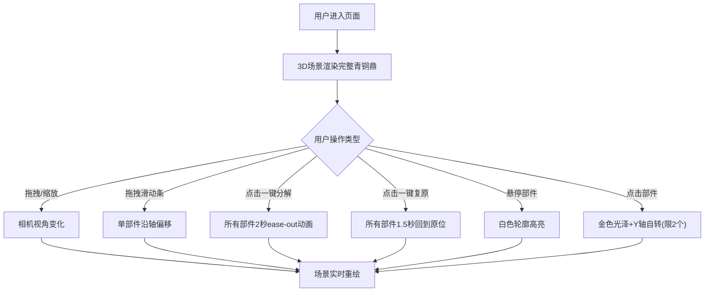

## 1. 产品概述

在线交互式3D文物拆解与分层展示应用，面向博物馆策展人和教育工作者，提供青铜鼎等文物的3D可交互分解展示工具，帮助观众从结构上理解文物的组装方式与内部构造。

- **目标用户**：博物馆策展人、教育工作者、文物爱好者、学生
- **核心价值**：通过3D交互拆解功能，让文物内部结构可视化，提升数字化展览的沉浸感与教育价值

## 2. 核心功能

### 2.1 用户角色

| 角色 | 注册方式 | 核心权限 |
|------|----------|----------|
| 访客用户 | 无需注册 | 浏览3D场景、控制拆解、查看部件信息 |

### 2.2 功能模块

1. **3D场景渲染模块**：青铜鼎模型渲染、光照与材质、相机控制
2. **部件拆解控制模块**：滑动条控制单部件偏移、一键分解/复原动画
3. **交互选择模块**：鼠标悬停高亮、点击选中自转、部件信息标签
4. **UI控制面板模块**：拆解参数调节、自动旋转开关、响应式布局

### 2.3 页面详情

| 页面名称 | 模块名称 | 功能描述 |
|----------|----------|----------|
| 主页面 | 3D场景区域 | Canvas渲染青铜鼎模型，支持鼠标拖拽旋转、右键平移、滚轮缩放 |
| 主页面 | 右侧控制面板 | 部件拆解滑动条、自动旋转开关、一键分解/复原按钮 |
| 主页面 | 信息标签 | 每个部件上方悬浮半透明标签，显示部件名称 |
| 主页面 | 移动端抽屉 | 屏幕<768px时控制面板折叠为底部抽屉，点击展开 |

## 3. 核心流程

用户打开应用后看到完整的青铜鼎3D模型，可通过鼠标拖拽旋转查看整体外观。用户可以通过右侧控制面板的滑动条单独控制每个部件的拆解偏移，或点击"一键分解"按钮观看动画效果。鼠标悬停在部件上时出现白色高亮轮廓，点击后部件变为金色光泽并缓慢自转。再次点击取消选中。

## 4. 用户界面设计

### 4.1 设计风格

- **主色调**：深色背景 #1a1a2e，控制面板 #16213e
- **强调色**：#e94560（暖红）→ #0f3460（深蓝）渐变按钮，部件金色选中效果 #D4AF37
- **部件色**：鼎身#6B4226，双耳#8B5E3C，三足#5C3317，纹饰层#C4985A，铭文层#D4AF37
- **按钮风格**：圆角、渐变背景、hover亮度+20%，尺寸190×44px
- **字体**：中文标题使用衬线体营造历史文化感，正文使用清晰无衬线字体
- **布局**：左侧70% 3D场景 + 右侧300px控制面板，桌面端固定布局
- **滑动条**：轨道高度6px，滑块直径18px，颜色与对应部件一致

### 4.2 页面设计概览

| 页面名称 | 模块名称 | UI元素 |
|----------|----------|--------|
| 主页面 | 3D场景区域 | 深色背景#1a1a2e、柔和环境光、聚光灯、阴影效果、部件标签精灵 |
| 主页面 | 控制面板标题区 | "青铜鼎拆解工具"标题、自动旋转开关（颜色切换） |
| 主页面 | 部件控制列表 | 部件名称+颜色指示条+滑动条+偏移数值（精确到0.1） |
| 主页面 | 底部操作按钮 | 一键分解、一键复原（渐变按钮，圆角8px） |
| 主页面 | 移动端抽屉 | 底部抽屉式面板，0.3s滑出动画，展开按钮 |

### 4.3 响应式设计

- **设计策略**：桌面端优先，移动端自适应
- **断点**：768px
- **桌面端（≥768px）**：左侧3D场景占剩余宽度，右侧300px固定控制面板
- **移动端（<768px）**：3D场景全屏，控制面板折叠为底部抽屉，点击展开按钮从底部滑出（动画时长0.3s）
- **触摸优化**：滑动条支持触摸拖拽，相机支持单指旋转、双指缩放

### 4.4 3D场景指引

- **环境/HDRI**：深色博物馆风格环境，柔和环境光配合定向聚光灯营造立体感
- **光照设置**：AmbientLight（强度0.4）+ DirectionalLight（强度0.8，带阴影）+ 2个PointLight补光
- **相机设置**：PerspectiveCamera，fov 45，初始距离8，目标位置[0,0,0]，OrbitControls最小距离1，最大距离5
- **构图**：青铜鼎居中展示，拆解爆炸图以鼎为中心向外发散
- **交互动画**：拆解动画使用ease-out缓动（2秒），复原动画1.5秒，选中部件Y轴自转每秒30度
- **后期效果**：悬停部件显示EdgesGeometry白色轮廓（2px），选中部件MeshStandardMaterial金属度提升、emissive金色发光
- **性能预算**：帧率≥30FPS，参数更新延迟≤50ms，最多2个部件同时自转
