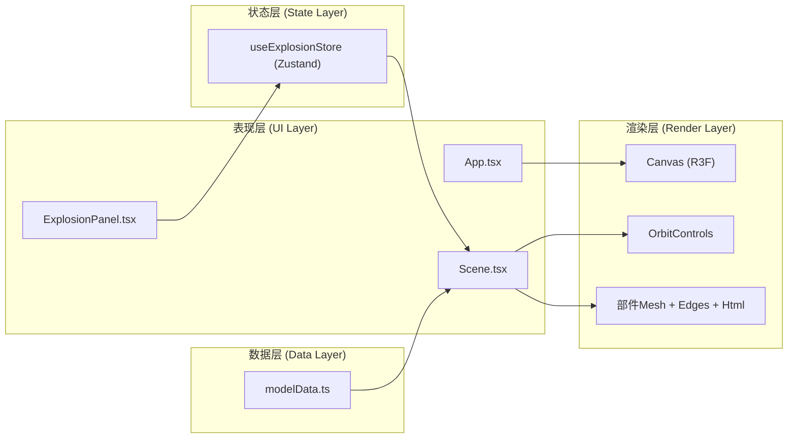

## 1. 架构设计



**模块调用关系与数据流向：**
1. `src/main.tsx` → 渲染 `<App />`
2. `src/components/App.tsx` → 集成 `<Canvas>` 与 `<ExplosionPanel>`，从store读取全局状态
3. `src/components/ExplosionPanel.tsx` → 用户交互 → 调用 `setPartOffset` / `explodeAll` / `resetAll` / `toggleAutoRotate` → 更新 Zustand store
4. `src/components/Scene.tsx` → 从 store 读取 `partOffsets` / `selectedParts` / `autoRotate` → 订阅状态变化 → 更新每个部件Mesh的position/rotation/material
5. `src/utils/modelData.ts` → 导出 `BRONZE_DING_PARTS` 数组，定义各部件几何、颜色、默认位置、拆解轴、标签文字
6. `src/store/explosionStore.ts` → 定义全局状态：拆解偏移量Map、选中部件Set、自动旋转开关、动画方法

## 2. 技术描述

- **前端框架**：React@18 + TypeScript@5
- **构建工具**：Vite@5 + @vitejs/plugin-react
- **3D渲染**：three@0.160 + @react-three/fiber@8 + @react-three/drei@9
- **状态管理**：zustand@4
- **样式方案**：原生CSS + CSS Modules（避免Tailwind以减小体积，专注3D性能）
- **初始化方式**：Vite React-TS 模板

## 3. 路由定义

| 路由 | 用途 |
|------|------|
| / | 主页面：3D场景 + 控制面板（单页应用，无路由跳转） |

## 4. API 定义

本项目为纯前端应用，无后端API，所有数据均为静态定义。

### 4.1 TypeScript 类型定义

```typescript
// src/types/index.ts
interface PartData {
  id: string;
  name: string;
  color: string;
  defaultPosition: [number, number, number];
  explodeAxis: [number, number, number];
  label: string;
  geometryType: 'dingBody' | 'ear' | 'leg' | 'pattern' | 'inscription';
  geometryArgs?: Record<string, number>;
}

interface ExplosionState {
  partOffsets: Record<string, number>;
  selectedParts: Set<string>;
  autoRotate: boolean;
  isAnimating: boolean;
  setPartOffset: (partId: string, value: number) => void;
  togglePartSelection: (partId: string) => void;
  toggleAutoRotate: () => void;
  explodeAll: () => Promise<void>;
  resetAll: () => Promise<void>;
}
```

## 5. 项目文件结构

```
auto90/
├── index.html
├── package.json
├── vite.config.js
├── tsconfig.json
├── src/
│   ├── main.tsx              # React入口，渲染<App />
│   ├── types/
│   │   └── index.ts          # TypeScript类型定义
│   ├── store/
│   │   └── explosionStore.ts # Zustand全局状态管理
│   ├── utils/
│   │   ├── modelData.ts      # 青铜鼎各部件数据定义
│   │   └── easing.ts         # 缓动函数（easeOutCubic等）
│   ├── components/
│   │   ├── App.tsx           # 主应用组件，布局与状态集成
│   │   ├── Scene.tsx         # 3D场景，部件渲染与交互
│   │   ├── ExplosionPanel.tsx # 右侧控制面板
│   │   ├── PartMesh.tsx      # 单个部件Mesh（含高亮、选中、标签）
│   │   └── PartLabel.tsx     # Canvas纹理标签精灵
│   └── styles/
│       ├── App.css           # 全局布局样式
│       └── ExplosionPanel.css # 控制面板样式
```

### 文件间调用关系与数据流说明：

1. **main.tsx → App.tsx**：入口文件挂载App组件
2. **App.tsx**：
   - 从 `explosionStore` 读取响应式布局状态
   - 集成 `Canvas`（内含 `Scene`）与 `ExplosionPanel`
   - 处理窗口resize事件，传递给响应式布局
3. **Scene.tsx**：
   - 从 `explosionStore` 订阅 `partOffsets`、`selectedParts`、`autoRotate`
   - 遍历 `modelData.BRONZE_DING_PARTS` 渲染 `<PartMesh>`
   - 配置光照、相机、OrbitControls、自动旋转
4. **PartMesh.tsx**：
   - 接收 `part`（PartData）、`offset`（number）、`isSelected`（boolean）
   - 计算拆解后位置：`defaultPosition + explodeAxis * offset`
   - 悬停显示 `<Edges>`，选中后material改为金色并触发 `useFrame` 自转
   - 渲染 `<PartLabel>` 显示部件名称
5. **ExplosionPanel.tsx**：
   - 调用 `setPartOffset`、`explodeAll`、`resetAll`、`toggleAutoRotate`
   - 遍历部件数据渲染滑动条列表，滑动条颜色关联 `part.color`
6. **explosionStore.ts**：
   - 维护 `partOffsets`（每个部件当前偏移量）
   - `explodeAll()`：requestAnimationFrame循环，2秒内用easeOutCubic将各部件偏移至预设值
   - `resetAll()`：1.5秒内将所有偏移归零
   - `togglePartSelection()`：最多保留2个选中部件，超出则移除最早选中的
7. **modelData.ts**：
   - 定义7个部件：鼎身、左耳、右耳、左前足、右前足、左后足、右后足、纹饰层、铭文层（注：用户描述足部为整体但分成三足，实际为鼎身+左耳+右耳+三足+纹饰层+铭文层=7-8个部件）
   - 每个部件定义拆解轴（法线方向）、默认位置、几何体参数

## 6. 性能优化策略

1. **几何复用**：三足和双耳使用相同的几何体BufferGeometry实例，仅变换矩阵不同
2. **材质共享**：同色部件共享MeshStandardMaterial实例（选中状态除外）
3. **状态订阅粒度**：Scene中通过selector精确订阅需要的字段，避免无关状态变化触发重渲染
4. **useFrame节流**：选中部件自转逻辑在useFrame中只更新rotation，不重建对象
5. **标签优化**：PartLabel使用离屏Canvas生成纹理，Sprite渲染，距离自适应通过scale实现
6. **帧率保障**：OrbitControls启用damping，拆解动画使用固定deltaTime计算，避免掉帧
