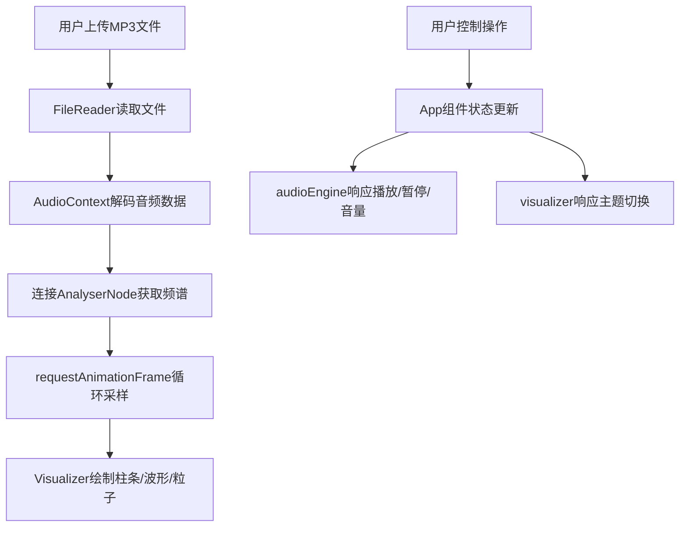

## 1. 产品概述

在线交互式音乐可视化均衡器，用户上传MP3音乐后，浏览器通过Web Audio API实时解析音频频谱数据，以动态柱状条、波形曲线和粒子特效的形式呈现音乐节奏与旋律。

- 核心价值：将听觉音乐转化为沉浸式视觉体验，为音乐爱好者提供新颖的音乐欣赏方式
- 目标用户：音乐爱好者、视觉艺术爱好者、内容创作者

## 2. 核心功能

### 2.1 用户角色

| 角色 | 注册方式 | 核心权限 |
|------|----------|----------|
| 普通用户 | 无需注册 | 上传音乐、播放控制、切换主题、查看可视化效果 |

### 2.2 功能模块

1. **音频处理模块**：文件上传、音频解码、频谱分析、节拍检测
2. **可视化渲染模块**：频谱柱状条、波形曲线、粒子系统
3. **控制面板模块**：播放/暂停、进度条、音量控制、主题切换
4. **主题系统模块**：三种预设主题配色方案

### 2.3 页面详情

| 页面名称 | 模块名称 | 功能描述 |
|----------|----------|----------|
| 主页面 | 文件上传区 | 拖拽或点击上传MP3文件，显示上传进度 |
| 主页面 | 频谱可视化视图 | 32个频段柱状条、动态波形曲线、粒子特效 |
| 主页面 | 控制面板 | 播放/暂停按钮、进度条、音量滑块、主题切换按钮 |

## 3. 核心流程

用户上传音乐文件 → 系统解码音频 → Web Audio API分析频谱 → Canvas实时渲染可视化效果 → 用户可通过控制面板交互

## 4. 用户界面设计

### 4.1 设计风格
- **整体风格**：深色科技感，沉浸式视觉体验
- **主色调**：纯黑背景（#000），频谱视图径向渐变背景（#1a1a2e 到 #000）
- **柱条渐变**：低频蓝色 → 高频红色（默认主题）
- **字体**：现代无衬线字体，数字等宽字体用于时间显示
- **动效**：所有动画使用requestAnimationFrame驱动，确保60fps流畅

### 4.2 页面设计概览

| 页面名称 | 模块名称 | UI元素 |
|----------|----------|--------|
| 主页面 | 频谱可视化视图 | 32个彩色渐变柱条（底部）、半透明白色波形曲线（带光晕）、100个彩色粒子（四角+中央散布）、径向渐变背景 |
| 主页面 | 左侧控制面板 | 圆形渐变播放/暂停按钮、渐变填充进度条、音量滑块、三个主题切换按钮（霓虹幻彩/深海幽蓝/极光森林） |

### 4.3 响应式适配

- **桌面端（≥1280px）**：控制面板左侧固定250px宽，频谱视图左右20px内边距
- **平板端（768px-1279px）**：控制面板折叠为顶部横条，频谱视图充满剩余空间
- **手机端（<768px）**：控制面板变为底部悬浮条，柱条缩减至16个，粒子减为50个

### 4.4 视觉效果主题

| 主题名称 | 柱条渐变 | 背景色调 | 粒子配色 | 光晕色调 |
|----------|----------|----------|----------|----------|
| 霓虹幻彩 | 紫→粉→橙 | 深紫黑 | 彩色霓虹 | 粉紫色 |
| 深海幽蓝 | 深蓝→青→浅蓝 | 深海蓝 | 蓝绿色系 | 青蓝色 |
| 极光森林 | 绿→青→黄 | 深森林绿 | 极光色系 | 翠绿色 |
