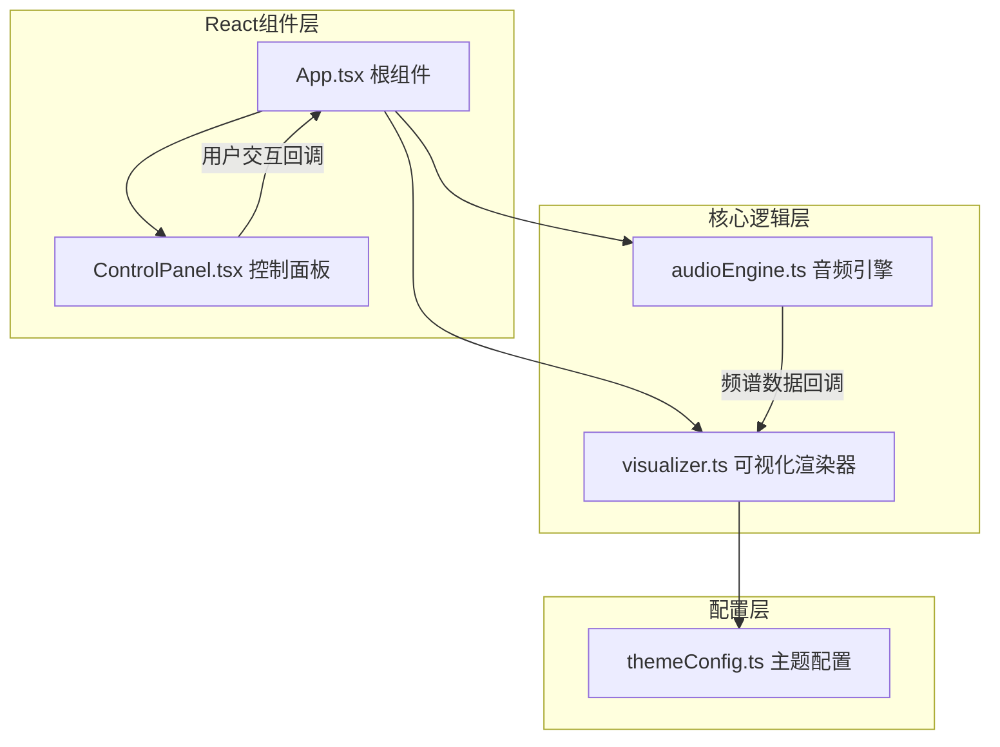

## 1. 架构设计



## 2. 技术选型

- **前端框架**：React 18 + TypeScript
- **构建工具**：Vite
- **音频处理**：Web Audio API (AudioContext, AnalyserNode)
- **图形渲染**：Canvas 2D API
- **状态管理**：React useState / useRef（轻量场景）
- **不使用UI组件库**：纯CSS实现，确保性能和定制性

## 3. 文件结构

```
src/
├── audioEngine.ts        # 音频引擎：文件加载、解码、频谱分析
├── visualizer.ts         # 可视化渲染：柱条、波形、粒子系统
├── themeConfig.ts        # 三种主题配色方案
├── components/
│   ├── App.tsx           # 根组件：状态管理、组件集成
│   └── ControlPanel.tsx  # 控制面板UI组件
├── main.tsx              # 入口文件
└── index.css             # 全局样式
```

## 4. 核心模块设计

### 4.1 audioEngine.ts

**职责**：音频文件加载、Web Audio API上下文管理、频谱数据解析

**核心API**：
```typescript
class AudioEngine {
  loadFile(file: File): Promise<void>
  play(): void
  pause(): void
  setVolume(value: number): void
  getCurrentTime(): number
  getDuration(): number
  seek(time: number): void
  setSpectrumCallback(callback: (data: SpectrumData) => void): void
  destroy(): void
}

interface SpectrumData {
  frequencies: number[]    // 归一化频段值 (0-1)
  waveform: number[]       // 时域波形数据
  beatIntensity: number    // 节拍强度 (0-1)
}
```

**实现要点**：
- 使用AnalyserNode的getByteFrequencyData获取频域数据
- 使用getByteTimeDomainData获取时域波形数据
- 节拍检测：低频段能量突变检测算法
- 使用requestAnimationFrame触发数据采样

### 4.2 visualizer.ts

**职责**：Canvas可视化渲染，包括柱条、波形、粒子系统

**核心API**：
```typescript
class Visualizer {
  constructor(canvas: HTMLCanvasElement)
  setTheme(theme: ThemeConfig): void
  setData(data: SpectrumData): void
  setBarCount(count: number): void
  setParticleCount(count: number): void
  resize(width: number, height: number): void
  start(): void
  stop(): void
  destroy(): void
}
```

**粒子系统**：
- 粒子对象：位置、速度、大小、颜色、生命周期
- 强节拍时：粒子向外爆散，速度与节拍强度成正比
- 弱节拍时：粒子缓慢向中心聚拢
- 粒子颜色与附近频段柱条颜色同步

### 4.3 themeConfig.ts

**主题配置数据结构**：
```typescript
interface ThemeConfig {
  name: string
  background: {
    inner: string   // 径向渐变内圈颜色
    outer: string   // 径向渐变外圈颜色
  }
  barGradient: string[]  // 柱条渐变色数组（从低到高频）
  waveformColor: string  // 波形颜色
  glowColor: string      // 光晕颜色
  particleColors: string[]  // 粒子颜色池
}
```

### 4.4 App.tsx

**状态管理**：
- 播放状态（isPlaying）
- 当前时间/总时长
- 音量
- 当前主题
- 文件上传进度
- 响应式断点状态

**生命周期**：
- 组件挂载：初始化audioEngine和visualizer
- 窗口大小变化：更新canvas尺寸和响应式状态
- 组件卸载：清理资源

### 4.5 ControlPanel.tsx

**Props**：
```typescript
interface ControlPanelProps {
  isPlaying: boolean
  currentTime: number
  duration: number
  volume: number
  currentTheme: string
  themes: string[]
  uploadProgress: number
  onFileUpload: (file: File) => void
  onPlayPause: () => void
  onSeek: (time: number) => void
  onVolumeChange: (value: number) => void
  onThemeChange: (theme: string) => void
}
```

## 5. 性能优化

1. **帧率控制**：使用requestAnimationFrame，固定60fps渲染循环
2. **内存管理**：及时清理AudioContext、取消动画帧
3. **响应式优化**：移动端减少柱条和粒子数量
4. **音频解码**：异步解码，不阻塞主线程
5. **Canvas优化**：使用离屏渲染策略，减少重绘区域
6. **大文件上传**：显示上传进度和预估剩余时间

## 6. 浏览器兼容性

- 使用Web Audio API（现代浏览器广泛支持）
- Canvas 2D API（全浏览器支持）
- 需要HTTPS或localhost环境才能使用AudioContext
