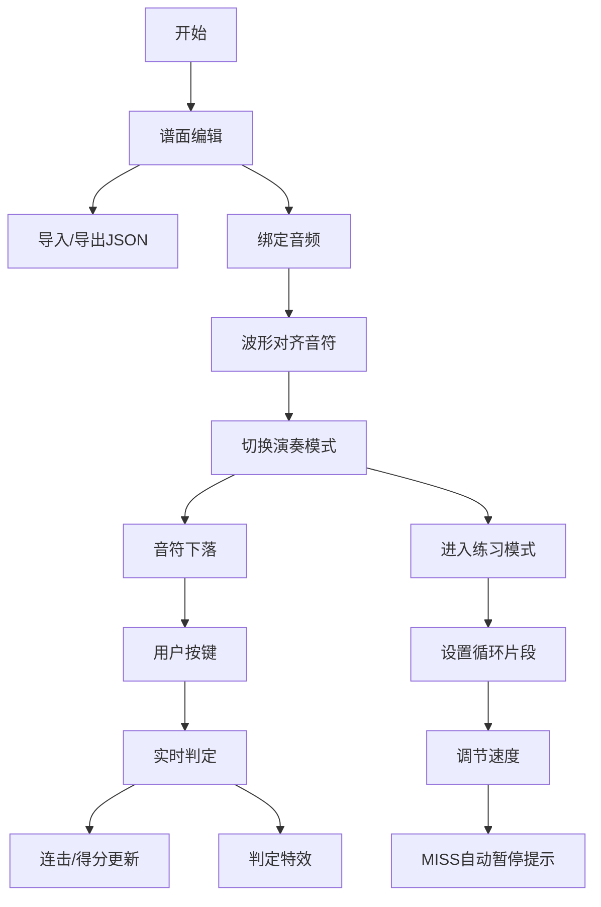

## 1. 产品概述

节奏音游谱面编辑器与练习器，面向音游爱好者提供自由创作谱面和针对性练习的完整解决方案。

- 核心解决音游玩家无法自由创作和测试不同节奏型与按键组合谱面的痛点，以及难以针对性练习特定片段的问题
- 目标用户为音游玩家、谱面创作者，提供从谱面编辑到演奏练习的一站式体验

## 2. 核心特性

### 2.1 功能模块

1. **谱面编辑器**：时间轴拖拽编辑、音符类型设置、BPM与节拍配置、JSON导入导出
2. **演奏模式**：音符下落、实时判定、连击系统、得分计算
3. **练习模式**：片段循环、速度调节、MISS提示暂停
4. **音频系统**：音频上传、波形显示、音画同步
5. **视觉反馈**：判定波纹特效、连击闪光动画

### 2.2 页面详情

| 页面名称 | 模块名称 | 功能描述 |
|-----------|-------------|---------------------|
| 主界面 | 谱面编辑器 | 时间轴水平滚动缩放、节拍线显示、小节编号、四轨道音符编辑 |
| 主界面 | 音频波形区 | 音频波形可视化、播放控制条、倍速/循环控制 |
| 演奏界面 | 游戏区域 | 四条垂直轨道、下落音符、发光判定线、实时判定反馈 |
| 演奏界面 | HUD | 连击数显示、总分显示、判定等级提示 |

## 3. 核心流程

### 3.1 谱面编辑流程
用户在主界面通过时间轴拖拽放置音符，设置音符类型与精确时间，配置BPM和节拍，可导入导出JSON格式谱面，绑定音频文件后可预览波形辅助对齐。

### 3.2 演奏流程
加载谱面后切换至全屏演奏模式，音符从顶部沿轨道下落，用户按下对应按键（A/S/D/F或方向键），系统实时判定PERFECT/GOOD/MISS，显示连击与得分。

### 3.3 练习流程
设置循环片段起止时间，调节播放速度（0.5x-1.5x），MISS时自动暂停0.5秒提示正确按键位置，帮助用户针对性练习难点片段。

## 4. 用户界面设计

### 4.1 设计风格
- **主题色调**：深色主题 #1a1a2e 背景，#e94560 强调色
- **字体选择**：显示字体使用 Orbitron（科技感），正文字体使用 Noto Sans SC
- **视觉风格**：赛博朋克霓虹风格，发光效果、渐变音符、半透明轨道
- **动画效果**：判定线呼吸动画、音符下落流畅动画、判定波纹扩散、连击闪光特效

### 4.2 页面设计概述

| 页面名称 | 模块名称 | UI元素 |
|-----------|-------------|-------------|
| 主界面 | 谱面编辑器 | 时间轴（可滚动缩放）、节拍线、小节编号、四轨道标识、音符卡片（可拖拽） |
| 主界面 | 控制面板 | BPM输入（60-200）、节拍选择（4/4、3/4、6/8）、导入导出按钮、音频上传 |
| 主界面 | 波形区域 | 音频波形图、播放控制条（播放/暂停/停止）、倍速选择、循环开关 |
| 演奏界面 | 游戏区域 | 四条轨道（宽120px，半透明背景）、判定线（白色发光呼吸动画）、音符卡片（渐变光泽） |
| 演奏界面 | HUD | 左上角连击数、右上角总得分、中央判定文字、边缘闪光特效 |

### 4.3 响应式设计
- 桌面端：四轨道水平排列，编辑区与波形区分层布局
- 移动端（<768px）：四轨道垂直堆叠，时间轴横向滚动，触控优化

### 4.4 视觉规范
- 音符卡片：宽度80px，高度30px，圆角矩形，渐变+光泽效果
- 判定线：白色发光，0.5s呼吸动画
- 判定波纹：PERFECT金色、GOOD蓝色、MISS红色，圆形扩散
- 轨道底色：rgba(255,255,255,0.05) 半透明
- 长按音符：尾部拖出半透明轨迹线
