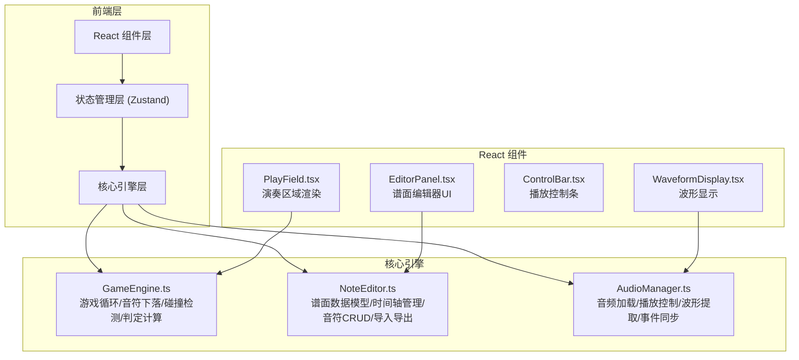

## 1. 架构设计



## 2. 技术描述

- **前端框架**：React 18 + TypeScript + Vite
- **样式方案**：CSS Modules + CSS Variables（深色主题）
- **状态管理**：Zustand（轻量级状态管理）
- **音频处理**：Web Audio API + HTML5 Audio
- **动画引擎**：requestAnimationFrame + CSS Transitions
- **图标库**：lucide-react

## 3. 项目文件结构

```
src/
├── GameEngine.ts        # 核心游戏引擎
├── NoteEditor.ts        # 谱面编辑器核心
├── AudioManager.ts      # 音频管理器
├── components/
│   ├── PlayField.tsx    # 演奏区域组件
│   ├── EditorPanel.tsx  # 谱面编辑器组件
│   ├── ControlBar.tsx   # 播放控制组件
│   ├── WaveformDisplay.tsx  # 波形显示组件
│   └── HUD.tsx          # 游戏HUD组件
├── store/
│   └── useGameStore.ts  # Zustand状态管理
├── types/
│   └── index.ts         # 类型定义
├── App.tsx
├── main.tsx
└── index.css
```

## 4. 数据模型

### 4.1 谱面数据结构

```typescript
interface Note {
  id: string;
  time: number;           // 毫秒级时间戳
  track: 0 | 1 | 2 | 3;   // 上下左右四个轨道
  type: 'tap' | 'hold' | 'swipe';  // 音符类型
  duration?: number;      // hold音符的持续时间
}

interface Beatmap {
  version: string;
  title: string;
  bpm: number;            // 60-200
  timeSignature: '4/4' | '3/4' | '6/8';
  offset: number;         // 音频偏移量
  notes: Note[];
  audioFile?: string;     // 关联的音频文件名
}
```

### 4.2 游戏状态

```typescript
interface GameState {
  mode: 'editor' | 'playing' | 'practice';
  isPlaying: boolean;
  currentTime: number;
  score: number;
  combo: number;
  maxCombo: number;
  playbackSpeed: 0.5 | 0.75 | 1.0 | 1.5;
  loopEnabled: boolean;
  loopStart: number;
  loopEnd: number;
  activeNotes: Note[];
  hitNotes: Map<string, Judgment>;
}

type Judgment = 'perfect' | 'good' | 'miss';
```

## 5. 核心算法

### 5.1 判定算法
- PERFECT: ±20ms 偏差
- GOOD: ±50ms 偏差
- MISS: 超过50ms 或音符过线

### 5.2 得分计算
- PERFECT: 300分 × 连击加成
- GOOD: 100分 × 连击加成
- MISS: 0分，连击中断

### 5.3 音符位置计算
```
y = (currentTime - note.time) * fallSpeed + judgeLineY
```

## 6. 性能要求

- 演奏模式：60FPS 稳定帧率
- 判定延迟：≤16ms
- 拖拽响应：≤50ms（吸附到节拍线）
- 内存占用：谱面1000音符时 ≤100MB
