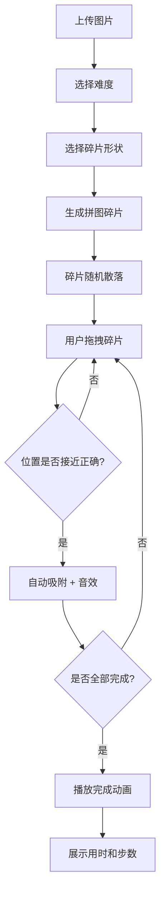

## 1. 产品概述

在线定制专属拼图挑战是一款基于 Web 的互动拼图游戏，用户可上传个人照片，系统自动切割为拼图碎片，用户通过拖拽完成拼图。支持多种难度和碎片形状，配合计时、步数记录和流畅的动画效果，为用户提供沉浸式的拼图体验。

- 核心价值：将个人照片转化为互动拼图，提供有趣的休闲娱乐体验
- 目标用户：喜欢拼图游戏、想要个性化娱乐体验的用户

## 2. 核心功能

### 2.1 功能模块

1. **图片上传模块**：支持用户上传本地图片作为拼图原图
2. **难度选择模块**：简单模式（4×4=16块）和困难模式（6×6=36块）
3. **碎片形状选择**：标准矩形 / 随机多边形（边缘带弯曲凹凸）
4. **拼图交互模块**：拖拽、旋转、自动吸附、放置反馈
5. **计时统计模块**：精确到 0.1 秒的计时器和步数统计
6. **预览功能**：半透明原图覆盖层辅助拼图
7. **完成动画**：碎片飞起组合成原图的庆祝动画

### 2.2 页面详情

| 页面名称 | 模块名称 | 功能描述 |
|-----------|-------------|---------------------|
| 主页面 | 顶部控制区 | 图片上传、难度选择、碎片形状选择 |
| 主页面 | 拼图放置区 | 左侧浅灰色网格背景，虚线边框，放置碎片 |
| 主页面 | 碎片散落区 | 右侧区域，随机散乱排列待拼碎片 |
| 主页面 | 信息面板 | 右下角计时器、步数、预览按钮 |
| 完成弹窗 | 完成展示 | 总用时、步数、重新开始按钮 |

## 3. 核心流程

用户上传图片 → 选择难度和碎片形状 → 系统生成碎片并随机散落在右侧 → 用户拖拽碎片到左侧网格 → 接近正确位置自动吸附 → 完成所有拼图 → 播放完成动画并展示统计数据

## 4. 用户界面设计

### 4.1 设计风格

- **主色调**：温暖米色 #f5e6d3，辅色木棕色 #8b5a2b
- **视觉风格**：温馨木质质感，类似在木桌上玩实体拼图
- **阴影效果**：拼图碎片带轻微阴影，拖拽时阴影放大、碎片放大 1.05 倍
- **按钮风格**：圆角矩形按钮，木纹质感，悬停有微动画
- **字体**：标题使用有衬线字体，正文使用清晰易读的无衬线字体
- **整体氛围**：温暖、舒适、放松，适合休闲娱乐

### 4.2 页面设计概述

| 页面名称 | 模块名称 | UI 元素 |
|-----------|-------------|-------------|
| 主页面 | 顶部控制区 | 上传按钮（木纹质感）、难度切换、形状切换 |
| 主页面 | 拼图放置区 | 浅灰色 #e0e0e0 网格，虚线边框，米色背景 |
| 主页面 | 碎片散落区 | 与放置区同高，米色背景，碎片随机分布 |
| 主页面 | 信息面板 | 右下角浮动卡片，计时器、步数、预览按钮 |
| 完成弹窗 | 全屏覆盖 | 半透明遮罩，中央动画区域，统计数据 |

### 4.3 响应式

- **桌面端**：左右布局，左侧拼图区，右侧碎片区
- **iPad 竖屏**：上下布局，上方拼图区，下方碎片区
- **触摸优化**：增大触控区域，支持触摸拖拽

### 4.4 动效设计

- 碎片拖拽：提升效果（阴影放大 + 1.05 倍缩放）
- 自动吸附：微缩弹跳动画 + 短促点击音效
- 碎片旋转：90 度平滑旋转过渡
- 完成动画：碎片从网格飞起，组合成完整图片
- 页面加载： staggered 渐入效果
