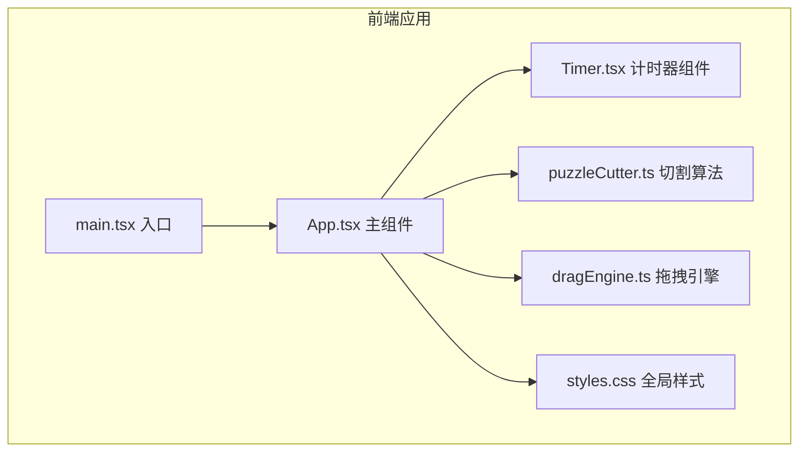

## 1. 架构设计



## 2. 技术描述

- **前端框架**：React 18 + TypeScript
- **构建工具**：Vite（支持热更新）
- **样式方案**：纯 CSS（CSS Variables 管理主题）
- **状态管理**：React useState/useRef（轻量级，无需状态库）
- **渲染方式**：Canvas 渲染拼图碎片（高性能，支持多边形切割）
- **动画方案**：CSS Transitions + requestAnimationFrame + Web Audio API

## 3. 文件结构

| 文件路径 | 说明 |
|---------|------|
| `package.json` | 项目依赖和脚本配置 |
| `index.html` | 入口 HTML 页面 |
| `tsconfig.json` | TypeScript 配置（严格模式） |
| `vite.config.js` | Vite 构建配置 |
| `src/main.tsx` | React 根组件入口 |
| `src/App.tsx` | 主应用组件 |
| `src/utils/puzzleCutter.ts` | 拼图切割算法 |
| `src/utils/dragEngine.ts` | 拖拽交互逻辑 |
| `src/components/Timer.tsx` | 计时器组件 |
| `src/styles.css` | 全局样式 |

## 4. 核心模块设计

### 4.1 puzzleCutter.ts 切割算法

```typescript
interface PuzzlePiece {
  id: number;
  row: number;
  col: number;
  x: number;      // 正确位置 x
  y: number;      // 正确位置 y
  width: number;
  height: number;
  rotation: number;     // 当前旋转角度
  initialRotation: number; // 初始随机旋转 (0-30度)
  vertices: { x: number; y: number }[]; // 多边形顶点
  tabEdges: { top: number; right: number; bottom: number; left: number }; // 凹凸方向
  imageData: ImageData;  // 该碎片的图像数据
}

function cutPuzzle(
  image: HTMLImageElement,
  gridSize: number,
  pieceShape: 'rectangle' | 'polygon'
): PuzzlePiece[]
```

### 4.2 dragEngine.ts 拖拽引擎

```typescript
interface DragState {
  isDragging: boolean;
  activePieceId: number | null;
  offsetX: number;
  offsetY: number;
}

class DragEngine {
  constructor(container: HTMLElement, pieces: PuzzlePiece[], gridSize: number);
  onPiecePlaced(callback: (pieceId: number) => void): void;
  onStep(callback: () => void): void;
  rotatePiece(pieceId: number): void;
  checkSnap(piece: PuzzlePiece): { snapped: boolean; x: number; y: number };
}
```

### 4.3 性能优化策略

- Canvas 批量渲染，避免 DOM 操作开销
- requestAnimationFrame 驱动动画循环
- 离屏 Canvas 预渲染碎片图像
- 多边形使用缓存路径，减少重复计算
- 拖拽时使用 transform 而非 top/left
- 事件委托减少事件监听器数量

## 5. 关键技术点

1. **多边形切割算法**：基于贝塞尔曲线生成凹凸边缘，每块碎片四边独立随机凹凸
2. **Canvas 裁剪渲染**：使用 Path2D 定义碎片形状，clip 后绘制对应图像区域
3. **自动吸附检测**：计算碎片中心与正确位置的距离，小于 15% 尺寸则吸附
4. **音频反馈**：Web Audio API 生成简单的点击音效，无需外部音频文件
5. **完成动画**：使用 requestAnimationFrame 逐帧动画，碎片从各位置飞向最终位置
