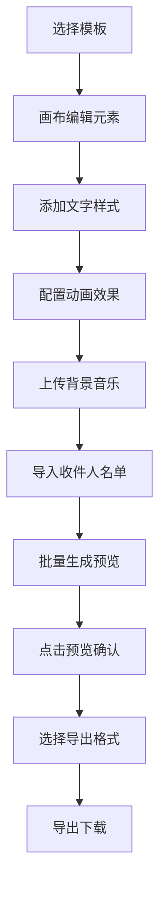

## 1. 产品概述

在线批量个性化动态贺卡编辑器，解决节日/纪念日无法快速制作带专属文字、动画和音乐的差异化电子贺卡的问题。面向需要批量发送个性化祝福的用户群体，提供一站式贺卡设计、个性化定制、批量生成和导出解决方案。

## 2. 核心功能

### 2.1 用户角色
| 角色 | 注册方式 | 核心权限 |
|------|----------|----------|
| 普通用户 | 无需注册 | 编辑贺卡、批量生成、导出分享 |

### 2.2 功能模块
1. **贺卡编辑主界面**：三栏布局（模板库、画布、属性面板），预览网格
2. **模板选择系统**：5种预设风格模板，支持快速加载
3. **画布编辑器**：可拖拽缩放的图层元素，实时渲染
4. **文字编辑系统**：多字体、多样式、描边投影效果
5. **动画配置系统**：进入动画+持续效果，时长可调
6. **音乐管理系统**：本地MP3上传，波形可视化，频率变色
7. **批量生成系统**：Excel/CSV导入，个性化变量替换，缩略图预览
8. **导出系统**：MP4视频、高清PNG、ZIP批量打包

### 2.3 页面详情
| 页面名称 | 模块名称 | 功能描述 |
|----------|----------|----------|
| 主编辑器页面 | 模板选择面板 | 竖向滚动展示5种模板缩略图，点击加载 |
| 主编辑器页面 | 中央画布区域 | 600x800像素3:4竖版卡片，支持拖拽缩放选择 |
| 主编辑器页面 | 属性编辑面板 | 手风琴折叠式布局，分元素/文字/动画/音乐四区 |
| 主编辑器页面 | 批量预览网格 | 200x267缩略图网格，点击放大预览 |
| 主编辑器页面 | 导出工具栏 | MP4/PNG/ZIP导出选项，进度条显示 |

## 3. 核心流程

用户从模板库选择基础模板 → 在画布上调整元素位置、大小、样式 → 添加并编辑文字内容（字体、颜色、描边、投影）→ 配置进入动画和持续效果 → 上传背景音乐并调整参数 → 导入收件人名单（Excel/CSV）→ 系统批量生成预览缩略图 → 点击预览确认效果 → 选择导出格式（MP4/PNG/ZIP）→ 等待导出完成并下载。

## 4. 用户界面设计

### 4.1 设计风格
- 主色：#FF6B6B 珊瑚红
- 辅色：#FFE66D 鹅黄色
- 背景：#FFF5E6 米白色
- 画布质感：CSS纸纹背景图案
- 按钮风格：圆角8px，悬停放大1.05倍，阴影加深
- 过渡动画：所有交互0.3s ease平滑过渡
- 字体搭配：思源黑体/思源宋体/站酷快乐体

### 4.2 页面设计概述
| 页面名称 | 模块名称 | UI元素 |
|----------|----------|--------|
| 主编辑器 | 模板面板 | 竖向滚动卡片缩略图，选中状态珊瑚红边框 |
| 主编辑器 | 画布区域 | 600x800白色卡片，纸纹背景，选中元素8个控制点 |
| 主编辑器 | 属性面板 | 手风琴折叠区块，珊瑚红标题，鹅黄色高亮滑块 |
| 主编辑器 | 预览网格 | 4列网格布局，200x267缩略图，悬停阴影上浮 |
| 主编辑器 | 导出区域 | 珊瑚红主按钮，进度条动画，文件大小预估 |

### 4.3 响应式
- 桌面端（≥1366px）：三栏布局（模板-画布-属性）
- 平板端（768-1366px）：顶部横向滚动模板条，画布+右侧属性面板
- 移动端（<768px）：全屏画布，底部滑动抽屉式属性面板
- 触摸优化：增大点击区域≥44px，支持双指缩放

### 4.4 动效设计
- 页面加载：元素错落淡入（staggered reveal）
- 按钮悬停：scale(1.05) + 阴影加深
- 滑块交互：轨道颜色随值变化
- 画布拖拽：光标变化，选中高亮
- 导出进度：进度条渐变填充 + 数字百分比
