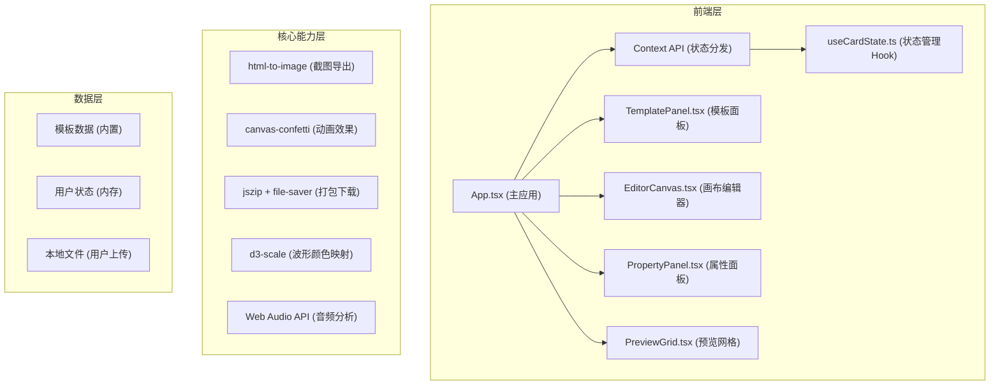

## 1. 架构设计



## 2. 技术描述
- 前端框架：React@18 + TypeScript@5
- 构建工具：Vite@5 + @vitejs/plugin-react
- 状态管理：React Context + useCardState 自定义Hook
- 样式方案：CSS Modules + CSS 变量主题系统
- 第三方库：
  - html-to-image：DOM转图片/缩略图生成
  - canvas-confetti：动画粒子效果
  - jszip：批量导出ZIP压缩
  - file-saver：文件下载
  - d3-scale：音频频率颜色映射
  - Web Audio API：音频分析与播放

## 3. 项目结构
```
auto95/
├── package.json
├── index.html
├── vite.config.js
├── tsconfig.json
└── src/
    ├── App.tsx                    # 主应用，布局管理+Context
    ├── components/
    │   ├── EditorCanvas.tsx       # 中央画布，拖拽缩放交互
    │   ├── TemplatePanel.tsx      # 左侧模板选择面板
    │   ├── PropertyPanel.tsx      # 右侧属性编辑面板
    │   └── PreviewGrid.tsx        # 批量预览网格
    ├── hooks/
    │   └── useCardState.ts        # 贺卡状态管理Hook
    ├── types/
    │   └── card.ts                # TypeScript类型定义
    ├── utils/
    │   ├── templates.ts           # 5种预设模板数据
    │   ├── audio.ts               # 音频处理工具
    │   └── export.ts              # 导出工具函数
    └── styles/
        ├── theme.css              # CSS变量主题
        └── paper-texture.css      # 纸纹背景图案
```

## 4. 核心数据模型

### 4.1 类型定义
```typescript
// 图层元素类型
interface Layer {
  id: string;
  type: 'background' | 'decoration' | 'text';
  x: number;
  y: number;
  width: number;
  height: number;
  rotation: number;
  opacity: number;
  zIndex: number;
  src?: string;
  color?: string;
  text?: TextProperties;
}

// 文字属性
interface TextProperties {
  content: string;
  fontFamily: 'noto-sans' | 'noto-serif' | 'zhanku-kuaile';
  fontSize: number;
  lineHeight: number;
  color: string;
  textAlign: 'left' | 'center' | 'right';
  strokeColor: string;
  strokeWidth: number;
  shadowOffsetX: number;
  shadowOffsetY: number;
  shadowBlur: number;
  shadowColor: string;
}

// 动画配置
interface AnimationConfig {
  enterEffect: 'fade-in' | 'slide-up' | 'zoom-in';
  duration: number;
  continuousEffect: 'petals' | 'stars' | 'particles';
}

// 音乐配置
interface MusicConfig {
  file: File | null;
  url: string | null;
  volume: number;
  loop: boolean;
  waveformData: number[];
}

// 贺卡状态
interface CardState {
  layers: Layer[];
  selectedLayerId: string | null;
  animation: AnimationConfig;
  music: MusicConfig;
  recipients: Recipient[];
  previews: PreviewItem[];
}

// 收件人
interface Recipient {
  name: string;
  message: string;
}

// 预览项
interface PreviewItem {
  recipient: Recipient;
  thumbnailUrl: string;
}
```

## 5. 关键技术实现

### 5.1 画布拖拽系统
- 使用React事件处理（onMouseDown/onMouseMove/onMouseUp）
- 变换矩阵计算支持旋转后拖拽
- requestAnimationFrame保证≥30fps帧率
- 8个控制点实现8方向缩放

### 5.2 批量生成性能优化
- Web Worker后台生成缩略图
- Promise并发池控制（最多3个并发）
- html-to-image缓存机制
- 目标：10张缩略图≤2秒

### 5.3 音频可视化
- Web Audio API AnalyserNode获取频率数据
- d3-scale将频率映射到RGB颜色（低频蓝、中频绿、高频红）
- Canvas绘制实时波形
- requestAnimationFrame驱动动画

### 5.4 响应式布局
- CSS Grid + 媒体查询实现断点切换
- 1366px+：三栏grid-template-columns: 240px 1fr 320px
- 768-1366px：顶部横向滚动条 + 两栏布局
- <768px：全屏画布 + transform: translateY抽屉

## 6. 性能指标
| 指标 | 目标 | 实现方式 |
|------|------|----------|
| 拖拽帧率 | ≥30fps | requestAnimationFrame + transform硬件加速 |
| 批量生成10张 | ≤2秒 | 并发控制 + 缓存复用 |
| 首屏加载 | ≤2s | 代码分割 + 资源预加载 |
| 内存占用 | ≤500MB | 及时释放URL.createObjectURL |

## 7. 构建配置
- Vite配置：React插件 + base路径设置
- TypeScript：strict模式 + esnext模块
- 依赖版本锁定在package.json
- 启动命令：npm run dev
