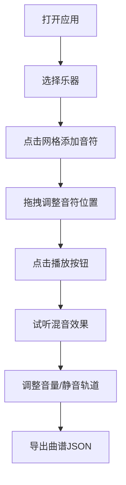

## 1. 产品概述
在线交互式虚拟乐器合奏编排应用，用户可通过浏览器选择不同乐器，在可视化时间轴上拖拽放置音符创作最多8个小节的合奏曲目，并实时播放混音效果。

- 主要目的：为音乐爱好者和创作者提供一个直观的在线音乐创作工具，无需专业设备即可进行多乐器合奏编排
- 目标用户：音乐爱好者、学生、业余作曲家、教育工作者
- 市场价值：降低音乐创作门槛，提供即时反馈的创作体验，可用于音乐教学和个人创作

## 2. 核心特性

### 2.1 用户角色
| 角色 | 注册方式 | 核心权限 |
|------|----------|----------|
| 普通用户 | 无需注册，直接使用 | 乐器选择、音符编排、播放控制、曲谱导入导出 |

### 2.2 功能模块
1. **乐器轨道管理**：5种乐器（钢琴、吉他、架子鼓、小提琴、贝斯）独立音轨，支持静音和音量控制
2. **可视化节奏编排**：32格十六分音符网格（8小节4/4拍），支持音符添加、拖拽移动、删除、多选
3. **实时播放与混音**：基于Web Audio API和Tone.js的多轨合成播放，当前节拍高亮显示
4. **节拍与循环控制**：播放/暂停/停止、进度显示、循环播放
5. **曲谱导入导出**：JSON格式的曲谱保存与加载

### 2.3 页面详情
| 页面名称 | 模块名称 | 功能描述 |
|---------|----------|---------|
| 主界面 | 顶部菜单栏 | 导出、导入按钮 |
| 主界面 | 左侧轨道列表 | 5种乐器音轨，静音按钮、音量滑块 |
| 主界面 | 中央编排画布 | 32格网格，音符可视化编辑，拖拽交互 |
| 主界面 | 底部播放控制栏 | 播放/暂停/停止按钮、循环开关、进度条、节拍位置显示 |

## 3. 核心流程

用户打开应用 → 选择乐器 → 在时间轴网格上点击添加音符 → 拖拽调整音符位置 → 点击播放试听效果 → 调整音量或静音某些轨道 → 导出曲谱JSON文件保存

## 4. 用户界面设计

### 4.1 设计风格
- **主背景**：#1a1a2e，副背景：#16213e，卡片区域：#0f3460
- **乐器颜色**：钢琴#e74c3c、吉他#f39c12、架子鼓#f1c40f、小提琴#2ecc71、贝斯#3498db
- **按钮风格**：圆形图标按钮，播放按钮绿色#27ae60，静音按钮灰色#95a5a6
- **字体**：白色字体，font-weight 500，简洁现代风格
- **布局**：三栏布局 - 左侧轨道列表(280px) + 中央编排画布(自适应) + 底部控制栏(56px)
- **动画**：所有交互平滑过渡(transition 0.2s ease)，音符缩放动画，高亮条渐入渐出

### 4.2 页面设计概述
| 页面名称 | 模块名称 | UI元素 |
|---------|----------|--------|
| 主界面 | 顶部菜单栏 | 导出按钮、导入按钮，深色背景 |
| 主界面 | 左侧轨道列表 | 乐器图标、名称、M静音按钮、音量滑块，行高60px |
| 主界面 | 中央编排画布 | 5行80px高的网格区域，32列十六分音符网格，彩色圆点音符，当前节拍黄色高亮条 |
| 主界面 | 底部控制栏 | 圆形播放/暂停/停止按钮(36px)，循环开关，进度条，节拍位置文字 |

### 4.3 响应性
- 桌面端优先设计，全屏无滚动条
- 中央画布自适应宽度，确保网格比例正确
- 触控设备支持基础的点击和拖拽操作

### 4.4 性能指标
- 16个音符同时播放延迟≤10ms
- 200个音符拖拽操作帧率≥50fps
