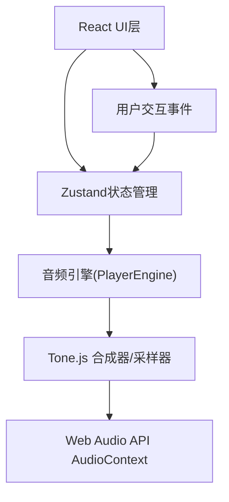

## 1. 架构设计



## 2. 技术描述
- **前端**：React 18 + TypeScript + Vite
- **状态管理**：Zustand
- **音频引擎**：Tone.js + Web Audio API
- **样式**：原生CSS + CSS变量
- **初始化工具**：Vite react-ts模板

## 3. 项目结构
```
d:\P\tasks\auto96/
├── package.json
├── index.html
├── vite.config.js
├── tsconfig.json
└── src/
    ├── main.tsx
    ├── App.tsx
    ├── store/
    │   └── useScoreStore.ts
    ├── components/
    │   ├── TrackList.tsx
    │   └── ScoreEditor.tsx
    └── audio/
        └── PlayerEngine.ts
```

## 4. 核心数据模型

### 4.1 数据类型定义
```typescript
type InstrumentType = 'piano' | 'guitar' | 'drums' | 'violin' | 'bass';

interface Note {
  id: string;
  instrument: InstrumentType;
  time: number;      // 0-31 十六分音符位置
  duration: number;  // 0.25 (十六分音符)
}

interface Track {
  instrument: InstrumentType;
  muted: boolean;
  volume: number;    // -20 到 0 dB
}

interface ScoreState {
  selectedInstrument: InstrumentType;
  notes: Note[];
  currentBeat: number;
  isPlaying: boolean;
  isLooping: boolean;
  tracks: Track[];
  selectedNoteIds: string[];
}
```

### 4.2 导出格式
```json
{
  "tempo": 120,
  "tracks": [
    {
      "instrument": "piano",
      "notes": [
        {"time": 0, "duration": 0.25},
        {"time": 4, "duration": 0.25}
      ]
    }
  ]
}
```

## 5. Zustand Store 方法
- `setSelectedInstrument(instrument)` - 切换当前选中乐器
- `addNote(instrument, time)` - 添加音符
- `deleteNote(noteId)` - 删除音符
- `moveNote(noteId, newTime)` - 移动音符
- `moveSelectedNotes(deltaTime)` - 批量移动选中音符
- `toggleMute(instrument)` - 切换静音
- `setVolume(instrument, volume)` - 设置音量
- `togglePlay()` - 播放/暂停
- `stop()` - 停止
- `toggleLoop()` - 切换循环
- `setCurrentBeat(beat)` - 设置当前节拍
- `selectNote(noteId, multiSelect)` - 选择音符
- `clearSelection()` - 清除选择
- `exportScore()` - 导出JSON
- `importScore(data)` - 导入JSON

## 6. 音频引擎核心逻辑
- 使用Tone.js的`PolySynth`处理钢琴、吉他、小提琴、贝斯
- 使用`Tone.MembraneSynth`处理架子鼓（低音鼓和军鼓）
- 所有音轨通过单个`AudioContext`混音输出
- 使用`Tone.Transport`控制节拍和播放进度
- 每个轨道独立的音量控制和静音开关

## 7. 性能优化
- 使用React.memo优化重渲染
- 使用requestAnimationFrame处理播放位置更新
- 音符拖拽使用transform属性避免重排
- 事件委托处理网格点击
- 使用CSS变量和transform实现动画
