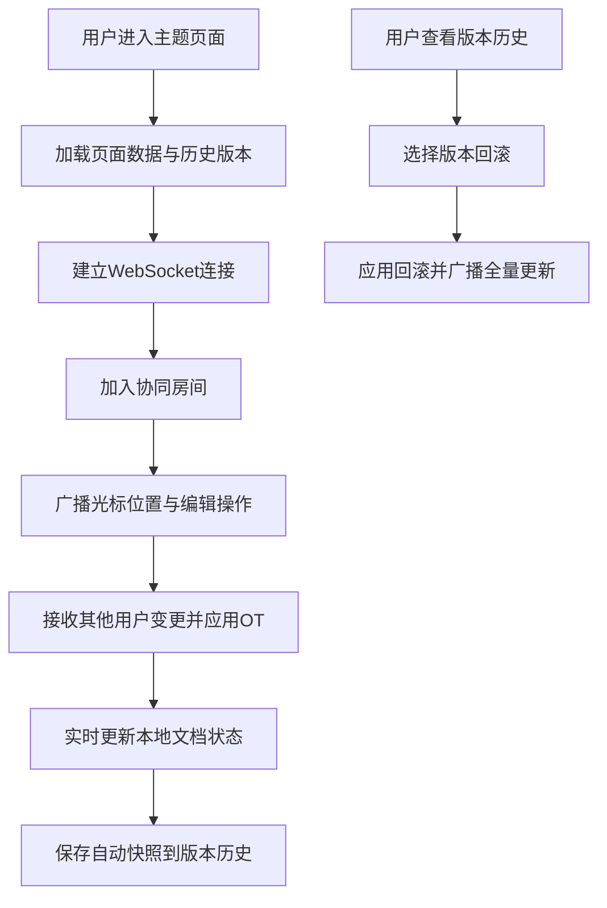

## 1. 产品概述

团队协同Wiki编辑器，支持多人实时围绕主题撰写、组织、串联知识片段，最终生成结构化文档页面。解决团队知识沉淀效率低、协作不同步、知识关联弱的问题，为团队成员提供沉浸式协同创作体验。

## 2. 核心功能

### 2.1 用户角色
| 角色 | 注册方式 | 核心权限 |
|------|---------|----------|
| 团队成员 | 账号登录 | 创建/编辑主题页面、协同编辑、版本回滚、情感投票 |
| 访客 | 链接访问 | 只读浏览页面内容 |

### 2.2 功能模块
1. **主题编辑页**：中央块级编辑区、侧边大纲树、关联箭头绘制、情感投票
2. **协同编辑模块**：实时光标显示、内容同步、OT冲突解决
3. **版本历史模块**：变更记录、时间线展示、一键回滚
4. **响应式适配**：桌面端双栏布局、移动端抽屉式导航

### 2.3 页面详情
| 页面名称 | 模块名称 | 功能描述 |
|----------|----------|----------|
| 主题编辑页 | 块级编辑器 | 支持文本/图片/代码块，拖拽排序，平滑过渡动画 |
| 主题编辑页 | 关联链接 | 块间创建引用关系，虚线曲线箭头，点击显示引用块标题 |
| 主题编辑页 | 大纲树 | 自动提取各级标题，支持折叠展开，侧边磨砂玻璃效果 |
| 主题编辑页 | 情感投票 | 块右侧笑脸/哭脸/惊讶按钮，实时票数气泡显示 |
| 协同模块 | 多光标显示 | 不同颜色圆点+用户简拼标签，跟随编辑位置移动 |
| 协同模块 | 实时同步 | 新增/修改内容300ms内同步，OT算法解决冲突 |
| 版本历史 | 侧滑面板 | 按时间排序变更记录，显示变更人/时间/摘要，点击回滚 |

## 3. 核心流程

## 4. 用户界面设计

### 4.1 设计风格
- **主色调**：浅米色背景 #f5f0e8，深灰色文字 #2c2c2c
- **侧边栏**：磨砂玻璃毛玻璃效果，背景模糊12px，半透明
- **动效风格**：编辑器块拖拽transform 0.2s ease，新建块opacity 0->1淡入
- **字体**：使用"Noto Serif SC"衬线字体配合"Cormorant Garamond"标题字体，营造笔记本质感
- **视觉细节**：纸张纹理背景、柔和阴影、虚线曲线关联箭头、小型数字气泡

### 4.2 页面设计概述
| 页面名称 | 模块名称 | UI元素 |
|----------|----------|----------|
| 主题编辑页 | 编辑区 | 米色纸张背景、块间距24px、聚焦块高亮边框 |
| 主题编辑页 | 侧边栏 | 磨砂玻璃面板、树形缩进、折叠箭头动画 |
| 主题编辑页 | 关联箭头 | SVG虚线曲线、hover时加粗、点击浮层 |
| 主题编辑页 | 投票按钮 | 右侧垂直排列、emoji图标、hover放大 |
| 协同模块 | 多光标 | 彩色圆点(6px)、简拼标签(10px)、跟随动画 |
| 版本历史 | 侧滑面板 | 右侧滑入、时间线、变更卡片、回滚按钮 |

### 4.3 响应式
- **桌面端**(≥768px)：左右双栏布局，侧边栏固定宽度280px，编辑区自适应
- **移动端**(<768px)：大纲树变为左侧滑出抽屉，编辑区字体缩小10%，间距缩小20%
- **触摸优化**：块拖拽支持500ms长按激活，振动反馈

### 4.4 性能指标
- 拖拽交互帧率 ≥ 50fps
- 多人编辑同步延迟 ≤ 300ms
- 首次加载时间 ≤ 2s
- 内存占用 ≤ 200MB（100个块时）
