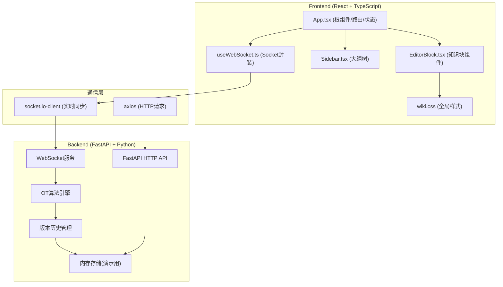
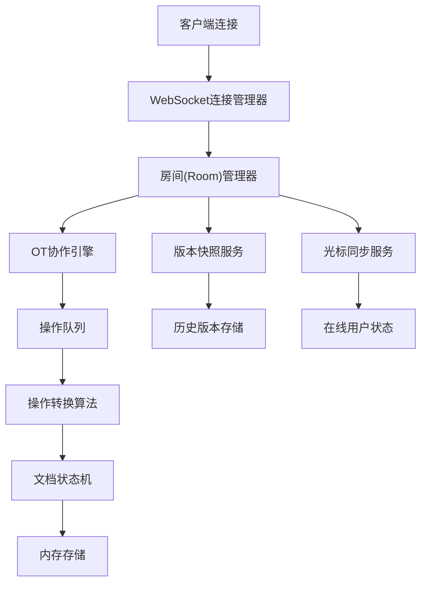

## 1. 架构设计



## 2. 技术描述

- **前端**：React 18 + TypeScript + Vite
  - 状态管理：React Context + useReducer
  - 实时通信：socket.io-client
  - HTTP请求：axios
  - 唯一ID：uuid
  - 拖拽：原生HTML5 Drag & Drop API + 触摸事件处理
- **后端**：FastAPI + Python 3.9+
  - WebSocket服务：FastAPI WebSocket
  - OT算法：自定义操作转换实现
  - 数据存储：内存字典（演示环境）
- **构建工具**：Vite 5.x
- **样式**：原生CSS + CSS变量

## 3. 路由定义

| 路由 | 用途 |
|------|------|
| `/` | 首页/主题列表 |
| `/page/:pageId` | 主题编辑页面 |

## 4. API 定义

### 4.1 HTTP API

```typescript
// 页面数据类型
interface WikiPage {
  id: string;
  title: string;
  blocks: Block[];
  connections: Connection[];
  createdAt: number;
  updatedAt: number;
}

interface Block {
  id: string;
  type: 'text' | 'image' | 'code';
  content: string;
  language?: string;
  votes: { happy: number; sad: number; surprised: number };
  createdAt: number;
  updatedAt: number;
}

interface Connection {
  id: string;
  fromBlockId: string;
  toBlockId: string;
  createdAt: number;
}

interface VersionHistory {
  id: string;
  pageId: string;
  version: number;
  author: string;
  authorInitials: string;
  timestamp: number;
  summary: string;
  snapshot: WikiPage;
}

interface CursorPosition {
  userId: string;
  userName: string;
  userInitials: string;
  color: string;
  blockId: string;
  offset: number;
  x: number;
  y: number;
}

// GET /api/pages/:pageId - 获取页面数据
// Response: WikiPage

// GET /api/pages/:pageId/versions - 获取版本历史
// Response: VersionHistory[]

// POST /api/pages/:pageId/versions/:versionId/rollback - 回滚到指定版本
// Response: { success: boolean; page: WikiPage }

// POST /api/pages/:pageId/blocks/:blockId/vote - 情感投票
// Request: { type: 'happy' | 'sad' | 'surprised' }
// Response: Block
```

### 4.2 WebSocket 事件

```typescript
// 客户端发送
'join': { pageId: string; userId: string; userName: string }
'operation': { op: OTOperation; userId: string }
'cursor': CursorPosition
'block-update': { blockId: string; content: string }
'block-reorder': { blockId: string; newIndex: number }
'block-create': { block: Block; index: number }
'block-delete': { blockId: string }
'connection-create': { connection: Connection }
'vote': { blockId: string; type: VoteType }

// 服务端广播
'user-joined': { userId: string; userName: string; color: string }
'user-left': { userId: string }
'operation': { op: OTOperation; userId: string }
'cursor-update': CursorPosition
'block-updated': { blockId: string; content: string; userId: string }
'block-reordered': { blockId: string; newIndex: number; userId: string }
'block-created': { block: Block; index: number; userId: string }
'block-deleted': { blockId: string; userId: string }
'connection-created': { connection: Connection; userId: string }
'vote-updated': { blockId: string; votes: VoteCounts; userId: string }
'page-rolled-back': { page: WikiPage; userId: string }
```

## 5. 服务器架构图



## 6. 数据模型

### 6.1 数据模型定义

```mermaid
erDiagram
    WIKI_PAGE ||--o{ BLOCK : contains
    WIKI_PAGE ||--o{ CONNECTION : has
    WIKI_PAGE ||--o{ VERSION_HISTORY : has
    BLOCK ||--o{ VOTE : has
    CONNECTION }o--|| BLOCK : from
    CONNECTION }o--|| BLOCK : to
    
    WIKI_PAGE {
        string id PK
        string title
        datetime createdAt
        datetime updatedAt
    }
    
    BLOCK {
        string id PK
        string pageId FK
        string type
        string content
        string language
        int orderIndex
        datetime createdAt
        datetime updatedAt
    }
    
    CONNECTION {
        string id PK
        string pageId FK
        string fromBlockId FK
        string toBlockId FK
        datetime createdAt
    }
    
    VOTE {
        string id PK
        string blockId FK
        string userId
        string type
        datetime createdAt
    }
    
    VERSION_HISTORY {
        string id PK
        string pageId FK
        int version
        string author
        string authorInitials
        datetime timestamp
        string summary
        json snapshot
    }
```

### 6.2 核心类型定义

```typescript
// OT 操作类型
type OTOperation = 
  | { type: 'insert'; position: number; text: string; blockId: string }
  | { type: 'delete'; position: number; length: number; blockId: string }
  | { type: 'retain'; length: number; blockId: string };

// 投票类型
type VoteType = 'happy' | 'sad' | 'surprised';

interface VoteCounts {
  happy: number;
  sad: number;
  surprised: number;
}

// 大纲项
interface OutlineItem {
  id: string;
  blockId: string;
  text: string;
  level: number;
  children: OutlineItem[];
  collapsed: boolean;
}
```
