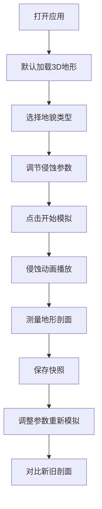

## 1. 产品概述
本产品是一款基于WebGL的3D地形侵蚀模拟可视化应用，旨在通过交互式方式展示不同地貌（山脉、盆地、平原、火山）在长期地质侵蚀作用下的演化过程。主要解决地质教学或沙盘设计中无法直观理解侵蚀速率、方向、强度等参数如何改变地表高程和纹理细节的问题。

- **目标用户**：地理/地质专业师生、沙盘设计师、地貌学爱好者
- **核心价值**：提供直观、可交互的侵蚀过程可视化，帮助用户定量对比侵蚀前后的地形变化

## 2. 核心功能

### 2.1 功能模块

1. **3D地形与地貌选择**：200x200网格生成的3D地形，中央地貌选择器（山脉/盆地/平原/火山四种初始地貌
2. **侵蚀参数调节**：风速、水流量、冰川强度、侵蚀持续时间四大参数滑块控制
3. **实时侵蚀模拟**：基于流体侵蚀算法的逐帧动画，动态颜色映射与粒子流可视化
4. **地形剖面测量与对比**：点击两点生成剖面高度图，支持快照保存与新旧剖面对比

### 2.2 功能详情

| 模块名称 | 功能描述 |
|---------|---------|
| 3D地形渲染 | 200x200网格地形，20x20单位范围，平滑光照与动态阴影 |
| 地貌选择器 | 4个圆形按钮，分别对应四种地貌，各有预设高度图和纹理颜色 |
| 参数控制面板 | 风速(0-100m/s)、水流量(0-50单位/秒)、冰川强度(0-10级)、持续时间(1-100年) |
| 侵蚀模拟引擎 | 简化流体侵蚀算法，2帧/秒更新，1x/2x/5x时间流速可调 |
| 粒子系统 | 500个半透明白色箭头粒子，显示水流路径和风力方向 |
| 剖面测量 | 两点点击生成剖面折线图，标注最高点/最低点/平均高程 |
| 快照对比 | 保存基准快照，叠加显示新旧剖面线（红/蓝区分） |
| 状态栏 | 实时显示模拟时间（年）和FPS |

## 3. 核心流程

用户打开应用后，默认展示山脉地貌的3D地形。用户可以选择不同地貌初始形态，调节侵蚀参数，点击开始模拟观察侵蚀过程。在模拟过程中或结束后，用户可以点击地形两点测量剖面，保存快照进行对比分析。

## 4. 用户界面设计

### 4.1 设计风格

- **主题风格**：暗色科技风格，深色背景配发光蓝色按钮
- **主色调**：背景 #1a1a2e，主强调色 #00d4ff
- **按钮风格**：发光蓝色按钮，hover变 #00a8cc，圆角设计
- **滑块风格**：渐变半透明蓝色轨道 #00d4ff40
- **顶部操作栏**：半透明磨砂玻璃效果
- **过渡动画**：所有控件 0.3s ease 平滑过渡

### 4.2 页面布局

| 区域 | 位置 | 占比 | 内容 |
|------|------|------|------|
| 主场景 | 左侧/中央 | 70%宽度 | 3D地形渲染、地貌选择器、粒子系统 |
| 控制面板 | 右侧 | 30%宽度 | 参数滑块、模拟控制、重置按钮 |
| 剖面图 | 左下角 | 浮动面板 | 剖面折线图、高度标注 |
| 状态栏 | 底部 | 全宽 | 模拟时间、FPS |
| 操作栏 | 顶部 | 全宽 | 标题、操作按钮 |

### 4.3 响应式设计

- **桌面端**（768px以上）：左右分栏布局
- **移动端**（768px以下）：面板折叠为汉堡菜单，地形全屏

### 4.4 3D场景设计

- **环境**：深色背景，暗色雾效
- **光照**：方向光 + 环境光，支持动态阴影
- **相机**：透视相机，可旋转/缩放/平移
- **地形材质**：基于高度的渐变颜色映射，低处绿高处棕
- **后处理**：平滑光照效果
- **交互**：鼠标悬停/点击涟漪动画
