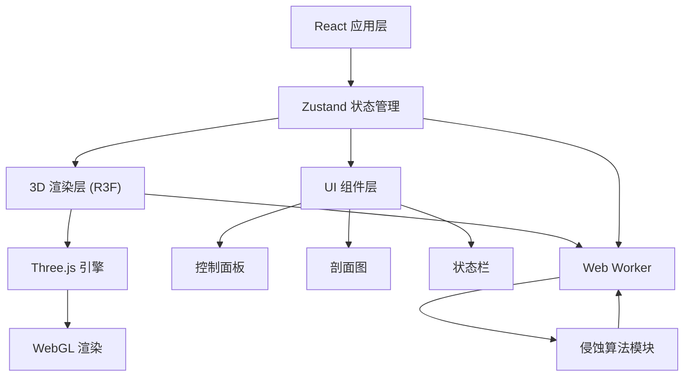
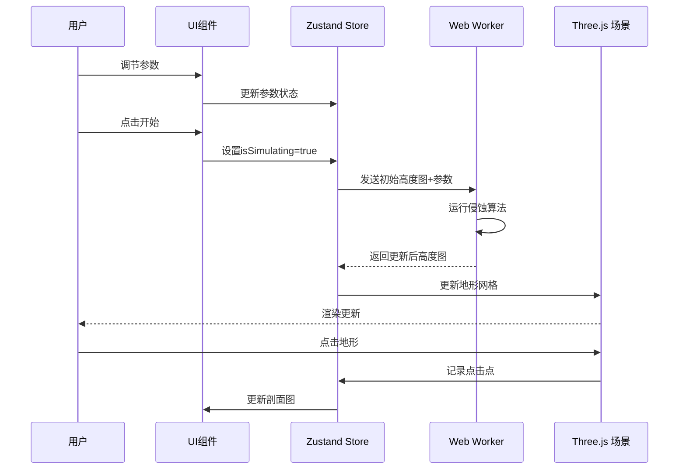

## 1. 架构设计



## 2. 技术选型

- **前端框架**：React 18 + TypeScript
- **构建工具**：Vite
- **3D 渲染**：Three.js + @react-three/fiber + @react-three/drei
- **状态管理**：Zustand
- **UI 样式**：CSS Modules / Tailwind CSS
- **并行计算**：Web Worker
- **2D 图表**：Canvas 2D

## 3. 项目结构

```
src/
├── main.tsx              # 应用入口
├── store/
│   └── terrainStore.ts   # Zustand 状态管理
├── components/
│   ├── Scene3D.tsx     # 3D场景组件
│   ├── ControlPanel.tsx # 右侧控制面板
│   └── TerrainProfile.tsx # 剖面测量组件
├── workers/
│   └── erosionWorker.ts # Web Worker
├── utils/
│   └── erosionModel.ts  # 侵蚀算法核心
```

## 4. 状态管理

### 4.1 Zustand Store

| 状态项 | 类型 | 说明 |
|--------|------|------|
| terrainType | string | 当前地貌类型 |
| heightMap | Float32Array | 地形高度数据数组 |
| windSpeed | number | 风速参数 |
| waterFlow | number | 水流量参数 |
| glacierStrength | number | 冰川强度参数 |
| duration | number | 侵蚀持续时间 |
| isSimulating | boolean | 模拟运行状态 |
| simulationTime | number | 当前模拟时间 |
| timeScale | number | 时间流速倍率 |
| snapshots | Array | 快照列表 |
| profilePoints | Array | 剖面点坐标 |
| fps | number | 当前帧率 |

### 4.2 Store Actions

- `setTerrainType(type)`: 设置地貌类型并重置高度图
- `setWindSpeed(value)`: 设置风速
- `setWaterFlow(value)`: 设置水流量
- `setGlacierStrength(value)`: 设置冰川强度
- `setDuration(value)`: 设置持续时间
- `startSimulation()`: 开始模拟
- `pauseSimulation()`: 暂停模拟
- `resetSimulation()`: 重置模拟
- `setTimeScale(scale)`: 设置时间流速
- `saveSnapshot()`: 保存快照
- `setProfilePoints(points)`: 设置剖面点
- `updateHeightMap(data)`: 更新高度图

## 5. 侵蚀算法

### 5.1 流体侵蚀算法（简化版）

核心思路：
1. 在地形上生成雨滴/水流
2. 水流沿坡度向下流动
3. 水流携带泥沙，在流速快的地方侵蚀
4. 在流速慢的地方沉积

### 5.2 风蚀算法

核心思路：
1. 沿风向方向对地表颗粒施加力
2. 风速越大，侵蚀越强
3. 迎风面侵蚀，背风面沉积

### 5.3 冰川侵蚀

核心思路：
1. 冰川沿山谷向下移动
2. 刨蚀形成 U 型谷
3. 冰川强度越大，谷越宽越陡

## 6. 性能优化

- 地形网格更新计算在 Web Worker 中完成
- 使用 BufferGeometry 直接更新顶点
- 粒子系统使用 Points 进行批量渲染
- requestAnimationFrame 动画循环
- 合理的网格分辨率（200x200）

## 7. 数据流


