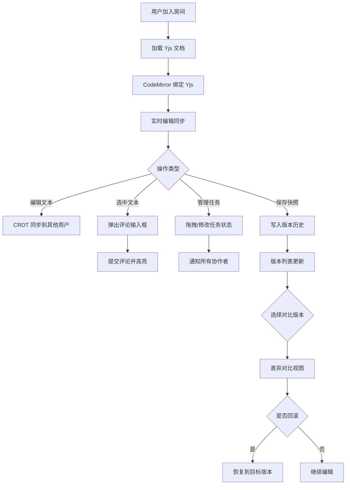

## 1. 产品概述

CoEdit 是一款面向中小团队的实时协作编辑器，核心解决多人同时编辑 Markdown 文档时的版本冲突与沟通延迟问题。通过 CRDT 实时同步、内联评论、版本快照和任务看板，让团队在同一文档内完成"写-评-改-跟"全流程。

- 目标用户：需要协同撰写技术文档、产品方案或知识库的 3–20 人团队
- 核心价值：零冲突实时编辑 + 文档内闭环沟通 + 完整版本回溯

## 2. 核心功能

### 2.1 用户角色

| 角色 | 注册方式 | 核心权限 |
|------|----------|----------|
| 协作者 | 输入用户名加入房间 | 编辑文档、添加评论、管理任务、查看/回滚历史版本 |

### 2.2 功能模块

1. **编辑器页面**：沉浸式 Markdown 编辑器、实时多光标、文件结构侧栏、属性面板
2. **历史面板**：版本快照列表、可视化差异对比、一键回滚
3. **评论系统**：选中文本添加评论、回复线程、高亮关联段落
4. **任务看板**：嵌入式可拖拽任务列表、优先级标记、过期提醒、状态变更通知

### 2.3 页面详情

| 页面名称 | 模块名称 | 功能描述 |
|----------|----------|----------|
| 编辑器页面 | 左侧工具条 | 文件大纲树、全局搜索框，窄边栏可折叠 |
| 编辑器页面 | 编辑区域 | CodeMirror 渲染 Markdown，绑定 Yjs 实时同步，显示他人光标和选区，代码块语法高亮 |
| 编辑器页面 | 右侧属性面板 | 按需弹出：文档元信息、当前选中评论列表、任务统计 |
| 编辑器页面 | 评论弹窗 | 选中文本后浮出毛玻璃弹窗，输入评论并提交，同段落高亮所有关联评论 |
| 编辑器页面 | 任务看板 | 文档内嵌入式看板，支持拖拽排序、优先级标记（高/中/低）、过期提醒、状态流转 |
| 历史面板 | 版本列表 | 侧边滑出面板，展示所有快照时间戳和操作者，60fps 滚动 |
| 历史面板 | 差异对比 | 选两个版本后展示可视化 diff，新增行绿色、删除行红色、修改行黄色 |

## 3. 核心流程

## 4. 用户界面设计

### 4.1 设计风格

- **双主题**：深色主题（深灰底 #1a1b26 + 浅灰文字 #a9b1d6）与浅色主题（米白底 #f5f5f0 + 深灰文字 #343b44），自适应系统偏好
- **低对比度清晰配色**：所有色彩饱和度控制在 50%–70%，背景与前景对比度 4.5:1–7:1
- **主色调**：深海蓝 #7aa2f7（强调色）、翡翠绿 #9ece6a（新增）、珊瑚红 #f7768e（删除）、琥珀黄 #e0af68（修改）
- **圆角**：按钮和面板 8px，弹窗 12px，工具条 4px
- **字体**：JetBrains Mono（代码/编辑器）、Noto Sans SC（UI 文案）
- **布局**：编辑区占页面 90% 宽度，左侧窄工具条 48px，右侧属性面板按需弹出 320px
- **动画**：所有交互 300ms cubic-bezier(0.4, 0, 0.2, 1) 过渡

### 4.2 页面设计概览

| 页面名称 | 模块名称 | UI 元素 |
|----------|----------|---------|
| 编辑器页面 | 左侧工具条 | 48px 宽竖向条，图标按钮（大纲/搜索），折叠箭头，深色半透明背景 |
| 编辑器页面 | 编辑区域 | 90% 宽度 CodeMirror，柔光标动效，语法高亮主题跟随双主题，行号栏 |
| 编辑器页面 | 右侧属性面板 | 滑入 320px 宽面板，毛玻璃背景，标签页切换（信息/评论/任务） |
| 编辑器页面 | 评论弹窗 | 浮动毛玻璃卡片，backdrop-filter: blur(16px)，圆角 12px，评论列表和输入框 |
| 编辑器页面 | 任务看板 | 内嵌看板行，拖拽手柄，优先级色条（红/黄/绿），状态标签，过期闪烁 |
| 历史面板 | 版本列表 | 右侧滑出 280px 面板，版本卡片列表，时间戳+操作者头像，虚拟滚动 |
| 历史面板 | 差异对比 | 左右双栏或统一视图，颜色编码差异行，行号对齐，折叠未变更区域 |

### 4.3 响应式适配

- 桌面端（≥1440px）：完整三栏布局
- 笔记本端（1024px–1439px）：工具条自动折叠为图标，属性面板浮层化
- 平板端（768px–1023px）：单栏布局，工具条底部 Tab 栏，属性面板全屏模态

### 4.4 无 3D 场景
