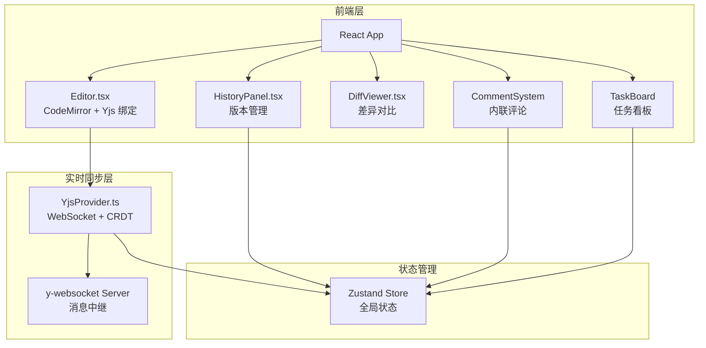
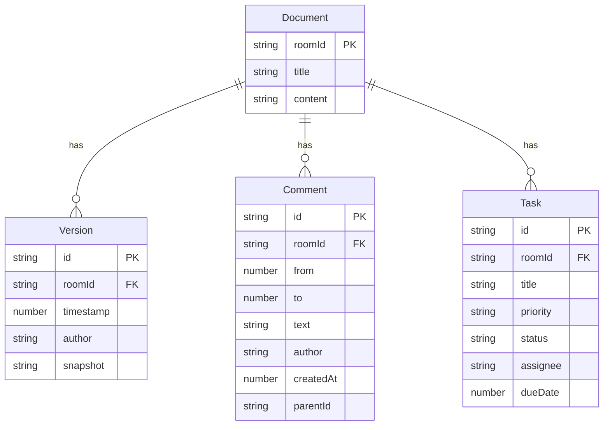

## 1. 架构设计

## 2. 技术说明

- **前端**：React 18 + TypeScript + Tailwind CSS 3 + Vite
- **初始化工具**：vite-init（react-ts 模板）
- **实时同步**：Yjs（CRDT）+ y-websocket（WebSocket 连接）
- **编辑器**：CodeMirror 6（@codemirror/view + @codemirror/state + @codemirror/lang-markdown）
- **差异对比**：diff-match-patch
- **路由**：react-router-dom v6
- **状态管理**：Zustand
- **后端**：无独立后端，y-websocket Server 作为中继
- **数据库**：无，版本快照存储在 Yjs 文档的 metadata 中（浏览器 IndexedDB 持久化）

## 3. 路由定义

| 路由 | 用途 |
|------|------|
| `/` | 首页/加入房间入口 |
| `/editor/:roomId` | 编辑器主页面，包含实时编辑、评论、任务看板 |

## 4. API 定义

无 REST API。所有实时通信通过 WebSocket（y-websocket 协议）完成：

- **Yjs Doc Sync**：客户端通过 WebSocket 连接到 y-websocket Server，自动同步文档内容
- **Awareness Protocol**：光标位置、用户名、选区范围通过 awareness 协议广播
- **自定义事件**：保存快照、评论增删、任务状态变更通过 Yjs SharedMap/Array 同步

## 5. 无独立后端

y-websocket Server 作为 npm 依赖内置，启动脚本中一并启动。

## 6. 数据模型

### 6.1 数据模型定义

### 6.2 数据定义

数据通过 Yjs SharedType 在客户端之间同步，持久化到 IndexedDB：

- `Y.Doc` → `Y.XmlFragment`（文档正文）
- `Y.Doc` → `Y.Map<versions>`（版本快照元数据）
- `Y.Doc` → `Y.Array<comments>`（评论列表）
- `Y.Doc` → `Y.Array<tasks>`（任务列表）
- `Awareness` → 用户光标、选区、用户名
