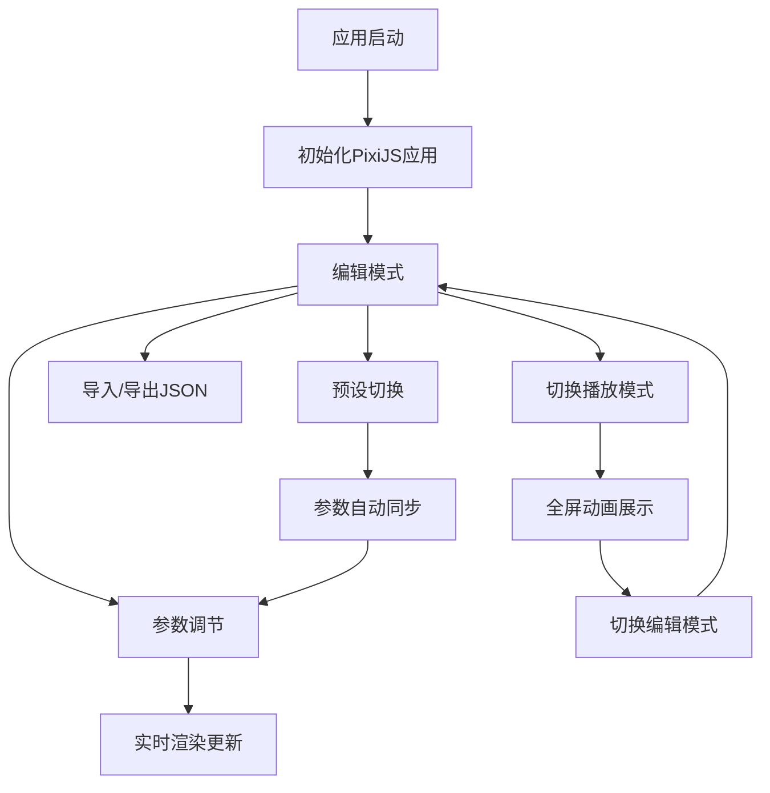

## 1. 产品概述

粒子特效编辑器与运行时预览应用，面向复古风格动作闯关游戏的开发者与设计师，提供粒子系统参数配置、实时画布预览和预设保存/加载功能。通过可视化编辑降低粒子特效调参成本，提升游戏视觉反馈迭代效率。

## 2. 核心功能

### 2.1 功能模块

1. **编辑页面**：画布预览区 + 控制面板 + 状态栏，完整的粒子参数编辑与实时预览体验

### 2.2 页面详情

| 页面名称 | 模块名称 | 功能描述 |
|----------|----------|----------|
| 编辑页面 | 画布预览区 | PixiJS画布实时渲染粒子效果，支持编辑/播放模式切换 |
| 编辑页面 | 控制面板 | 发射参数、运动参数、外观参数分组，滑块+颜色选择器实时调节 |
| 编辑页面 | 预设管理 | 5种内置预设切换，JSON导入导出，参数自动同步 |
| 编辑页面 | 模式切换 | 编辑模式/播放模式切换，播放模式锁定参数全屏展示 |
| 编辑页面 | 状态栏 | 显示当前粒子数量和帧率 |

## 3. 核心流程

用户打开应用后进入编辑模式，左侧画布实时渲染粒子效果，右侧控制面板提供参数调节。用户可通过滑块调整发射速率、速度、生命周期、大小、扩散角度等参数，通过颜色选择器设置颜色渐变，修改即时生效。用户可选择内置预设快速切换效果，也可导出/导入JSON自定义预设。切换至播放模式后，控制面板隐藏，画布全屏展示粒子动画。

## 4. 界面设计

### 4.1 设计风格

- 主色：#e94560（赛博朋克霓虹红）
- 辅色：#0f3460（深蓝）
- 强调色：#00e5ff（霓虹青）
- 背景：#1a1a2e（深紫黑）
- 画布背景：#16213e（深蓝黑）
- 文字：#e0e0e0（浅灰白）
- 控制面板：毛玻璃效果（rgba(255,255,255,0.08)，blur 12px，border 1px rgba(255,255,255,0.15)）
- 滑块进度条：主色#e94560，轨道#3a3a5c
- 画布外圈：发光边框（box-shadow 0 0 20px rgba(233,69,96,0.3)）
- 字体：Orbitron（标题/数字）+ Rajdhani（正文/标签）
- 整体风格：赛博朋克霓虹，深色背景配合霓虹发光元素

### 4.2 页面设计概览

| 页面名称 | 模块名称 | UI元素 |
|----------|----------|--------|
| 编辑页面 | 顶部标题栏 | 应用名称，模式切换图标按钮（画笔/播放图标，旋转动画0.3s rotateY 180deg） |
| 编辑页面 | 画布预览区 | 左侧70%宽度，PixiJS画布，发光边框，粒子实时渲染 |
| 编辑页面 | 控制面板 | 右侧30%宽度，毛玻璃背景，折叠卡片分组（发射参数/运动参数/外观参数），展开收起动画0.3s ease |
| 编辑页面 | 参数控件 | 标签+当前值（左），渐变滑块（右），颜色选择器 |
| 编辑页面 | 预设区域 | 下拉菜单切换预设，淡入淡出过渡0.5s，导入/导出按钮 |
| 编辑页面 | 底部状态栏 | 当前粒子数、帧率显示 |

### 4.3 响应式设计

桌面优先设计，固定左右分栏布局（70%/30%），暂不需要移动端适配。
