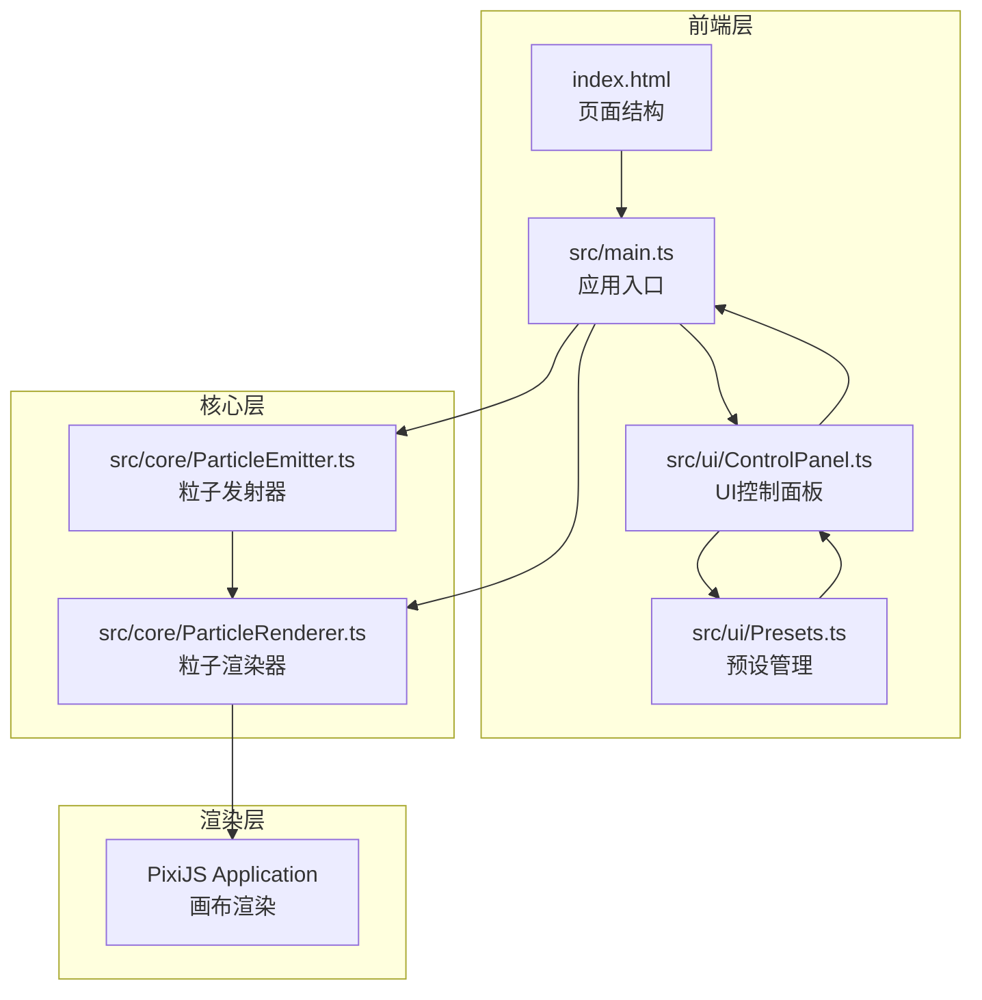

## 1. 架构设计



**数据流向**：
- 控制面板参数变更 → main.ts接收参数对象 → 传递给ParticleEmitter更新配置
- ParticleEmitter每帧更新粒子状态 → 返回粒子数组给ParticleRenderer
- ParticleRenderer接收粒子数组 → 使用PixiJS Graphics批量绘制到Stage
- 预设切换 → Presets提供参数 → ControlPanel更新UI → 触发参数变更流程

## 2. 技术说明

- 前端：TypeScript + PixiJS@7 + Vite（无框架，原生DOM操作）
- 构建工具：Vite（barebone配置，无插件）
- 运行时：浏览器原生ES模块
- 无后端、无数据库

## 3. 文件结构

```
├── package.json          # 依赖与脚本
├── vite.config.js        # Vite配置
├── tsconfig.json         # TypeScript配置
├── index.html            # 入口HTML
└── src/
    ├── main.ts           # 应用入口
    ├── core/
    │   ├── ParticleEmitter.ts   # 粒子发射器
    │   └── ParticleRenderer.ts  # 粒子渲染器
    └── ui/
        ├── ControlPanel.ts      # 控制面板
        └── Presets.ts           # 预设管理
```

### 3.1 文件职责与调用关系

| 文件 | 职责 | 调用关系 |
|------|------|----------|
| main.ts | 初始化PixiJS、挂载UI、渲染循环 | 导入并协调Emitter、Renderer、ControlPanel |
| ParticleEmitter.ts | 粒子对象池、发射速率、生命周期、速度、颜色渐变 | 被main.ts调用，提供粒子数组给Renderer |
| ParticleRenderer.ts | PixiJS Graphics批量绘制、混合模式 | 被main.ts调用，接收Emitter的粒子数据 |
| ControlPanel.ts | 滑块、颜色选择器、预设下拉、按钮 | 被main.ts初始化，通过回调传递参数给main.ts |
| Presets.ts | 5种内置预设、JSON导入导出 | 被ControlPanel调用，通过回调更新UI |

## 4. 核心数据结构

```typescript
interface ParticleConfig {
  emissionRate: number;
  initialSpeed: number;
  lifetime: number;
  size: number;
  spreadAngle: number;
  startColor: string;
  endColor: string;
}

interface Particle {
  x: number;
  y: number;
  vx: number;
  vy: number;
  life: number;
  maxLife: number;
  size: number;
  alpha: number;
  startColor: { r: number; g: number; b: number };
  endColor: { r: number; g: number; b: number };
  active: boolean;
}

interface PresetData {
  name: string;
  config: ParticleConfig;
}
```

## 5. 性能策略

- 粒子对象池：预分配粒子对象，避免GC压力
- 对象池回收：粒子数超过5000时自动启用回收机制，最大粒子数8000
- 批量绘制：使用PixiJS Graphics单次beginPath/fill批量绘制同色粒子
- 帧率监控：状态栏实时显示FPS，低于30FPS时触发降级策略
