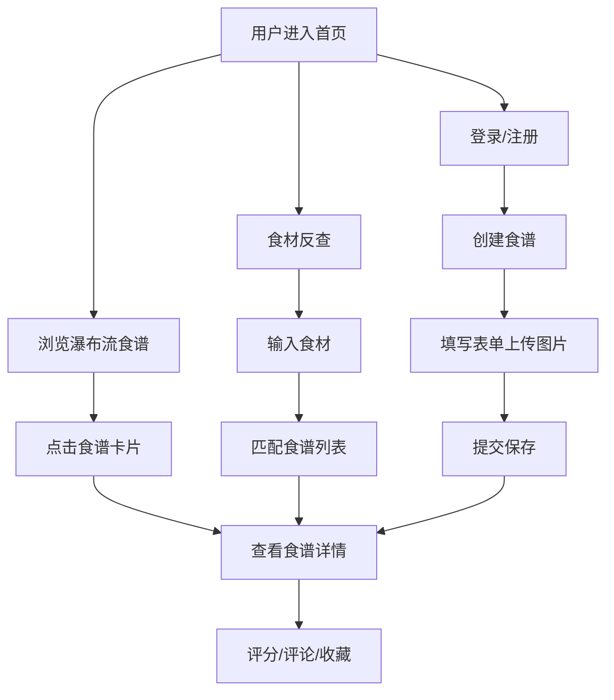

## 1. 产品概述

互动式食谱管理平台，让用户创建、搜索和分享烹饪食谱，支持基于冰箱食材的智能菜品推荐。

- **主要用途**：个人食谱管理、食材反查找菜、社区分享交流
- **目标用户**：家庭厨师、烹饪爱好者、健康饮食人群
- **核心价值**：降低决策成本，激发烹饪灵感，管理个人食谱库

## 2. 核心功能

### 2.1 用户角色

| 角色 | 注册方式 | 核心权限 |
|------|----------|----------|
| 普通用户 | 用户名+密码注册 | 创建食谱、搜索浏览、评分评论、收藏食谱 |

### 2.2 功能模块

1. **首页/发现页**：导航栏、搜索框、标签筛选、瀑布流食谱展示
2. **食谱详情页**：食谱详情、评分评论、相关推荐、收藏按钮
3. **创建食谱**：表单填写（标题、步骤、配料、图片、标签）
4. **用户登录/注册**：账号注册、登录、JWT 认证
5. **个人收藏**：收藏的食谱列表

### 2.3 页面详情

| 页面名称 | 模块名称 | 功能描述 |
|----------|----------|----------|
| 首页 | 顶部导航 | Logo、搜索框、登录/注册入口、个人中心 |
| 首页 | 标签筛选 | 中餐、甜点、低卡等分类标签切换 |
| 首页 | 瀑布流列表 | 食谱卡片网格展示，支持滚动加载更多 |
| 食材反查 | 食材输入 | 多食材输入，添加/删除标签式食材 |
| 食材反查 | 匹配结果 | 按匹配度排序的食谱列表 |
| 食谱详情 | 食谱信息 | 图片、标题、作者、配料、步骤 |
| 食谱详情 | 评分评论 | 五星评分、评论列表、发表评论 |
| 食谱详情 | 相关推荐 | 基于标签和浏览历史的推荐 |
| 创建食谱 | 表单 | 标题、标签、配料、步骤、图片上传 |
| 登录注册 | 表单 | 用户名、密码、登录/注册切换 |

## 3. 核心流程

**主流程**：用户进入首页 → 浏览瀑布流食谱 → 点击进入详情 → 查看配料步骤 → 评分/评论/收藏

**食材反查流程**：用户输入冰箱食材 → 系统匹配食谱 → 按匹配度排序展示 → 点击查看详情

**创建食谱流程**：用户登录 → 进入创建页 → 填写信息上传图片 → 提交保存 → 跳转到详情页

## 4. 用户界面设计

### 4.1 设计风格

- **主色调**：陶土橙 (#D96C3A)、米白 (#F8F2E8)
- **辅助色**：暖棕 (#8B5A2B)、奶油色 (#FFF9F0)
- **卡片风格**：圆角 16px，轻微投影，hover 上浮 + 发光动画
- **导航栏**：固定顶部，半透明毛玻璃效果 (backdrop-blur)
- **字体**：标题使用衬线字体增强质感，正文使用无衬线字体保证可读性
- **图标风格**：线性图标，暖色调，与整体风格统一

### 4.2 页面设计概览

| 页面名称 | 模块名称 | UI 元素 |
|----------|----------|----------|
| 首页 | 导航栏 | 毛玻璃背景、Logo、搜索框、用户头像 |
| 首页 | 标签栏 | 横向滚动标签胶囊，选中态陶土橙填充 |
| 首页 | 瀑布流 | 不等高卡片，两列/三列自适应，图片懒加载 |
| 食谱卡片 | - | 封面图、标题、标签、作者头像、评分星星 |
| 搜索框 | - | 圆角输入框，输入时下拉自动补全，打字动画 |
| 食材反查 | - | 标签式食材输入，匹配度进度条 |
| 详情页 | - | 大图横幅、配料清单、步骤序号、评论区 |
| 评论框 | - | 多行文本域，表情选择器，提交按钮 |

### 4.3 响应式

- **桌面端**：瀑布流 3 列，侧边筛选栏
- **平板端**：瀑布流 2-3 列自适应
- **移动端**：瀑布流 2 列，底部导航栏，触控优化
- 所有交互元素触控区域 ≥ 44px

### 4.4 动效设计

- **卡片 hover**：translateY(-4px) + 阴影加深 + 轻微发光
- **搜索框**：输入时边框发光，下拉选项渐入
- **瀑布流加载**：骨架屏脉冲动画，新卡片渐入
- **评分星星**：点击时缩放弹跳动画
- **收藏按钮**：心形填充动画
- **页面切换**：淡入淡出过渡
