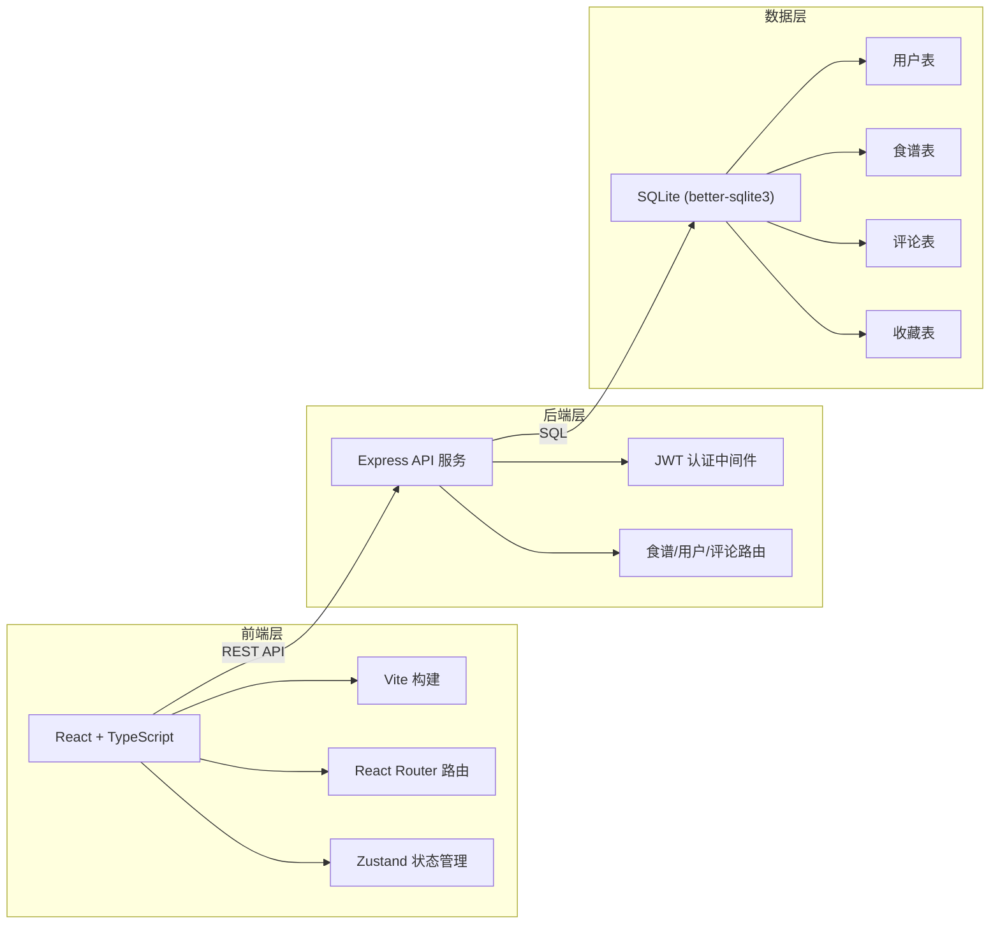
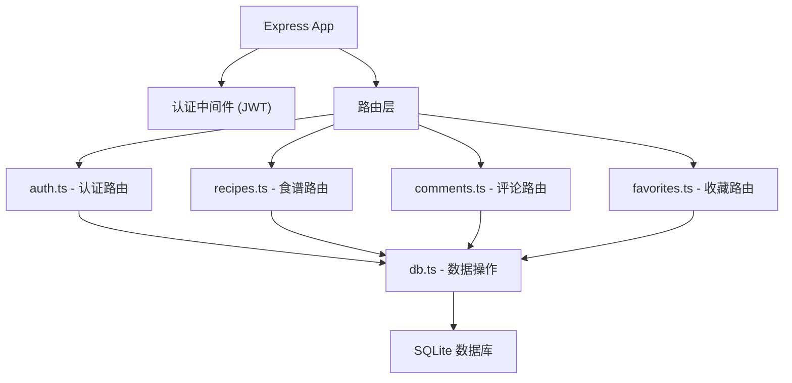

## 1. 架构设计



## 2. 技术选型

- **前端框架**：React 18 + TypeScript
- **构建工具**：Vite 5 + @vitejs/plugin-react
- **路由管理**：React Router DOM 6
- **状态管理**：Zustand
- **样式方案**：CSS Modules / 全局 CSS 变量
- **后端框架**：Express 4
- **数据库**：SQLite (better-sqlite3)
- **认证方案**：JWT (jsonwebtoken)
- **密码加密**：bcryptjs

## 3. 路由定义

| 路由 | 页面 | 用途 |
|------|------|------|
| `/` | 首页 | 瀑布流食谱展示、标签筛选 |
| `/recipe/:id` | 食谱详情 | 查看食谱、评分评论、收藏 |
| `/create` | 创建食谱 | 新建食谱表单 |
| `/search` | 搜索结果 | 关键词搜索、食材反查 |
| `/login` | 登录页 | 用户登录 |
| `/register` | 注册页 | 用户注册 |
| `/favorites` | 收藏页 | 我的收藏食谱 |
| `/profile` | 个人中心 | 用户信息、我的食谱 |

## 4. API 定义

### 4.1 认证接口

```typescript
// POST /api/auth/register
interface RegisterRequest {
  username: string;
  password: string;
}
interface AuthResponse {
  token: string;
  user: { id: number; username: string; avatar?: string };
}

// POST /api/auth/login
interface LoginRequest {
  username: string;
  password: string;
}
// 返回 AuthResponse
```

### 4.2 食谱接口

```typescript
interface Recipe {
  id: number;
  title: string;
  description: string;
  image: string;
  ingredients: { name: string; amount: string }[];
  steps: { order: number; content: string }[];
  tags: string[];
  authorId: number;
  authorName: string;
  rating: number;
  ratingCount: number;
  createdAt: string;
}

// GET /api/recipes - 分页获取食谱列表
// Query: page, limit, tag, search
interface RecipeListResponse {
  recipes: Recipe[];
  total: number;
  hasMore: boolean;
}

// GET /api/recipes/:id - 获取食谱详情
// POST /api/recipes - 创建食谱 (需认证)
// POST /api/recipes/:id/rating - 评分 (需认证)
// GET /api/recipes/:id/related - 相关推荐
```

### 4.3 食材匹配接口

```typescript
// POST /api/recipes/match
interface MatchRequest {
  ingredients: string[];
}
interface MatchRecipe extends Recipe {
  matchScore: number;
  matchedIngredients: string[];
  missingIngredients: string[];
}
// 返回 MatchRecipe[] 按 matchScore 降序
```

### 4.4 评论接口

```typescript
interface Comment {
  id: number;
  recipeId: number;
  userId: number;
  username: string;
  avatar?: string;
  content: string;
  rating: number;
  createdAt: string;
}

// GET /api/recipes/:id/comments
// POST /api/recipes/:id/comments (需认证)
```

### 4.5 收藏接口

```typescript
// GET /api/favorites (需认证)
// POST /api/favorites/:recipeId (需认证)
// DELETE /api/favorites/:recipeId (需认证)
```

## 5. 服务器架构图



## 6. 数据模型

### 6.1 数据模型定义

```mermaid
erDiagram
    USER ||--o{ RECIPE : creates
    USER ||--o{ COMMENT : writes
    USER ||--o{ FAVORITE : favorites
    RECIPE ||--o{ COMMENT : has
    RECIPE ||--o{ FAVORITE : favorited
    
    USER {
        number id PK
        string username
        string password_hash
        string avatar
        datetime created_at
    }
    
    RECIPE {
        number id PK
        string title
        string description
        string image
        string ingredients JSON
        string steps JSON
        string tags JSON
        number author_id FK
        number rating
        number rating_count
        datetime created_at
    }
    
    COMMENT {
        number id PK
        number recipe_id FK
        number user_id FK
        string content
        number rating
        datetime created_at
    }
    
    FAVORITE {
        number id PK
        number user_id FK
        number recipe_id FK
        datetime created_at
    }
```

### 6.2 初始数据

预置 10+ 条示例食谱数据，覆盖中餐、甜点、低卡等分类，包含完整的配料、步骤和图片 URL。

## 7. 性能优化

- **搜索优化**：SQLite FTS5 全文索引，响应时间 < 500ms
- **图片懒加载**：Intersection Observer API，按视口加载
- **瀑布流性能**：虚拟滚动 / 懒渲染，保持 60fps
- **前端缓存**：搜索结果、食谱详情本地缓存
- **防抖处理**：搜索框输入防抖 300ms
