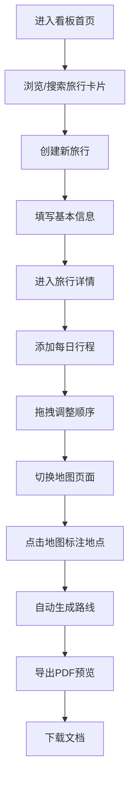

## 1. 产品概述

旅行规划看板是一款帮助用户可视化管理旅行计划的Web应用，支持创建旅行卡片、管理每日行程、在地图上标注地点并自动生成路线，最终可一键导出完整的旅行规划PDF文档。

- 主要用途：为自由行用户提供从行程规划到路线可视化的一站式解决方案
- 目标用户：自助旅行者、旅行规划爱好者、家庭出游组织者
- 产品价值：将复杂的旅行信息结构化展示，通过地图可视化和拖拽交互提升规划效率

## 2. 核心功能

### 2.1 用户角色

| 角色 | 注册方式 | 核心权限 |
|------|----------|----------|
| 普通用户 | 无需注册，本地存储 | 创建、编辑、删除旅行计划，导出PDF |

### 2.2 功能模块

1. **旅行看板首页**：卡片网格展示所有旅行计划，支持搜索筛选、创建和删除
2. **旅行详情页**：每日行程管理，支持添加、编辑、拖拽排序活动项目
3. **交互式地图页**：Leaflet地图集成，地点标注、路线自动生成
4. **PDF导出功能**：一键导出旅行规划文档，含封面、行程表、地图快照

### 2.3 页面详情

| 页面名称 | 模块名称 | 功能描述 |
|----------|----------|----------|
| 旅行看板首页 | 卡片网格 | 展示旅行目的地、日期范围、封面图，支持点击进入详情 |
| 旅行看板首页 | 搜索筛选 | 按目的地关键字搜索，按日期范围筛选，实时高亮匹配 |
| 旅行看板首页 | 空白状态 | 友好引导提示，快速创建第一个旅行计划 |
| 旅行详情页 | 每日行程列表 | 展示每日活动，支持添加、编辑、拖拽排序 |
| 旅行详情页 | 迷你时间线 | 底部显示行程总览时间线 |
| 旅行详情页 | 渐入动画 | 行程项目加载时的平滑过渡效果 |
| 地图页面 | 地图交互 | 点击添加标记，双击删除标记，弹出窗显示地点信息 |
| 地图页面 | 路线生成 | 按日期顺序自动连接地点生成折线路线 |
| 地图页面 | 分栏布局 | 左栏50%地图，右栏50%地点详情和编辑表单 |
| 导出预览页 | PDF预览 | 导出前预览文档样式，含封面、行程表格、地图快照 |

## 3. 核心流程

### 用户主要操作流程

1. 用户进入看板首页，浏览已有旅行卡片
2. 通过搜索筛选快速定位目标旅行计划
3. 点击"创建旅行"按钮，填写目的地、日期、上传封面
4. 进入旅行详情页，按天添加行程活动，通过拖拽调整顺序
5. 切换到地图页面，点击地图标注地点，自动生成连接路线
6. 点击导出按钮，预览PDF样式后一键下载

## 4. 用户界面设计

### 4.1 设计风格

- **主色调**：清新蓝绿色调（#14b8a6 青色、#0ea5e9 蓝色），营造旅行的清爽感
- **背景色**：暖灰色背景（#f8fafc），减少视觉疲劳
- **卡片设计**：圆角16px，柔和阴影（shadow-lg），hover时上浮4px并带有青绿色发光边框
- **按钮风格**：全圆角设计（rounded-full），蓝绿渐变背景，点击缩放动画
- **字体**：标题使用 'Inter' 字体，正文使用系统无衬线字体，层级清晰
- **动画过渡**：所有状态切换使用 0.2s cubic-bezier(0.4, 0, 0.2, 1) 缓动函数
- **图标**：统一使用 lucide-react 图标库，保持线性风格一致

### 4.2 页面设计概述

| 页面名称 | 模块名称 | UI 元素 |
|----------|----------|----------|
| 旅行看板首页 | 顶部导航 | 应用Logo、搜索框、筛选按钮、创建按钮 |
| 旅行看板首页 | 卡片网格 | 响应式Grid布局（PC端4列，平板2列，手机1列） |
| 旅行看板首页 | 卡片内容 | 封面图、目的地标签、日期范围、删除按钮 |
| 旅行看板首页 | 空白状态 | 插画占位、引导文案、创建按钮 |
| 旅行详情页 | 顶部区域 | 返回按钮、旅行标题、日期、切换到地图按钮 |
| 旅行详情页 | 日期标签页 | 横向滚动日期选择器，当前日期高亮 |
| 旅行详情页 | 活动列表 | 时间线布局，每项包含时间、地点、描述、拖拽手柄 |
| 旅行详情页 | 添加表单 | 展开式表单，时间选择器、地点输入、描述文本域 |
| 旅行详情页 | 迷你时间线 | 底部固定，显示每天活动数量概览 |
| 地图页面 | 地图区域 | 全屏Leaflet地图，自定义蓝绿色标记图标 |
| 地图页面 | 侧边面板 | 选中地点详情、编辑表单、地点列表 |
| 导出预览页 | 预览区域 | 模拟PDF页面样式，分页展示 |
| 导出预览页 | 操作栏 | 返回编辑、调整样式、下载按钮 |

### 4.3 响应式设计

- **PC端（>1024px）**：并排布局，地图与表单左右分栏各占50%
- **平板端（768px-1024px）**：上下布局，地图在上表单在下
- **手机端（<768px）**：单列堆叠，所有卡片和面板垂直排列，触控目标增大到44x44px，支持滑动手势操作

### 4.4 动画与微交互

- **页面加载**：卡片依次渐入（staggered fade-in），延迟50ms递增
- **卡片hover**：translateY(-4px) + 阴影增强 + 青绿色外发光
- **拖拽排序**：被拖拽项缩放1.02，半透明，目标位置显示占位条
- **搜索高亮**：匹配文字背景色从透明过渡到黄色（#fef08a）再淡出
- **地图标记**：添加时弹跳动画，删除时淡出缩小
- **路线绘制**：stroke-dashoffset 动画模拟路径绘制过程

### 4.5 性能优化

- **虚拟滚动**：超过20张旅行卡片时启用虚拟列表，保持60fps滚动
- **地图聚合**：30个以上标记时启用MarkerCluster聚合，保证200ms内响应
- **节流防抖**：搜索输入防抖300ms，地图事件节流100ms
- **图片懒加载**：封面图使用Intersection Observer实现懒加载
