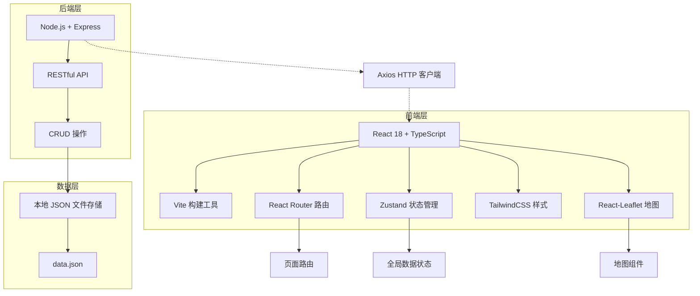
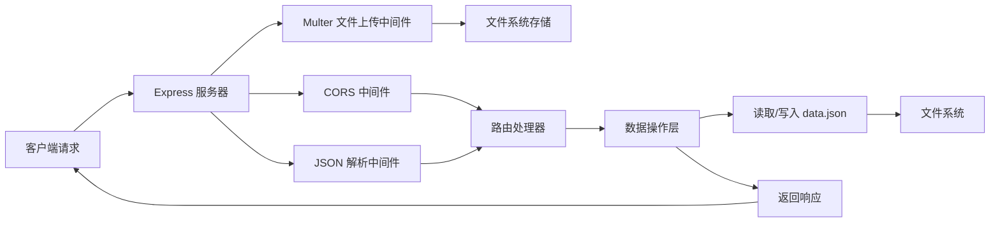
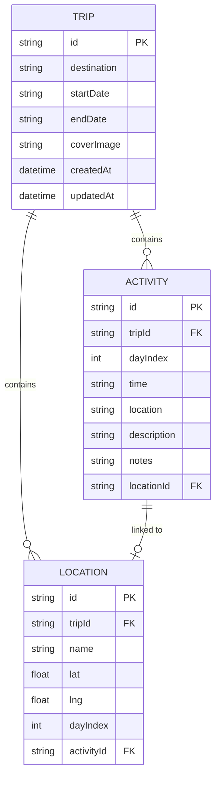

## 1. 架构设计



## 2. 技术栈说明

### 前端技术
- **框架**：React 18 + TypeScript 5，严格模式开启
- **构建工具**：Vite 5，支持 HMR 热更新
- **路由**：react-router-dom v6，单页应用路由管理
- **状态管理**：Zustand，轻量级全局状态管理
- **样式**：TailwindCSS 3.4，原子化CSS
- **地图**：react-leaflet v4 + leaflet v1.9，交互式地图
- **HTTP客户端**：axios v1，统一API请求
- **拖拽**：@dnd-kit/core + @dnd-kit/sortable，高性能拖拽排序
- **PDF导出**：html2canvas + jspdf，客户端PDF生成
- **图标**：lucide-react，轻量级图标库

### 后端技术
- **运行时**：Node.js 18+
- **框架**：Express 4，Web应用框架
- **数据存储**：本地JSON文件，无需数据库
- **CORS**：cors 中间件处理跨域
- **文件上传**：multer 处理封面图上传

### 项目初始化
- **初始化工具**：`pnpm create vite-init@latest . --template react-express-ts --force`
- **包管理器**：pnpm（优先）或 npm

## 3. 目录结构

```
travel-board/
├── package.json                 # 项目依赖和脚本
├── vite.config.js               # Vite 配置
├── tsconfig.json                # TypeScript 配置
├── index.html                   # 入口HTML
├── src/
│   ├── App.tsx                  # 主应用组件，路由配置
│   ├── main.tsx                 # 应用入口
│   ├── index.css                # 全局样式
│   ├── pages/
│   │   ├── BoardPage.tsx        # 看板首页
│   │   ├── TripDetailPage.tsx   # 旅行详情页
│   │   ├── MapPage.tsx          # 地图页面
│   │   └── ExportPreviewPage.tsx # 导出预览页
│   ├── components/
│   │   ├── TripBoard.tsx        # 旅行看板组件
│   │   ├── TripCard.tsx         # 旅行卡片组件
│   │   ├── DayPlan.tsx          # 每日行程组件
│   │   ├── ActivityItem.tsx     # 活动项组件
│   │   ├── MapView.tsx          # 地图组件
│   │   ├── MiniTimeline.tsx     # 迷你时间线组件
│   │   ├── SearchFilter.tsx     # 搜索筛选组件
│   │   ├── EmptyState.tsx       # 空白状态组件
│   │   └── Modal/               # 弹窗组件目录
│   ├── store/
│   │   ├── useTripStore.ts      # 旅行数据状态管理
│   │   └── useUiStore.ts        # UI状态管理
│   ├── dataStore.ts             # 后端API数据层
│   ├── types/
│   │   └── index.ts             # TypeScript 类型定义
│   ├── utils/
│   │   ├── pdfExport.ts         # PDF导出工具
│   │   ├── mapUtils.ts          # 地图工具函数
│   │   └── dateUtils.ts         # 日期处理工具
│   └── hooks/
│       ├── useVirtualScroll.ts  # 虚拟滚动Hook
│       └── useDebounce.ts       # 防抖Hook
├── server/
│   ├── index.js                 # Express 服务器入口
│   ├── routes/
│   │   └── trips.js             # 旅行数据API路由
│   └── data/
│       └── data.json            # 数据存储文件
└── public/
    └── uploads/                 # 上传图片存储目录
```

## 4. 路由定义

| 路由路径 | 页面名称 | 说明 |
|----------|----------|------|
| `/` | 旅行看板首页 | 展示所有旅行卡片，搜索筛选 |
| `/trip/:id` | 旅行详情页 | 管理每日行程，拖拽排序 |
| `/trip/:id/map` | 地图页面 | 地点标注，路线生成 |
| `/trip/:id/export` | 导出预览页 | PDF预览和下载 |
| `*` | 404页面 | 路由未匹配时重定向到首页 |

## 5. API 接口定义

### 5.1 数据类型定义

```typescript
interface Location {
  id: string;
  name: string;
  lat: number;
  lng: number;
  dayIndex: number;
  activityId?: string;
}

interface Activity {
  id: string;
  dayIndex: number;
  time: string;
  location: string;
  description: string;
  notes: string;
  locationId?: string;
}

interface Trip {
  id: string;
  destination: string;
  startDate: string;
  endDate: string;
  coverImage: string;
  activities: Activity[];
  locations: Location[];
  createdAt: string;
  updatedAt: string;
}
```

### 5.2 API 接口列表

| 方法 | 路径 | 描述 | 请求体 | 响应 |
|------|------|------|--------|------|
| GET | `/api/trips` | 获取所有旅行计划 | - | `Trip[]` |
| GET | `/api/trips/:id` | 获取单个旅行详情 | - | `Trip` |
| POST | `/api/trips` | 创建新旅行 | `{ destination, startDate, endDate, coverImage? }` | `Trip` |
| PUT | `/api/trips/:id` | 更新旅行信息 | `Partial<Trip>` | `Trip` |
| DELETE | `/api/trips/:id` | 删除旅行 | - | `{ success: boolean }` |
| POST | `/api/trips/:id/activities` | 添加活动 | `Activity` | `Activity` |
| PUT | `/api/trips/:id/activities/:activityId` | 更新活动 | `Partial<Activity>` | `Activity` |
| DELETE | `/api/trips/:id/activities/:activityId` | 删除活动 | - | `{ success: boolean }` |
| PUT | `/api/trips/:id/activities/reorder` | 重新排序活动 | `{ activityIds: string[], dayIndex: number }` | `{ success: boolean }` |
| POST | `/api/trips/:id/locations` | 添加地点标记 | `Location` | `Location` |
| DELETE | `/api/trips/:id/locations/:locationId` | 删除地点标记 | - | `{ success: boolean }` |
| POST | `/api/upload` | 上传封面图 | `FormData (file)` | `{ url: string }` |

## 6. 服务器架构



## 7. 数据模型

### 7.1 实体关系图



### 7.2 data.json 结构

```json
{
  "trips": [
    {
      "id": "trip_001",
      "destination": "东京",
      "startDate": "2024-07-01",
      "endDate": "2024-07-07",
      "coverImage": "/uploads/tokyo.jpg",
      "activities": [
        {
          "id": "act_001",
          "dayIndex": 0,
          "time": "09:00",
          "location": "浅草寺",
          "description": "参观东京最古老的寺庙",
          "notes": "记得穿舒适的鞋子",
          "locationId": "loc_001"
        }
      ],
      "locations": [
        {
          "id": "loc_001",
          "name": "浅草寺",
          "lat": 35.7148,
          "lng": 139.7967,
          "dayIndex": 0,
          "activityId": "act_001"
        }
      ],
      "createdAt": "2024-06-01T10:00:00Z",
      "updatedAt": "2024-06-01T10:00:00Z"
    }
  ]
}
```

## 8. 性能保障方案

### 8.1 前端性能优化

| 优化点 | 实施方案 | 性能指标 |
|--------|----------|----------|
| 列表滚动 | 虚拟滚动（react-window），只渲染可视区域 | 20+卡片保持60fps |
| 地图性能 | MarkerCluster 聚合，超过30个标记自动聚合 | 地图操作响应 < 200ms |
| 搜索性能 | 防抖300ms，前端缓存搜索结果 | 实时搜索无卡顿 |
| 图片优化 | WebP格式，懒加载，生成缩略图 | LCP < 2s |
| 打包优化 | 代码分割，Tree Shaking，按需加载 | 首屏JS < 200KB |

### 8.2 关键实现策略

1. **拖拽排序**：使用 @dnd-kit 替代 react-beautiful-dnd，性能更优
2. **地图标记**：自定义 Canvas 渲染标记，避免 DOM 节点过多
3. **状态管理**：Zustand 选择器订阅，避免不必要的重渲染
4. **动画优化**：使用 transform 和 opacity 属性，触发 GPU 加速
5. **API缓存**：SWR 或 React Query 做请求缓存和重试（轻量场景可用简单内存缓存）
