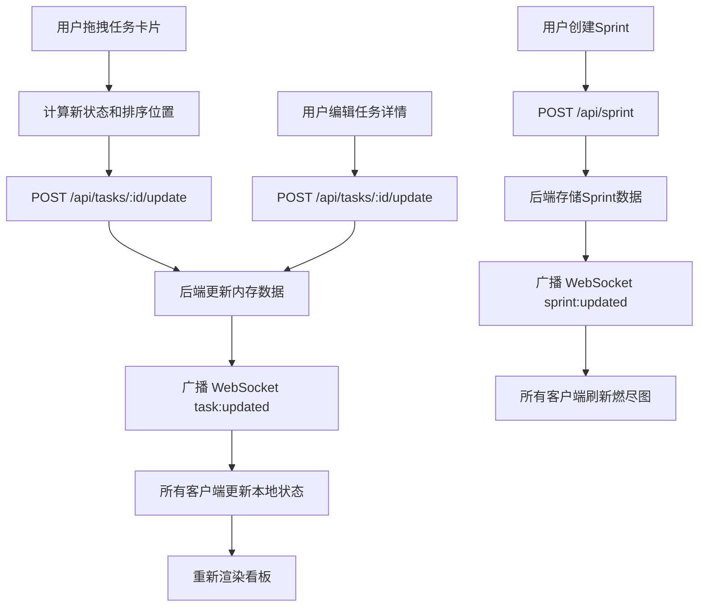

## 1. 产品概述

团队敏捷看板是一款轻量级敏捷开发管理工具，旨在替代Jira，为敏捷团队提供可视化任务管理、Sprint规划与燃尽图追踪功能。核心价值在于极简操作、实时协作和快速响应，面向中小型敏捷开发团队。

- 目标用户：5-20人敏捷开发团队的产品经理、开发者和测试人员
- 核心诉求：轻量替代Jira，可视化看板拖拽，实时多人协作

## 2. 核心功能

### 2.1 用户角色

| 角色 | 注册方式 | 核心权限 |
|------|----------|----------|
| 团队成员 | 自动分配（输入昵称加入） | 查看看板、创建/编辑/拖拽任务、查看燃尽图 |
| 所有在线用户 | 实时同步 | 所有操作实时广播至在线用户 |

### 2.2 功能模块

1. **看板页面**：三泳道看板、任务卡片拖拽、详情弹窗编辑
2. **Sprint面板**：Sprint创建/编辑、燃尽图可视化、故事点统计
3. **在线协作**：实时WebSocket同步、在线用户列表、操作日志

### 2.3 页面详情

| 页面名称 | 模块名称 | 功能描述 |
|----------|----------|----------|
| 看板页面 | 三泳道看板 | 待办/进行中/已完成三个竖排泳道，支持跨泳道拖拽任务卡片，拖拽时半透明视觉反馈 |
| 看板页面 | 任务卡片 | 显示标题、负责人、优先级（红/黄/绿圆形标识）、状态；点击打开详情弹窗 |
| 看板页面 | 详情弹窗 | 编辑标题、描述、优先级、负责人；修改后实时同步至所有在线用户 |
| Sprint面板 | Sprint规划 | 创建Sprint、设定起止日期和总故事点数 |
| Sprint面板 | 燃尽图 | 折线图：虚线为理想线，实线为实际完成线；X轴日期，Y轴剩余点数 |
| 右侧栏 | 在线用户列表 | 显示当前在线用户昵称 |
| 右侧栏 | 操作日志 | 记录所有任务变更操作及操作人 |

## 3. 核心流程

**任务拖拽流程**：用户拖拽卡片 → 计算新泳道和排序 → 发送HTTP请求更新后端 → 后端广播WebSocket事件 → 所有客户端更新UI

**Sprint燃尽图流程**：创建Sprint设定故事点 → 每日完成任务减少剩余点数 → 系统自动生成燃尽图数据 → WebSocket推送更新 → 图表实时刷新

## 4. 用户界面设计

### 4.1 设计风格

- 主色调：蓝灰（#2c3e50）和白色（#ffffff）
- 按钮和标签：柔和蓝色（#3498db）
- 优先级标签：圆形小标识 — 绿色（低）、黄色（中）、红色（高）
- 泳道分隔线：细腻的 #e0e0e0
- 拖拽效果：box-shadow: 0 6px 12px rgba(0,0,0,0.15)，半透明跟随
- 弹窗动画：淡入 transition: opacity 0.3s
- 极简主义设计，充足留白，信息密度适中

### 4.2 页面设计概述

| 页面名称 | 模块名称 | UI元素 |
|----------|----------|--------|
| 看板页面 | 三栏布局 | 左侧栏20%（Sprint面板+全局按钮）、中间60%（看板主体）、右侧栏20%（在线用户+日志） |
| 看板页面 | 泳道区域 | 三列等宽泳道，#e0e0e0分隔线，每列顶部泳道标题 |
| 看板页面 | 任务卡片 | 白色圆角卡片，左上角优先级圆形标识，标题加粗，负责人灰色小字 |
| 看板页面 | 详情弹窗 | 模态遮罩+居中卡片，表单字段：标题/描述/优先级下拉/负责人输入，淡入动画 |
| Sprint面板 | 燃尽图 | recharts折线图，虚线理想线+实线实际线，蓝灰色调 |
| 右侧栏 | 在线列表 | 圆形头像+昵称，绿色在线状态点 |
| 右侧栏 | 操作日志 | 时间戳+操作描述，最新操作在顶部 |

### 4.3 响应式设计

- 桌面优先，三栏布局
- 小屏幕（<768px）：左侧栏和右侧栏折叠为顶栏按钮触发的侧滑抽屉
- 中间看板区域在小屏幕上横向滚动
- 触控优化：拖拽区域和按钮适当增大点击区域

### 4.4 性能约束

- 交互响应时间（拖拽、弹窗打开）< 100ms
- WebSocket端到端延迟 < 50ms
- 拖拽使用CSS transform实现硬件加速
- React列表使用key优化渲染
