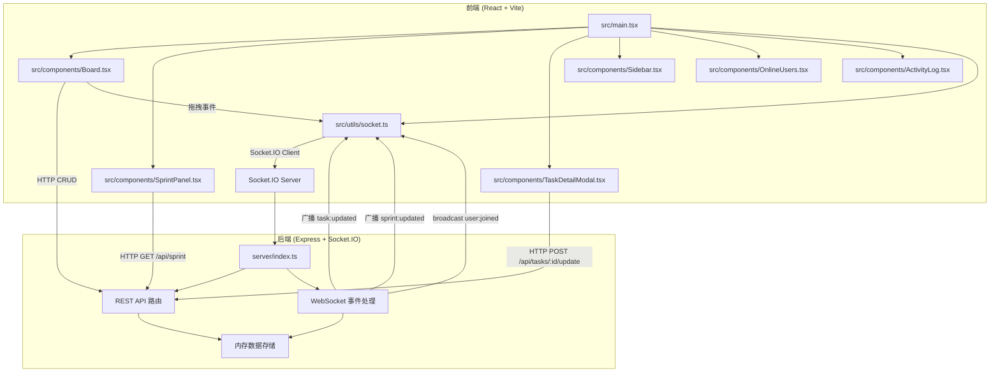
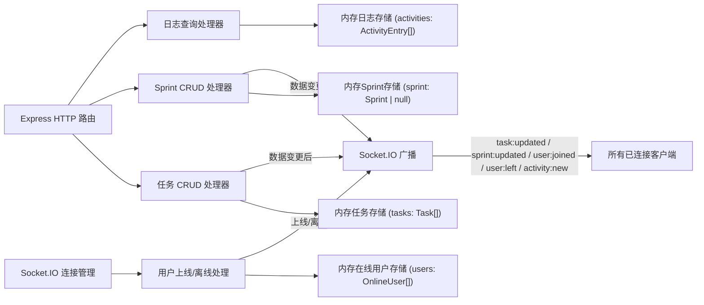
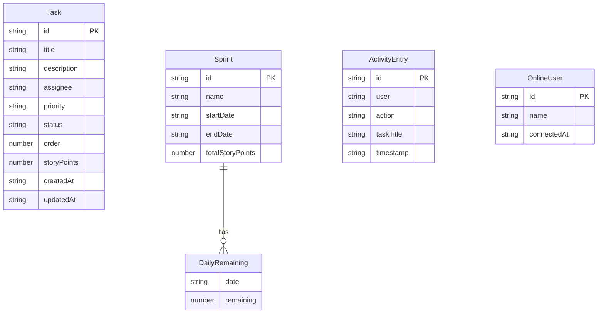

## 1. 架构设计



## 2. 技术说明

- 前端：React 18 + TypeScript + Vite + Tailwind CSS
- 初始化工具：vite-init（react-express-ts模板）
- 后端：Express 4 + Socket.IO
- 数据库：内存存储模拟（Map/数组）
- 状态管理：Zustand
- 图表：Recharts
- 拖拽：@hello-pangea/dnd（react-beautiful-dnd的维护分支，支持React 18）
- 图标：lucide-react
- 实时通信：Socket.IO（WebSocket协议）

## 3. 路由定义

| 路由 | 用途 |
|------|------|
| / | 看板主页面（包含三泳道、Sprint面板、在线用户、操作日志） |

## 4. API定义

### 4.1 TypeScript 类型定义

```typescript
interface Task {
  id: string;
  title: string;
  description: string;
  assignee: string;
  priority: 'high' | 'medium' | 'low';
  status: 'todo' | 'in-progress' | 'done';
  order: number;
  storyPoints: number;
  createdAt: string;
  updatedAt: string;
}

interface Sprint {
  id: string;
  name: string;
  startDate: string;
  endDate: string;
  totalStoryPoints: number;
  dailyRemaining: { date: string; remaining: number }[];
}

interface ActivityEntry {
  id: string;
  user: string;
  action: string;
  taskTitle: string;
  timestamp: string;
}

interface OnlineUser {
  id: string;
  name: string;
  connectedAt: string;
}
```

### 4.2 REST API

| 方法 | 路径 | 请求体 | 响应 | 用途 |
|------|------|--------|------|------|
| GET | /api/tasks | - | Task[] | 获取所有任务 |
| POST | /api/tasks | Partial<Task> | Task | 创建新任务 |
| POST | /api/tasks/:id/update | Partial<Task> | Task | 更新任务（含状态变更、排序） |
| DELETE | /api/tasks/:id | - | { success: boolean } | 删除任务 |
| GET | /api/sprint | - | Sprint \| null | 获取当前Sprint |
| POST | /api/sprint | Partial<Sprint> | Sprint | 创建/更新Sprint |
| GET | /api/activities | - | ActivityEntry[] | 获取操作日志 |
| GET | /api/users/online | - | OnlineUser[] | 获取在线用户列表 |

### 4.3 WebSocket 事件

| 事件名 | 方向 | 数据 | 用途 |
|--------|------|------|------|
| task:updated | Server → Client | Task | 任务被创建/更新/删除时广播 |
| sprint:updated | Server → Client | Sprint | Sprint数据变更时广播 |
| user:joined | Server → Client | OnlineUser | 新用户加入时广播 |
| user:left | Server → Client | { id: string } | 用户离开时广播 |
| activity:new | Server → Client | ActivityEntry | 新操作日志时广播 |

## 5. 服务端架构图



## 6. 数据模型

### 6.1 数据模型定义



### 6.2 数据初始化

应用启动时预置示例数据：
- 6条示例任务（2条待办、2条进行中、2条已完成）
- 1个示例Sprint（7天周期，含每日剩余点数数据）
- 空操作日志列表
