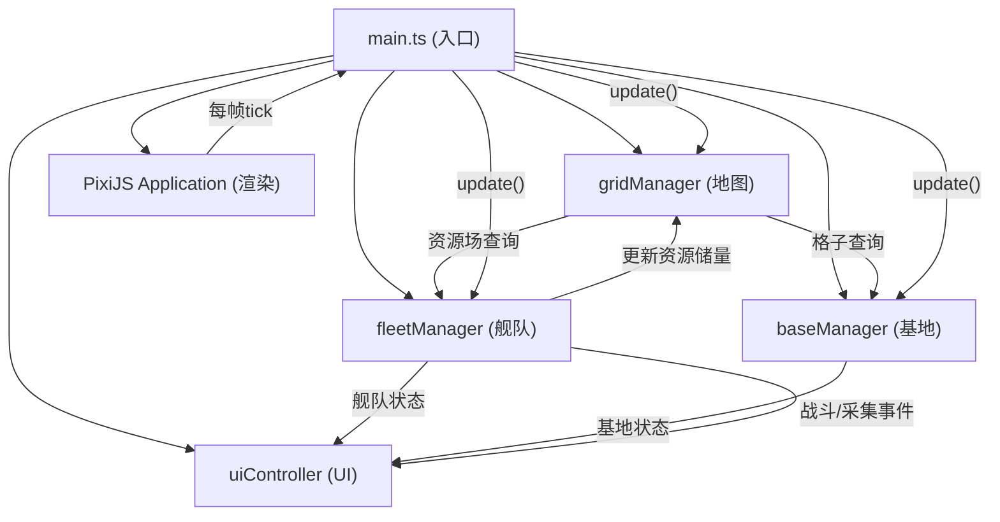

# 太空资源采集与舰队管理沙盒 - 技术架构文档

## 1. 技术选型

| 类别 | 技术 | 版本 | 选型理由 |
|------|------|------|----------|
| 开发语言 | TypeScript | 5.x | 类型安全，提升大型项目可维护性 |
| 渲染引擎 | PixiJS | 7.x | 高性能2D WebGL渲染，粒子系统支持好 |
| 构建工具 | Vite | 5.x | 极速热更新，开箱即用TS支持 |
| 模块系统 | ESNext | - | 原生ESM，tree-shaking友好 |

---

## 2. 目录结构

```
auto16/
├── index.html                      # 应用入口HTML
├── package.json                    # 依赖与脚本
├── vite.config.js                  # Vite配置
├── tsconfig.json                   # TypeScript配置
└── src/
    ├── main.ts                     # 应用入口，初始化所有模块
    ├── map/
    │   ├── gridManager.ts          # 网格地图管理
    │   └── resourceField.ts        # 资源场对象
    ├── ai/
    │   ├── fleetManager.ts         # 舰队调度与A*寻路
    │   └── ship.ts                 # 单个飞船对象
    ├── core/
    │   └── baseManager.ts          # 基地管理与升级逻辑
    └── ui/
        └── uiController.ts         # UI面板与DOM更新
```

---

## 3. 模块架构与数据流向



---

## 4. 核心模块设计

### 4.1 地图生成模块 (src/map/)

#### gridManager.ts
- **职责**: 管理100×100网格、资源场分布、障碍物位置
- **核心数据结构**:
  ```typescript
  interface GridCell {
      x: number;
      y: number;
      type: 'empty' | 'obstacle' | 'resource' | 'base';
      resourceField?: ResourceField;
      baseId?: string;
  }
  ```
- **关键方法**:
  - `generateMap(seed?)`: 生成地图，随机分布资源场和障碍物
  - `getCell(x, y)`: 查询指定格子
  - `getNeighbors(x, y)`: 获取8邻域格子（供A*使用）
  - `isWalkable(x, y)`: 判断格子是否可通行
  - `findNearestResource(type, fromX, fromY)`: 查找最近的某类资源

#### resourceField.ts
- **职责**: 单个资源场对象，管理储量与采集
- **核心属性**:
  ```typescript
  enum ResourceType { IRON = 'iron', CRYSTAL = 'crystal', GAS = 'gas' }
  
  class ResourceField {
      id: string;
      type: ResourceType;
      x: number;
      y: number;
      totalReserve: number;      // 总储量
      remaining: number;         // 剩余量
      efficiency: number;        // 采集效率 (单位/秒)
      scale: number;             // 当前显示缩放
      isDepleted: boolean;
  }
  ```
- **关键方法**:
  - `harvest(amount)`: 采集资源，返回实际采集量
  - `updateVisual(delta)`: 更新缩放动画
  - `playDepleteAnimation()`: 播放耗尽消失动画

---

### 4.2 AI调度模块 (src/ai/)

#### fleetManager.ts
- **职责**: 舰队创建、路径规划、采集调度、战斗逻辑
- **A* 寻路算法**:
  - 启发函数: 欧几里得距离
  - 代价: 基础移动代价 + 障碍惩罚 + 舰队避让代价
  - 路径平滑: 关键点简化 + 线性插值
- **核心数据结构**:
  ```typescript
  enum FleetState { IDLE, MOVING_TO_TARGET, HARVESTING, RETURNING, FIGHTING }
  
  interface Fleet {
      id: string;
      ships: Ship[];
      state: FleetState;
      targetResourceId?: string;
      homeBaseId: string;
      path: { x: number; y: number }[];
      pathIndex: number;
      cargo: { iron: number; crystal: number; gas: number };
      cargoCapacity: number;
      speed: number;             // 格子/秒
      speedCoefficient: number;  // 显示用速度系数
  }
  ```
- **关键方法**:
  - `createFleet(baseId, shipCount)`: 创建舰队
  - `assignTarget(fleetId, resourceId)`: 分配采集目标
  - `update(delta)`: 主循环，处理移动/采集/战斗
  - `calculatePath(from, to)`: A*路径计算
  - `checkPirateEncounter(fleet)`: 海盗遭遇检测
  - `resolveCombat(fleet, pirate)`: 战斗结算

#### ship.ts
- **职责**: 单个飞船对象，位置/HP/粒子拖尾
- **核心属性**:
  ```typescript
  class Ship {
      id: string;
      fleetId: string;
      x: number;
      y: number;
      hp: number;
      maxHp: number;
      firepower: number;    // 火力值
      armor: number;        // 护甲值
      angle: number;        // 朝向角度 (弧度)
      trailParticles: Particle[];  // 拖尾粒子
  }
  ```
- **关键方法**:
  - `moveToward(targetX, targetY, delta, speed)`: 平滑移动
  - `updateTrail(delta)`: 更新粒子拖尾
  - `takeDamage(amount)`: 受到伤害

---

### 4.3 核心模块 (src/core/)

#### baseManager.ts
- **职责**: 基地创建、升级逻辑、仓库管理
- **核心数据结构**:
  ```typescript
  interface Base {
      id: string;
      name: string;
      level: number;               // 1-5
      x: number;
      y: number;
      warehouse: {
          iron: number;
          crystal: number;
          gas: number;
          capacity: number;        // 随等级提升
      };
      buildSpeed: number;          // 随等级提升
      upgradeRippleTime: number;   // 升级波纹动画计时
  }
  
  interface UpgradeCost {
      iron: number;
      crystal: number;
      gas: number;
  }
  ```
- **升级消耗表**:
  | 等级 | 铁矿 | 水晶 | 气体 |
  |------|------|------|------|
  | 1→2 | 100 | 50 | 30 |
  | 2→3 | 250 | 150 | 80 |
  | 3→4 | 500 | 300 | 200 |
  | 4→5 | 1000 | 600 | 400 |
- **关键方法**:
  - `createBase(x, y)`: 创建基地
  - `upgradeBase(baseId)`: 执行升级（检查资源→扣除→提升等级）
  - `depositResources(baseId, cargo)`: 存入资源
  - `getUpgradeCost(level)`: 获取升级消耗
  - `getInfluenceRange(level)`: 获取影响范围（格子数）

---

### 4.4 UI模块 (src/ui/)

#### uiController.ts
- **职责**: DOM面板更新、动画、事件绑定
- **子面板**:
  1. 左侧：舰队控制栏 + 基地列表（可滚动）
  2. 右上：地图缩略预览
  3. 右下：实时统计面板
- **核心数据**:
  ```typescript
  interface GameStats {
      totalHarvested: { iron: number; crystal: number; gas: number };
      activeFleets: number;
      totalBases: number;
      piratesDefeated: number;
      runTime: number;  // 秒
  }
  ```
- **关键方法**:
  - `updateStats(stats)`: 更新统计面板（数字滚动动画）
  - `renderFleetList(fleets)`: 渲染舰队列表
  - `renderBaseList(bases)`: 渲染基地列表
  - `showCombatPopup(x, y, damage, isWin)`: 战斗伤害跳字
  - `bindEvents()`: 绑定按钮/卡片交互事件

---

## 5. PixiJS 渲染层设计

### 5.1 容器层级结构
```
PIXI.Application.stage
├── backgroundContainer       (星空背景)
│   ├── gradientSprite        (深空渐变)
│   └── starParticles         (静态星星)
├── gridContainer             (100×100网格)
│   ├── gridLines             (半透明发光网格线)
│   └── influenceHighlights   (基地影响范围高亮)
├── resourceContainer         (资源场)
│   └── ResourceField Sprite[]
├── baseContainer             (基地)
│   └── Base Sprite[] (+ upgradeRipple effects)
├── fleetContainer            (舰队)
│   ├── Ship Sprite[]
│   └── trailParticleContainer (拖尾粒子)
└── uiOverlayContainer        (Canvas层UI: 路径线、战斗特效)
    ├── pathLines             (舰队路径可视化)
    └── combatEffects         (战斗动画)
```

### 5.2 视觉效果实现

| 效果 | 实现方案 |
|------|----------|
| 六边形发光 | PIXI.Graphics 绘制六边形 + `blur` 滤镜 + 多层叠加 |
| 脉冲缩放 | `Math.sin(time * pulseSpeed)` 驱动 `scale` |
| 粒子拖尾 | 对象池复用 Particle，alpha渐变 + 缩小 |
| 升级波纹 | 同心圆Graphics，scale扩大 + alpha减小 |
| 伤害跳字 | PIXI.BitmapText / Text，向上移动 + fadeOut |
| 毛玻璃面板 | CSS: `backdrop-filter: blur(10px)` + 半透明背景 |
| 霓虹描边 | CSS: `box-shadow` + `border` 双层发光 |

---

## 6. 性能优化策略

### 6.1 渲染优化
- **视口裁剪**: 只渲染 Camera 可见区域内的对象
- **粒子对象池**: 拖尾/特效粒子复用，避免频繁GC
- **批量渲染**: 同类Sprite使用同一Texture，启用Pixi批处理
- **纹理缓存**: 六边形/三角形等图形预渲染为RenderTexture

### 6.2 逻辑优化
- **A* 路径缓存**: 同一起终点的路径复用，仅地图变化时重算
- **分帧计算**: 大量舰队的路径计算分摊到多帧
- **空间分区**: 资源/舰队按网格区块索引，加速邻近查询
- **海盗遭遇**: 仅在舰队移动时按概率检测，非每帧全量检测

### 6.3 UI优化
- **DOM 最小更新**: 使用虚拟列表渲染基地/舰队列表
- **RAF 合并**: 统计面板更新与Pixi主循环同步，避免额外重排
- **CSS 硬件加速**: 面板动画使用 `transform` + `opacity`

---

## 7. 事件与通信

### 7.1 事件总线
使用轻量级自定义事件系统（或简单的回调数组）实现模块间解耦：

```typescript
type EventType = 
  | 'fleet:created'
  | 'fleet:stateChanged'
  | 'fleet:arrived'
  | 'resource:depleted'
  | 'base:upgraded'
  | 'combat:occurred'
  | 'stats:updated';
```

### 7.2 模块依赖规则
- `main.ts` 持有所有 Manager 实例
- Manager 之间通过事件通信，不直接引用
- `uiController` 可读取所有 Manager 的公开只读数据
- 数据单向流动：用户操作 → Manager 更新 → 事件通知 → UI 更新

---

## 8. 构建与运行

- **开发**: `npm run dev` → Vite dev server (HMR)
- **构建**: `tsc && vite build` → 输出到 `dist/`
- **类型检查**: 严格模式（`strict: true`），启用 `noImplicitAny`
