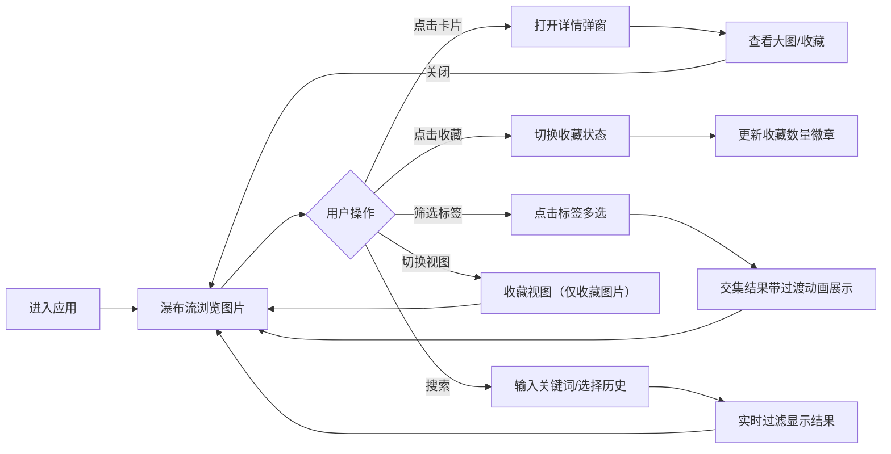

## 1. 产品概述
交互式画廊看板应用，以瀑布流布局展示图片，支持收藏、标签筛选、搜索和详情查看功能。
- 面向需要浏览、筛选和管理大量图片的用户群体，解决图片快速浏览、分类收藏、标签定位的需求
- 目标是打造高性能、极简设计风格的图片浏览体验

## 2. 核心功能

### 2.1 用户角色（如适用）
| 角色 | 注册方式 | 核心权限 |
|------|----------|----------|
| 普通用户 | 无需注册 | 浏览图片、搜索、标签筛选、收藏管理 |

### 2.2 功能模块
1. **画廊主页**：瀑布流图片网格、顶部导航栏、侧边标签筛选面板
2. **收藏视图**：仅展示已收藏图片，支持搜索和标签筛选
3. **图片详情弹窗**：大图查看、标题/标签展示、收藏操作

### 2.3 页面详情
| 页面名称 | 模块名称 | 功能描述 |
|----------|----------|----------|
| 画廊主页 | 瀑布流网格 | 2-5列自适应瀑布流，卡片悬浮放大动画，图片懒加载 |
| 画廊主页 | 搜索栏 | 防抖300ms搜索、清除按钮、搜索历史下拉（最近5条）、自动完成建议 |
| 画廊主页 | 标签筛选面板 | 去重排序标签列表、多选筛选、带图片数量统计、切换动画 |
| 画廊主页 | 导航栏 | 视图切换（全部/收藏）、收藏数量统计徽章 |
| 收藏视图 | 收藏列表 | 仅显示收藏图片，同样支持搜索和标签筛选 |
| 图片详情弹窗 | 详情展示 | 大图、标题、标签、收藏按钮、Esc/点击外部关闭、背景模糊 |

## 3. 核心流程
用户进入应用后，默认在画廊主页浏览瀑布流图片；可通过顶部搜索栏输入关键词搜索，或点击侧边标签进行筛选；点击心形按钮收藏图片；点击图片卡片打开详情弹窗；通过导航切换到收藏视图查看收藏的图片。

## 4. 用户界面设计
### 4.1 设计风格
- 主色调：白色 + 浅灰背景（#f8f9fa）
- 文字/强调色：深蓝灰（#2c3e50）
- 收藏按钮：渐变红色（#ff6b6b → #ee5a24）
- 卡片阴影：`0 2px 8px rgba(0,0,0,0.08)`，悬浮时加深至 `rgba(0,0,0,0.3)` 并上移4px
- 字体：系统字体栈（-apple-system, BlinkMacSystemFont, 'Segoe UI'），行高1.6
- 动画：CSS过渡，0.2-0.3秒，ease-out缓动
- 背景模糊：下拉菜单、模态框使用 `backdrop-filter: blur(4px)`

### 4.2 页面设计概述
| 页面名称 | 模块名称 | UI元素 |
|----------|----------|--------|
| 画廊主页 | 导航栏 | 左侧Logo、中间/右侧搜索、右侧收藏按钮带数量徽章、视图切换 |
| 画廊主页 | 标签筛选面板 | 标签列表（字母排序）、每项带数量徽标、选中态高亮、多选样式 |
| 画廊主页 | 瀑布流网格 | 固定宽度卡片、高度自适应、图片懒加载纯色占位、心形收藏按钮、渐变标题遮罩 |
| 搜索栏 | 搜索组件 | 输入框 + 搜索图标 + 清除按钮、下拉历史记录（最近5条）、自动完成建议 |
| 详情弹窗 | 模态框 | 居中显示、背景模糊遮罩、大图自适应、底部信息栏、关闭按钮、Esc支持 |
| 收藏视图 | 收藏列表 | 同瀑布流样式，但数据源仅为收藏项，顶部提示收藏为空的状态 |

### 4.3 响应式
- 桌面端（≥768px）：左侧筛选面板 + 主内容瀑布流，搜索栏完整展开
- 移动端（<768px）：搜索栏折叠为图标按钮，筛选面板变底部抽屉式，卡片间距缩小至8px
- 窗口resize时动态计算瀑布流列数（2-5列），确保无卡顿

### 4.4 性能指标
- 首次加载20张卡片渲染时间 ≤ 200ms
- 搜索/筛选反应时间 ≤ 50ms
- 窗口resize时瀑布流重排无卡顿
- 图片懒加载使用纯色占位，避免布局抖动
