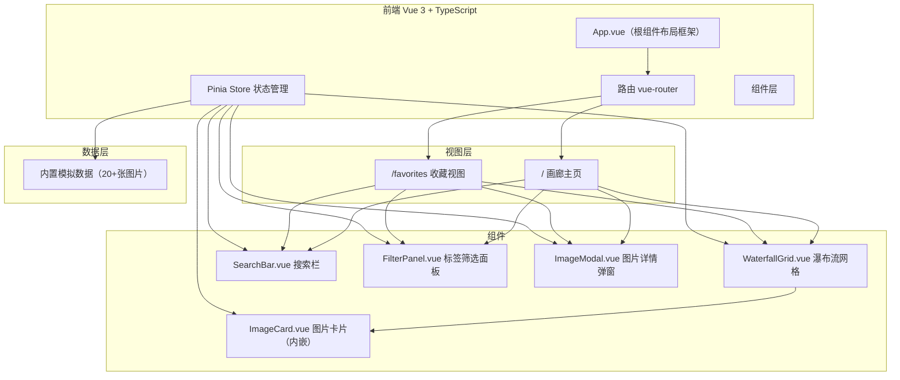
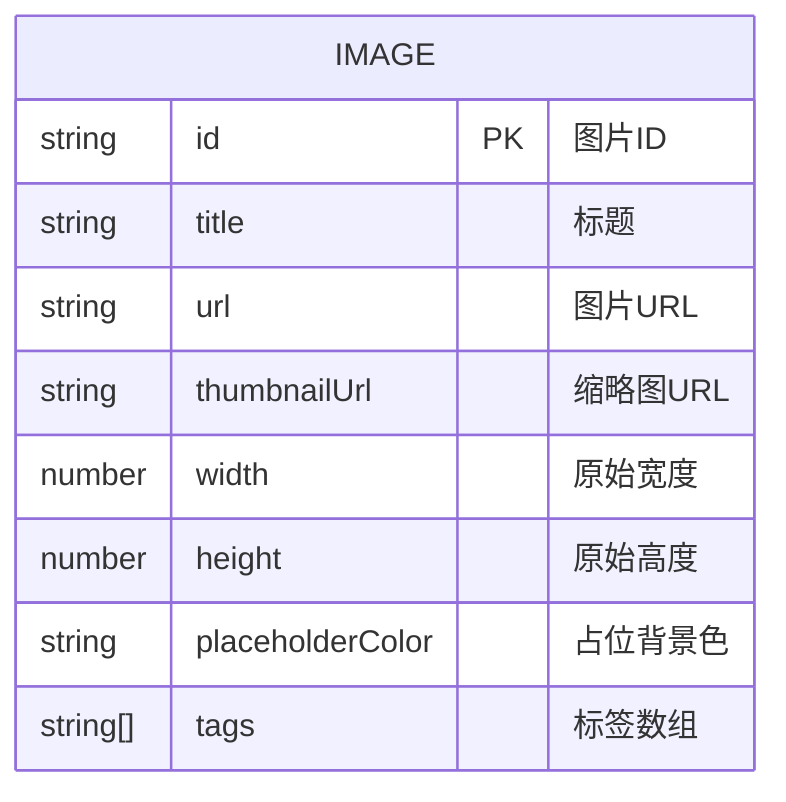

## 1. 架构设计



## 2. 技术描述
- 前端框架：Vue 3 + TypeScript
- 构建工具：Vite + @vitejs/plugin-vue
- 路由：vue-router
- 状态管理：Pinia
- 样式：原生 CSS + CSS 变量 + scoped styles，无 UI 库
- 构建脚本：`npm run dev`
- 数据来源：内置 mock 数据（20+张图片，含标题、标签、URL、尺寸）

## 3. 路由定义
| 路由 | 用途 |
|------|------|
| / | 画廊主页，展示所有图片瀑布流 |
| /favorites | 收藏视图，仅展示已收藏图片 |

## 4. 状态管理（Pinia Store）
### 4.1 galleryStore.ts
```
State:
  - images: Image[]           // 全部图片数据
  - favorites: string[]       // 收藏的图片ID集合
  - searchQuery: string       // 当前搜索词
  - searchHistory: string[]   // 搜索历史（最多5条）
  - selectedTags: string[]    // 当前选中标签集合
  - selectedImage: Image | null  // 当前选中的图片（弹窗用）

Getters:
  - filteredImages: Image[]   // 经过搜索+标签+收藏筛选的图片
  - allTags: {tag, count}[]   // 所有标签（去重排序+数量）
  - favoriteImages: Image[]   // 已收藏图片
  - favoritesCount: number    // 收藏数量

Actions:
  - toggleFavorite(id)        // 切换收藏
  - setSearchQuery(query)     // 设置搜索词（加入历史）
  - clearSearch()             // 清除搜索
  - toggleTag(tag)            // 切换标签选中
  - clearTags()               // 清除所有标签
  - openModal(image)          // 打开详情弹窗
  - closeModal()              // 关闭弹窗
```

## 5. 数据模型
### 5.1 数据模型定义



### 5.2 数据类型（TypeScript）
```typescript
interface ImageItem {
  id: string;
  title: string;
  url: string;
  thumbnailUrl: string;
  width: number;
  height: number;
  placeholderColor: string;
  tags: string[];
}

interface TagInfo {
  name: string;
  count: number;
}
```

### 5.3 Mock 数据说明
- 使用 picsum.photos 或 unsplash 等公共图片服务提供URL
- 预置 24 张图片（保证≥20张），覆盖自然、城市、人物、建筑、艺术等主题
- 标签池：nature, city, portrait, architecture, art, landscape, animal, food, travel, technology, ocean, mountain
- placeholderColor 为每张图片预生成的平均色或随机柔和色（如 #e8d5c4），避免布局抖动

## 6. 性能优化策略
- **瀑布流布局计算**：使用 CSS `column-count` + `break-inside: avoid` 或纯 JS 绝对定位方案，resize 时使用 requestAnimationFrame 防抖
- **搜索防抖**：300ms lodash-like 自研防抖函数
- **图片懒加载**：原生 `loading="lazy"` + IntersectionObserver 双保险，纯色背景占位
- **列表渲染优化**：v-memo / key 使用图片ID，避免不必要的重渲染
- **计算缓存**：Pinia getters 自带缓存，复杂计算使用 computed
- **CSS 过渡动画**：全部使用 transform/opacity，启用硬件加速（will-change / translate3d）

## 7. 响应式断点
| 断点 | 列数 | 搜索栏样式 | 筛选面板 | 卡片间距 |
|------|------|-----------|---------|---------|
| <768px | 2列 | 图标按钮，点击展开 | 底部抽屉 | 8px |
| 768px-1024px | 3列 | 完整展开 | 左侧固定 | 12px |
| 1024px-1440px | 4列 | 完整展开 | 左侧固定 | 16px |
| ≥1440px | 5列 | 完整展开 | 左侧固定 | 20px |
