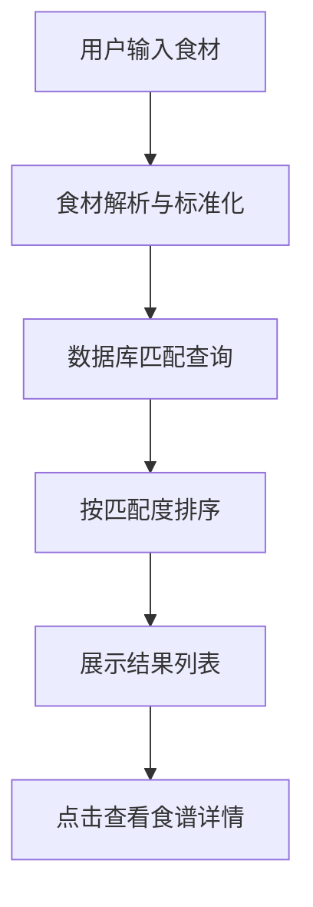

## 1. 产品概述

互动式食谱管理平台，让用户创建、搜索和分享烹饪食谱，支持根据冰箱食材智能推荐菜式。

- 主要用途：个人食谱管理、食谱分享、基于现有食材的菜式推荐
- 目标用户：家庭厨师、烹饪爱好者、需要清理冰箱食材的用户
- 产品价值：解决"今天吃什么"的痛点，通过食材反查减少食物浪费，构建美食分享社区

## 2. 核心功能

### 2.1 用户角色

| 角色 | 注册方式 | 核心权限 |
|------|----------|----------|
| 普通用户 | 用户名+密码注册 | 创建食谱、搜索浏览、收藏食谱、评分评论 |

### 2.2 功能模块

1. **首页瀑布流**：食谱卡片展示、标签筛选、无限滚动加载
2. **食谱创建**：表单填写（标题、配料、步骤、图片、标签）、图片上传
3. **智能搜索**：关键词搜索、防抖自动补全、食材反查匹配
4. **食谱详情**：配料步骤展示、评分系统、评论区、相关推荐、收藏功能
5. **用户认证**：注册、登录、JWT 令牌管理

### 2.3 页面详情

| 页面名称 | 模块名称 | 功能描述 |
|-----------|-------------|---------------------|
| 首页 | 瀑布流展示 | 食谱卡片按 masonry 布局展示，支持标签筛选，无限滚动加载 |
| 首页 | 搜索栏 | 顶部固定搜索框，支持关键词搜索和食材输入，自动补全建议 |
| 食谱详情页 | 内容展示 | 食谱封面图、标题、配料列表、步骤说明、标签展示 |
| 食谱详情页 | 互动模块 | 星级评分、评论列表、评论输入框（支持多行和表情）、收藏按钮 |
| 食谱详情页 | 相关推荐 | 基于标签匹配的推荐食谱列表 |
| 创建食谱页 | 表单模块 | 多字段表单、图片上传预览、动态添加配料和步骤 |
| 登录/注册页 | 认证模块 | 表单验证、错误提示、登录状态持久化 |

## 3. 核心流程

### 主流程描述

用户进入首页浏览瀑布流食谱 → 通过搜索框输入关键词或食材 → 点击食谱卡片查看详情 → 登录后可评分、评论、收藏 → 在创建页发布自己的食谱。

### 食材反查流程

用户输入冰箱现有食材（如鸡蛋、番茄） → 系统匹配包含这些食材的食谱 → 按匹配度排序展示结果 → 用户选择食谱查看详情。

## 4. 用户界面设计

### 4.1 设计风格

- **主色调**：陶土橙 (#D2691E) 作为主色，米白 (#FAF0E6) 作为背景色
- **辅助色**：深棕色 (#5D4037) 用于文字，浅橙色 (#FFAB91) 用于高亮和强调
- **卡片风格**：圆角 16px，轻微阴影 (box-shadow: 0 4px 20px rgba(210, 105, 30, 0.15))
- **按钮风格**：圆角 12px，主色填充，hover 时上浮 2px 并添加发光效果
- **字体**：标题使用 'Playfair Display' 衬线字体，正文使用 'Noto Sans SC' 无衬线字体
- **图标**：使用 Lucide React 图标库，线性风格，统一 20px 尺寸

### 4.2 页面设计概览

| 页面名称 | 模块名称 | UI 元素 |
|-----------|-------------|----------|
| 首页 | 导航栏 | 半透明毛玻璃效果，固定顶部，包含 Logo、搜索框、用户头像 |
| 首页 | 瀑布流网格 | 4 列桌面布局，2 列移动布局，卡片交错排列 |
| 首页 | 食谱卡片 | 封面图（懒加载）、标题、标签、评分、收藏数 |
| 食谱详情 | 封面区域 | 大图展示，标题叠加，标签徽章 |
| 食谱详情 | 配料区 | 卡片式列表，带勾选框可标记已准备 |
| 食谱详情 | 步骤区 | 带序号的步骤卡片，支持图片展示 |
| 食谱详情 | 评论区 | 头像+昵称+时间+内容，支持多行输入和表情选择 |
| 创建食谱 | 表单区 | 分组表单，动态添加配料/步骤，图片拖拽上传 |

### 4.3 动画与交互

- **卡片 hover**：transform: translateY(-4px)，阴影加深，添加橙色发光边框
- **搜索框**：输入时底部边框动画扩展，自动补全建议淡入
- **页面切换**：淡入淡出 + 轻微上移动画，duration 300ms
- **滚动加载**：底部出现加载骨架屏，新卡片依次淡入
- **按钮点击**：scale(0.95) 缩放反馈

### 4.4 响应式设计

- **桌面端 (≥1200px)**：瀑布流 4 列，侧边栏筛选
- **平板端 (768-1199px)**：瀑布流 3 列
- **移动端 (<768px)**：瀑布流 2 列，底部导航栏替代顶部部分功能
- **触摸优化**：按钮最小 44x44px，触摸反馈 ripple 效果

### 4.5 性能指标

- 搜索响应时间 ≤ 500ms
- 瀑布流滚动帧率稳定 60fps
- 图片懒加载，按尺寸加载合适分辨率
- 首屏加载时间 ≤ 2s
