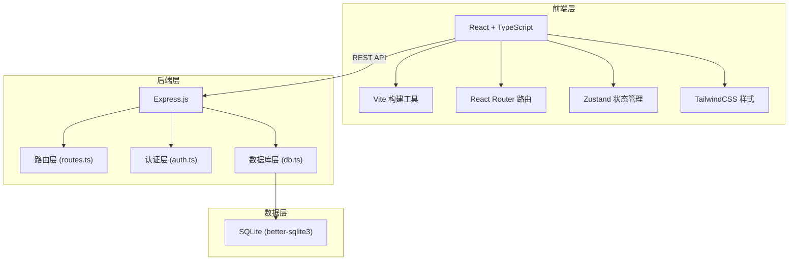
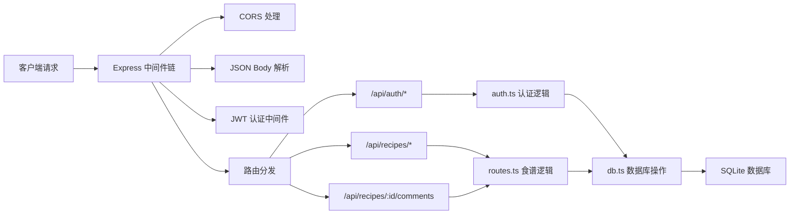
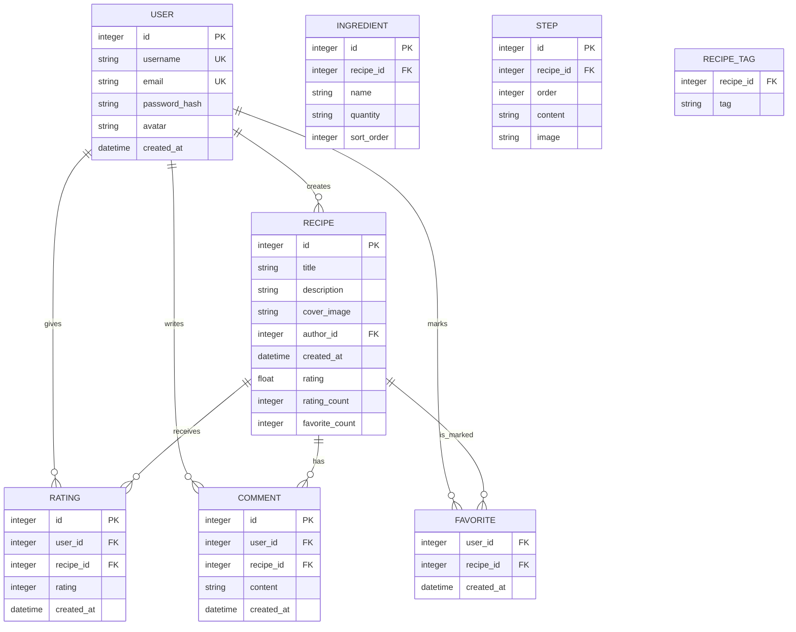

## 1. 架构设计



## 2. 技术描述

- **前端**: React 18 + TypeScript + Vite + React Router DOM + TailwindCSS 3 + Zustand
- **后端**: Express 4 + TypeScript
- **数据库**: SQLite (better-sqlite3)
- **认证**: JWT (jsonwebtoken)
- **图标**: Lucide React
- **HTTP 客户端**: 原生 fetch API
- **开发模式**: Vite 开发服务器 + Express API 服务器（concurrently 同时启动）

## 3. 目录结构

```
auto19/
├── .trae/documents/          # 项目文档
├── server/
│   ├── db.ts                 # 数据库初始化与 CRUD
│   ├── auth.ts               # 认证接口与 JWT
│   ├── routes.ts             # API 路由定义
│   └── index.ts              # Express 服务器入口
├── src/
│   ├── components/
│   │   ├── RecipeCard.tsx    # 食谱卡片组件
│   │   ├── SearchBox.tsx     # 搜索框组件
│   │   ├── Navbar.tsx        # 导航栏组件
│   │   ├── CommentSection.tsx # 评论区组件
│   │   ├── StarRating.tsx    # 星级评分组件
│   │   └── MasonryGrid.tsx   # 瀑布流布局组件
│   ├── pages/
│   │   ├── Home.tsx          # 首页
│   │   ├── RecipeDetail.tsx  # 食谱详情页
│   │   ├── CreateRecipe.tsx  # 创建食谱页
│   │   ├── Login.tsx         # 登录页
│   │   └── Register.tsx      # 注册页
│   ├── hooks/
│   │   ├── useDebounce.ts    # 防抖 Hook
│   │   ├── useInfiniteScroll.ts # 无限滚动 Hook
│   │   └── useLazyImage.ts   # 图片懒加载 Hook
│   ├── store/
│   │   └── useAuthStore.ts   # 认证状态管理
│   ├── types/
│   │   └── index.ts          # 类型定义
│   ├── utils/
│   │   └── api.ts            # API 请求封装
│   ├── main.tsx              # 应用入口
│   └── index.css             # 全局样式
├── package.json
├── vite.config.js
├── tsconfig.json
└── index.html
```

## 4. 路由定义

| 前端路由 | 页面组件 | 功能 |
|----------|----------|------|
| `/` | Home | 首页瀑布流展示 |
| `/recipe/:id` | RecipeDetail | 食谱详情页 |
| `/create` | CreateRecipe | 创建食谱（需登录） |
| `/login` | Login | 用户登录 |
| `/register` | Register | 用户注册 |
| `/search?q=:query` | Home | 搜索结果页 |
| `/ingredients?items=:list` | Home | 食材匹配结果页 |

## 5. API 定义

### 5.1 认证接口

```typescript
// POST /api/auth/register
interface RegisterRequest {
  username: string;
  email: string;
  password: string;
}

interface RegisterResponse {
  token: string;
  user: { id: number; username: string; email: string };
}

// POST /api/auth/login
interface LoginRequest {
  username: string;
  password: string;
}

interface LoginResponse {
  token: string;
  user: { id: number; username: string; email: string };
}

// GET /api/auth/me (需要 Bearer Token)
interface AuthMeResponse {
  id: number;
  username: string;
  email: string;
  avatar?: string;
}
```

### 5.2 食谱接口

```typescript
interface Recipe {
  id: number;
  title: string;
  description: string;
  coverImage: string;
  ingredients: { name: string; quantity: string }[];
  steps: { order: number; content: string; image?: string }[];
  tags: string[];
  authorId: number;
  authorName: string;
  rating: number;
  ratingCount: number;
  favoriteCount: number;
  createdAt: string;
}

// GET /api/recipes?page=1&limit=20&tag=:tag&sort=:sort
interface RecipeListResponse {
  recipes: Recipe[];
  total: number;
  page: number;
  hasMore: boolean;
}

// GET /api/recipes/:id
type RecipeDetailResponse = Recipe;

// POST /api/recipes (需要认证)
interface CreateRecipeRequest {
  title: string;
  description: string;
  coverImage: string;
  ingredients: { name: string; quantity: string }[];
  steps: { order: number; content: string; image?: string }[];
  tags: string[];
}

// GET /api/recipes/search?q=:query
interface SearchResponse {
  recipes: Recipe[];
  suggestions: string[];
}

// POST /api/recipes/match-by-ingredients
interface MatchByIngredientsRequest {
  ingredients: string[];
}

interface MatchResult {
  recipe: Recipe;
  matchScore: number;
  matchedIngredients: string[];
  missingIngredients: string[];
}

interface MatchByIngredientsResponse {
  results: MatchResult[];
}

// POST /api/recipes/:id/rate (需要认证)
interface RateRecipeRequest {
  rating: number; // 1-5
}

interface RateRecipeResponse {
  newRating: number;
  ratingCount: number;
}

// POST /api/recipes/:id/favorite (需要认证)
interface FavoriteRecipeResponse {
  isFavorited: boolean;
  favoriteCount: number;
}

// GET /api/recipes/suggestions?prefix=:prefix
interface SuggestionsResponse {
  suggestions: string[];
}
```

### 5.3 评论接口

```typescript
interface Comment {
  id: number;
  recipeId: number;
  userId: number;
  username: string;
  avatar?: string;
  content: string;
  createdAt: string;
}

// GET /api/recipes/:id/comments
interface CommentsResponse {
  comments: Comment[];
}

// POST /api/recipes/:id/comments (需要认证)
interface CreateCommentRequest {
  content: string;
}

type CreateCommentResponse = Comment;
```

## 6. 服务器架构



## 7. 数据模型

### 7.1 ER 图



### 7.2 DDL 语句

```sql
-- 用户表
CREATE TABLE IF NOT EXISTS user (
  id INTEGER PRIMARY KEY AUTOINCREMENT,
  username TEXT UNIQUE NOT NULL,
  email TEXT UNIQUE NOT NULL,
  password_hash TEXT NOT NULL,
  avatar TEXT,
  created_at DATETIME DEFAULT CURRENT_TIMESTAMP
);

-- 食谱表
CREATE TABLE IF NOT EXISTS recipe (
  id INTEGER PRIMARY KEY AUTOINCREMENT,
  title TEXT NOT NULL,
  description TEXT,
  cover_image TEXT,
  author_id INTEGER NOT NULL,
  created_at DATETIME DEFAULT CURRENT_TIMESTAMP,
  rating REAL DEFAULT 0,
  rating_count INTEGER DEFAULT 0,
  favorite_count INTEGER DEFAULT 0,
  FOREIGN KEY (author_id) REFERENCES user(id)
);

-- 配料表
CREATE TABLE IF NOT EXISTS ingredient (
  id INTEGER PRIMARY KEY AUTOINCREMENT,
  recipe_id INTEGER NOT NULL,
  name TEXT NOT NULL,
  quantity TEXT,
  sort_order INTEGER DEFAULT 0,
  FOREIGN KEY (recipe_id) REFERENCES recipe(id)
);

-- 步骤表
CREATE TABLE IF NOT EXISTS step (
  id INTEGER PRIMARY KEY AUTOINCREMENT,
  recipe_id INTEGER NOT NULL,
  "order" INTEGER NOT NULL,
  content TEXT NOT NULL,
  image TEXT,
  FOREIGN KEY (recipe_id) REFERENCES recipe(id)
);

-- 食谱标签表
CREATE TABLE IF NOT EXISTS recipe_tag (
  recipe_id INTEGER NOT NULL,
  tag TEXT NOT NULL,
  PRIMARY KEY (recipe_id, tag),
  FOREIGN KEY (recipe_id) REFERENCES recipe(id)
);

-- 评分表
CREATE TABLE IF NOT EXISTS rating (
  id INTEGER PRIMARY KEY AUTOINCREMENT,
  user_id INTEGER NOT NULL,
  recipe_id INTEGER NOT NULL,
  rating INTEGER NOT NULL CHECK(rating BETWEEN 1 AND 5),
  created_at DATETIME DEFAULT CURRENT_TIMESTAMP,
  FOREIGN KEY (user_id) REFERENCES user(id),
  FOREIGN KEY (recipe_id) REFERENCES recipe(id),
  UNIQUE(user_id, recipe_id)
);

-- 评论表
CREATE TABLE IF NOT EXISTS comment (
  id INTEGER PRIMARY KEY AUTOINCREMENT,
  user_id INTEGER NOT NULL,
  recipe_id INTEGER NOT NULL,
  content TEXT NOT NULL,
  created_at DATETIME DEFAULT CURRENT_TIMESTAMP,
  FOREIGN KEY (user_id) REFERENCES user(id),
  FOREIGN KEY (recipe_id) REFERENCES recipe(id)
);

-- 收藏表
CREATE TABLE IF NOT EXISTS favorite (
  user_id INTEGER NOT NULL,
  recipe_id INTEGER NOT NULL,
  created_at DATETIME DEFAULT CURRENT_TIMESTAMP,
  PRIMARY KEY (user_id, recipe_id),
  FOREIGN KEY (user_id) REFERENCES user(id),
  FOREIGN KEY (recipe_id) REFERENCES recipe(id)
);

-- 索引
CREATE INDEX IF NOT EXISTS idx_recipe_title ON recipe(title);
CREATE INDEX IF NOT EXISTS idx_recipe_author ON recipe(author_id);
CREATE INDEX IF NOT EXISTS idx_recipe_rating ON recipe(rating);
CREATE INDEX IF NOT EXISTS idx_ingredient_name ON ingredient(name);
CREATE INDEX IF NOT EXISTS idx_recipe_tag_tag ON recipe_tag(tag);
CREATE INDEX IF NOT EXISTS idx_comment_recipe ON comment(recipe_id);
CREATE INDEX IF NOT EXISTS idx_favorite_user ON favorite(user_id);
```

## 8. 性能优化策略

1. **搜索性能**: SQLite FTS5 全文搜索索引，食材匹配使用预计算的食材倒排表
2. **图片懒加载**: Intersection Observer API，按视口加载
3. **瀑布流性能**: CSS columns 实现（比 JS 计算更高效），虚拟滚动（大数据量时）
4. **防抖搜索**: 300ms 防抖，减少 API 调用
5. **缓存策略**: 食谱列表本地缓存 5 分钟，搜索结果缓存 1 分钟
6. **骨架屏**: 加载时显示占位骨架，提升感知性能
7. **数据库查询优化**: 使用 prepared statements，合理建立索引
