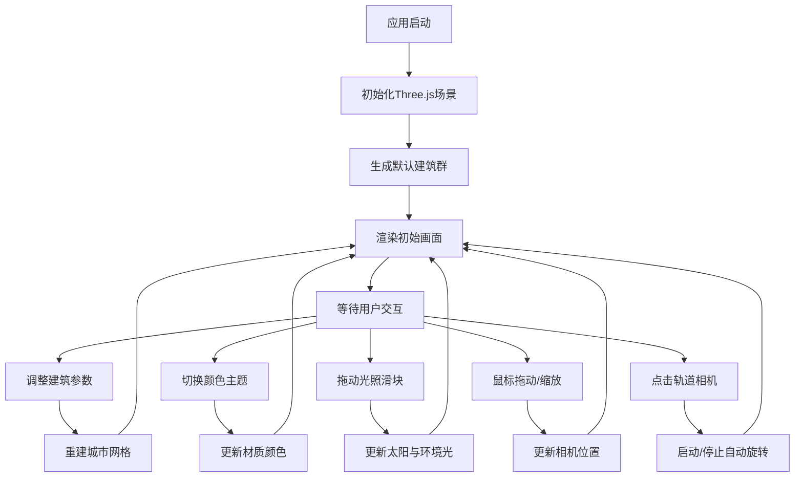

## 1. 产品概述

3D城市天际线生成器是一款基于WebGL的交互式城市景观生成工具。用户可以通过参数化控件实时调整建筑密度、高度、颜色主题和光照效果，即时预览生成的3D城市模型。产品面向设计师、创意工作者和3D可视化爱好者，提供快速生成城市天际线参考图的能力。

## 2. 核心功能

### 2.1 功能模块
1. **3D场景渲染**：Three.js渲染器、相机、光照系统
2. **建筑群生成器**：基于InstancedMesh优化的参数化建筑生成
3. **UI控制面板**：毛玻璃风格悬浮控件，参数滑块与颜色主题选择
4. **颜色主题系统**：4种预设配色 + 自定义颜色拾取
5. **动态昼夜光照**：24小时时间轴控制太阳位置与环境光
6. **相机交互**：鼠标拖动旋转、滚轮缩放、轨道巡航

### 2.2 页面详情
| 页面名称 | 模块名称 | 功能描述 |
|-----------|-------------|---------------------|
| 主界面 | 3D场景画布 | 全屏WebGL渲染城市模型，支持鼠标交互 |
| 主界面 | 控制面板 | 悬浮于右下角的毛玻璃卡片，包含所有参数控件 |
| 主界面 | 颜色主题选择 | 缩略色块按钮切换预设方案，支持自定义颜色 |
| 主界面 | 光照控制 | 24小时滑块控制太阳位置与色温变化 |
| 主界面 | 轨道相机按钮 | 一键切换自动环绕城市旋转视角 |

## 3. 核心流程

用户打开应用 → 默认生成日落金主题城市 → 调整建筑密度/高度/基底面积滑块 → 实时重建城市 → 切换颜色主题或自定义颜色 → 拖动24小时光照滑块观察昼夜变化 → 使用鼠标拖动/缩放探索视角 → 点击轨道相机按钮自动巡航

## 4. 用户界面设计

### 4.1 设计风格
- **整体基调**：暗色科幻风，底色 `#1a1a2e`
- **主色调**：随当前颜色主题动态变化的高亮色
- **控件样式**：圆角卡片、毛玻璃磨砂效果（`backdrop-filter: blur(16px)`）、半透明背景（`rgba(26,26,46,0.75)`）
- **字体**：现代无衬线字体，数字使用等宽字体显示实时数值
- **动效**：控件入场向下滑入0.3s ease-out，滑块thumb悬停放大，色块按钮点击反馈

### 4.2 页面设计概述
| 页面名称 | 模块名称 | UI元素 |
|-----------|-------------|-------------|
| 主界面 | 3D画布 | 全屏WebGL，无多余装饰 |
| 主界面 | 控制面板容器 | 右下角定位，毛玻璃卡片，圆角16px，内边距20px，最大宽度340px |
| 主界面 | 标题区域 | "天际线生成器"标题 + 副标题说明 |
| 主界面 | 密度滑块 | 标签 + 数值显示 + 范围10-50的滑块 |
| 主界面 | 高度滑块 | 标签 + 数值显示 + 范围10-150的滑块 |
| 主界面 | 基底面积滑块 | 标签 + 数值显示 + 范围5-20的滑块 |
| 主界面 | 颜色主题区 | 4个缩略色块按钮 + 3个自定义颜色拾取器 |
| 主界面 | 光照时间滑块 | 标签 + 时间显示(HH:00) + 范围0-24的滑块 |
| 主界面 | 轨道相机按钮 | 带图标的切换按钮 |

### 4.3 响应式设计
- **桌面端（≥768px）**：控制面板完全展开悬浮于右下角
- **移动端（<768px）**：面板折叠为圆形悬浮按钮，点击展开/收起，展开时全屏宽度底部弹出

### 4.4 3D场景指导
- **环境**：渐变天空背景，随时间从深蓝→橙红→暖黄→浅蓝平滑过渡
- **光照**：主光源（DirectionalLight模拟太阳）+ 半球环境光（HemisphereLight）+ 窗户点光源，启用PCFSoftShadowMap软阴影
- **相机**：PerspectiveCamera，默认俯视角45°，目标点位于城市中心
- **构图**：城市位于场景中央，建筑随机分布在网格内，高低错落，外围留空
- **交互**：OrbitControls实现鼠标拖动旋转（限制俯仰角10°-80°）、滚轮缩放（距离30-500）、右键平移
- **后期**：ACESFilmicToneMapping色调映射，启用抗锯齿
- **性能**：使用InstancedMesh合并所有建筑几何体，单Draw Call，材质共享，目标帧率60FPS
