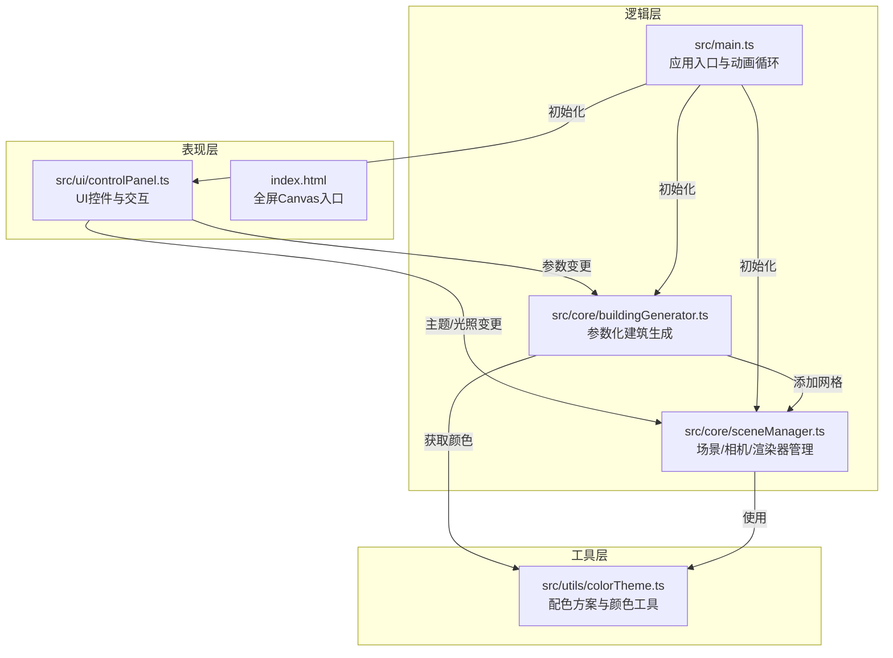

## 1. 架构设计



## 2. 技术描述
- **构建工具**：Vite 5.x（ES模块热更新）
- **语言**：TypeScript 5.x（严格模式）
- **3D渲染**：Three.js r160+ + @types/three
- **UI**：原生DOM + CSS（backdrop-filter），无UI框架依赖
- **无后端**：纯前端应用

## 3. 文件结构
```
auto2/
├── package.json
├── vite.config.js
├── tsconfig.json
├── index.html
└── src/
    ├── main.ts                    # 应用入口
    ├── core/
    │   ├── sceneManager.ts        # 场景/相机/渲染器/光照/控制器
    │   └── buildingGenerator.ts   # InstancedMesh建筑生成
    ├── ui/
    │   └── controlPanel.ts        # 控制面板DOM与事件
    └── utils/
        └── colorTheme.ts          # 颜色主题与插值
```

## 4. 核心模块设计

### 4.1 sceneManager.ts
```typescript
interface SceneManager {
  scene: THREE.Scene;
  camera: THREE.PerspectiveCamera;
  renderer: THREE.WebGLRenderer;
  controls: OrbitControls;
  sun: THREE.Mesh;            // 可视化太阳
  sunLight: THREE.DirectionalLight;
  hemiLight: THREE.HemisphereLight;
  ground: THREE.Mesh;
  
  init(container: HTMLElement): void;
  addObject(obj: THREE.Object3D): void;
  removeObject(obj: THREE.Object3D): void;
  clearBuildings(): void;
  updateTime(hour: number): void;  // 更新太阳位置与光照
  setGroundColor(color: number): void;
  setOrbitEnabled(enabled: boolean): void;
  setAutoRotate(enabled: boolean): void;
  render(): void;
  dispose(): void;
}
```

### 4.2 buildingGenerator.ts
```typescript
interface BuildingParams {
  density: number;       // 10-50
  minHeight: number;     // 10
  maxHeight: number;     // 150
  minBase: number;       // 5
  maxBase: number;       // 20
}

interface BuildingGenerator {
  instancedMesh: THREE.InstancedMesh;
  windowMesh: THREE.InstancedMesh;
  
  generate(params: BuildingParams, theme: ColorTheme): void;
  rebuild(params: BuildingParams, theme: ColorTheme): void;
  updateTheme(theme: ColorTheme): void;
  clear(): void;
}
```

### 4.3 colorTheme.ts
```typescript
interface ColorTheme {
  name: string;
  building: number;      // 建筑立面颜色
  windows: number;       // 窗格发光颜色
  ground: number;        // 地面颜色
  accent: number;        // UI高亮色
}

// 预设主题
const THEMES: Record<string, ColorTheme> = {
  sunsetGold: {...},
  cyberBlue: {...},
  forestGreen: {...},
  minimalGray: {...}
};

function lerpColor(a: number, b: number, t: number): number;
function getSkyColors(hour: number): { top: number; bottom: number };
```

### 4.4 controlPanel.ts
```typescript
interface ControlPanelCallbacks {
  onBuildingChange(params: BuildingParams): void;
  onThemeChange(theme: ColorTheme): void;
  onTimeChange(hour: number): void;
  onAutoRotate(enabled: boolean): void;
}

function createControlPanel(container: HTMLElement, callbacks: ControlPanelCallbacks): void;
```

## 5. 性能优化策略
1. **InstancedMesh**：所有建筑合并为单个InstancedMesh，窗格发光面单独一个InstancedMesh
2. **共享材质**：同一主题下所有建筑使用共享的MeshStandardMaterial
3. **阴影优化**：仅建筑主体投射/接收阴影，关闭动态阴影更新（static场景）
4. **几何体复用**：预创建立方体几何体，不在重建时重新分配
5. **节流防抖**：滑块拖动时使用requestAnimationFrame节流，避免频繁重建
6. **像素比限制**：renderer.setPixelRatio(Math.min(devicePixelRatio, 2))
