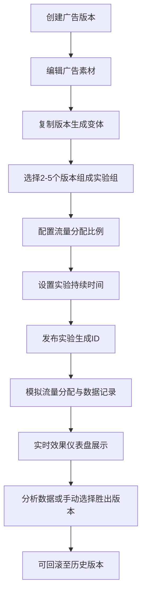

## 1. 产品概述

A/B测试广告管理平台，帮助营销团队高效创建、管理和分析多版本广告素材的投放效果。

- 解决多版本广告素材管理混乱、投放效果对比分析低效的核心问题
- 面向营销团队、广告运营人员，提供从创意制作到效果分析的一站式解决方案
- 通过实时数据看板和统计分析，帮助团队快速做出数据驱动的广告优化决策

## 2. 核心功能

### 2.1 用户角色

| 角色 | 核心权限 |
|------|----------|
| 营销人员 | 创建广告版本、配置实验、查看效果仪表盘、导出数据 |
| 广告运营 | 管理版本历史、执行回滚操作、手动选择胜出版本 |

### 2.2 功能模块

1. **广告创意工坊**：广告版本创建、编辑、复制、图片上传/URL引用
2. **实验配置与发布**：版本组选择、流量分配、实验时长设置、模拟投放
3. **实时效果仪表盘**：指标卡片展示、Canvas自绘图表、自动刷新、胜出版本高亮、CSV导出
4. **版本历史与回滚**：时间线展示、历史版本对比、一键回滚、操作注释

### 2.3 页面详情

| 页面名称 | 模块名称 | 功能描述 |
|-----------|-------------|---------------------|
| 主应用页面 | 广告创意工坊 | 创建多个广告版本，包含标题、描述、图片、CTA按钮文案和链接；支持复制已有版本快速生成变体 |
| 主应用页面 | 实验配置与发布 | 选择2-5个广告版本组成实验组，设置流量分配比例和实验持续时间，生成唯一实验ID并发布 |
| 主应用页面 | 实时效果仪表盘 | 卡片网格展示展示量、点击量、CTR、转化量、CVR；每10秒自动刷新；Canvas绘制CTR趋势折线图和CVR柱状图；胜出版本高亮；CSV导出 |
| 主应用页面 | 版本历史与回滚 | 时间线形式展示修改历史，支持回滚到任意历史版本，回滚操作添加注释 |

## 3. 核心流程

用户创建多个广告版本后，选择版本组并配置流量分配和实验时长，发布实验后系统模拟流量分配并记录数据，仪表盘实时展示效果指标，用户可根据数据分析或手动选择胜出版本，同时可随时回滚到任意历史版本。

## 4. 用户界面设计

### 4.1 设计风格

- **主色调**：深蓝色 (#0a1628) 作为背景主色，亮蓝绿色 (#00e5ff) 作为强调色
- **辅助色**：渐变蓝绿色 (#00d4aa → #00b4d8) 用于数字指标卡片
- **卡片风格**：毛玻璃效果 (backdrop-filter: blur) + 半透明背景 + 圆角边框
- **字体**：使用现代无衬线字体，数字使用等宽字体显示
- **布局**：仪表盘风格，网格化布局，分区明确
- **图标**：使用 lucide-react 图标库

### 4.2 页面设计概述

| 页面名称 | 模块名称 | UI元素 |
|-----------|-------------|-------------|
| 主应用页面 | 广告创意工坊 | 表单输入、图片预览、版本卡片列表、复制按钮 |
| 主应用页面 | 实验配置与发布 | 版本选择器、滑块/输入框设置流量比例、日期选择器、发布按钮 |
| 主应用页面 | 实时效果仪表盘 | 渐变色卡片网格、Canvas图表、刷新指示器、导出按钮、胜出版本高亮标记 |
| 主应用页面 | 版本历史与回滚 | 垂直时间线、版本缩略图、回滚按钮、注释输入框 |

### 4.3 响应式

- 桌面端：4列卡片网格，左右分栏布局
- 平板端：2列卡片网格，上下堆叠布局
- 移动端：单列布局，纵向滚动，触控优化
