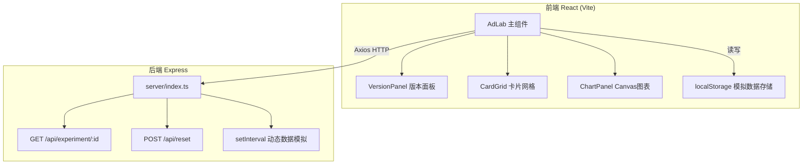
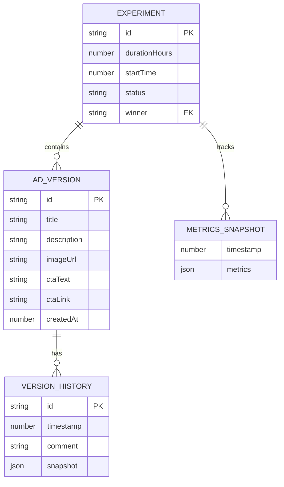

## 1. 架构设计



## 2. 技术描述

- **前端**：React@18 + TypeScript + Vite + 原生Canvas自绘图表
- **后端**：Express@4 + TypeScript
- **HTTP客户端**：axios
- **工具库**：uuid（生成唯一ID）、html2canvas（截图导出）
- **数据存储**：localStorage（前端模拟）+ 内存（后端模拟）
- **构建工具**：Vite，配置proxy代理到Express端口

## 3. 文件组织

| 文件路径 | 用途 |
|----------|------|
| package.json | 项目依赖与启动脚本 |
| vite.config.js | Vite配置，React插件，proxy代理 |
| tsconfig.json | TypeScript严格模式配置 |
| index.html | 前端入口HTML |
| server/index.ts | Express服务器，模拟API |
| src/main.tsx | React入口，渲染App组件 |
| src/frontend/AdLab.tsx | 主组件，状态管理，数据刷新 |
| src/frontend/CardGrid.tsx | 指标卡片网格，动画，CSV导出 |
| src/frontend/ChartPanel.tsx | Canvas自绘折线图和柱状图 |
| src/frontend/VersionPanel.tsx | 版本管理，历史时间线，回滚 |

## 4. API 定义

```typescript
// 广告版本
interface AdVersion {
  id: string;
  title: string;
  description: string;
  imageUrl: string;
  ctaText: string;
  ctaLink: string;
  createdAt: number;
  history: VersionHistory[];
}

// 版本历史记录
interface VersionHistory {
  id: string;
  timestamp: number;
  snapshot: Partial<AdVersion>;
  comment: string;
}

// 实时指标
interface AdMetrics {
  impressions: number;
  clicks: number;
  conversions: number;
  ctr: number;
  cvr: number;
}

// 实验数据
interface ExperimentData {
  id: string;
  versions: AdVersion[];
  trafficAllocation: Record<string, number>;
  durationHours: number;
  startTime: number;
  metrics: Record<string, AdMetrics>;
  history: { timestamp: number; metrics: Record<string, AdMetrics> }[];
  status: 'draft' | 'running' | 'ended';
  winner: string | null;
}

// GET /api/experiment/:id 返回 ExperimentData
// POST /api/reset 重置所有实验数据
```

## 5. 数据模型


