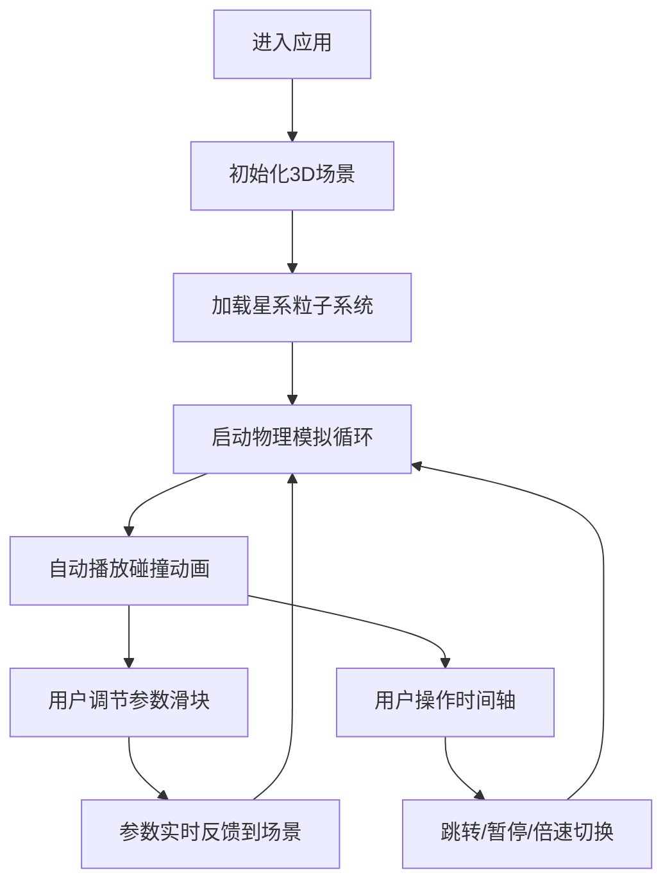

## 1. 产品概述

星系碰撞模拟器是一款基于 WebGL 的交互式 3D 科学可视化应用，让用户通过调节物理参数直观观察两个螺旋星系在引力作用下逐渐合并的动态过程。目标用户为天文爱好者、学生和科普教育工作者。

产品价值在于将抽象的天体物理过程转化为可交互、可调节的沉浸式体验，帮助用户理解星系动力学和引力相互作用。

## 2. 核心功能

### 2.1 功能模块

1. **主模拟场景：双螺旋星系 3D 可视化、粒子系统渲染、引力物理模拟
2. **参数控制面板：质量/距离/角度/速度实时调节
3. **能量显示面板：动能与势能实时数值展示
4. **时间轴控制：播放/暂停/重置/倍速调节、时间跳转
5. **热力图叠加：粒子密度分布热力图可视化

### 2.2 页面详情

| 页面名称 | 模块名称 | 功能描述 |
|-----------|-------------|---------------------|
| 主场景 | 3D 星系渲染 | 两个螺旋星系粒子系统，包含数千个发光粒子，颜色根据恒星类型和速度渐变，核心高亮光晕 |
| 主场景 | 引力模拟 | 基于 N 体引力计算的星系运动与合并效果 |
| 主场景 | 热力图叠加 | 星系外围动态密度热力图 |
| 左侧面板 | 参数滑块 | 星系质量、初始距离、碰撞角度、速度倍数的实时调节 |
| 左侧面板 | 能量显示 | 实时显示系统动能与势能数值 |
| 底部控制栏 | 时间轴控制 | 播放/暂停按钮、重置按钮、倍速选择器（0.5x~4x）、时间轴拖动跳转 |

## 3. 核心流程

用户进入应用 → 查看默认星系碰撞动画自动开始播放 → 用户拖动左侧滑块调节参数 → 星系轨迹立即更新 → 用户通过时间轴控制播放进度 → 实时观察能量数值变化

## 4. 用户界面设计

### 4.1 设计风格

- **主色调**：深蓝到紫黑的深空渐变背景（#0a0a1f → #1a0a2e → #0d0221）
- **粒子颜色**：蓝巨星（#6fa8ff）、红巨星（#ff6b6b）、主序星（#ffe082），速度越快颜色越偏向蓝紫
- **发光效果**：粒子带 Bloom 发光与尾迹拖影
- **控制面板**：半透明玻璃质感（backdrop-filter: blur(12px)，rgba(20, 15, 40, 0.6)）
- **交互反馈**：按钮和滑块悬停时带脉冲光效（glow pulse animation）
- **字体**：标题使用 Orbitron（科技感字体），正文使用 Inter
- **布局**：左窄右宽，左侧 280px 控制面板，右侧 3D 场景占剩余空间，底部 80px 时间轴控制栏

### 4.2 页面设计概览

| 页面名称 | 模块名称 | UI 元素 |
|-----------|-------------|-------------|
| 主场景 | 3D 渲染区域 | 深空渐变背景、发光粒子系统、核心光晕、密度热力图 |
| 左侧面板 | 参数控制区 | 4 组带发光轨道滑块、数值标签、实时能量数值卡片 |
| 底部控制栏 | 时间轴区域 | 播放/暂停按钮（圆形发光按钮）、重置按钮、倍速选择器、时间进度条（可拖动） |

### 4.3 响应式

桌面端：左窄右宽固定布局
移动端：控制面板折叠为顶部抽屉，时间轴固定底部，3D 场景全屏适配，支持触摸手势旋转视角

### 4.4 3D 场景指引

- **环境**：深空渐变背景，无外部光源，粒子自发光
- **光照**：仅使用粒子自发光与核心点光源
- **相机**：PerspectiveCamera，初始视角略微俯视，支持鼠标拖拽旋转视角
- **后期处理**：Bloom 发光效果、轻微色调映射
- **性能预算**：粒子总数 ≤ 15000 时帧率稳定 60fps
