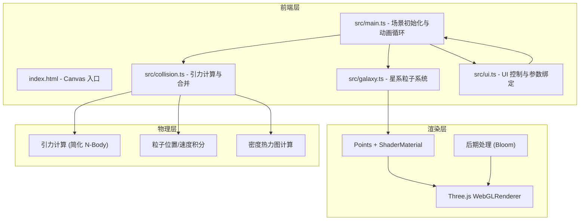

## 1. 架构设计



## 2. 技术描述

- **前端框架**：纯 TypeScript + Three.js（无 React/Vue，按用户指定）
- **构建工具**：Vite
- **UI 控制**：dat.gui（按用户指定）
- **粒子渲染**：Three.js Points + 自定义 ShaderMaterial
- **物理模拟**：简化 Barnes-Hut 或直接粒子-粒子引力计算（粒子数 8000~15000）
- **后期处理**：three/examples/jsm/postprocessing/EffectComposer + UnrealBloomPass

## 3. 目录结构

```
.
├── package.json
├── vite.config.js
├── tsconfig.json
├── index.html
└── src/
    ├── main.ts        # 场景、相机、渲染器初始化，动画循环
    ├── galaxy.ts    # 星系粒子生成、颜色分布、星系类
    ├── collision.ts # 引力计算、能量计算、热力图
    └── ui.ts       # dat.gui 配置、时间轴控制、参数更新
```

## 4. 核心模块说明

### 4.1 Galaxy（星系模块）

```typescript
interface GalaxyParams {
  particleCount: number;
  mass: number;
  radius: number;
  arms: number;
  position: THREE.Vector3;
  rotation: THREE.Euler;
}

class Galaxy {
  particles: THREE.Points;
  positions: Float32Array;
  velocities: Float32Array;
  colors: Float32Array;
  mass: number;
  centerOfMass: THREE.Vector3;
  constructor(params: GalaxyParams);
  generateSpiralArm(): void;
  assignStarColors(): void;
  updateGeometry(): void;
}
```

### 4.2 CollisionSimulator（碰撞模拟模块）

```typescript
class CollisionSimulator {
  galaxyA: Galaxy;
  galaxyB: Galaxy;
  time: number;
  constructor(galaxyA: Galaxy, galaxyB: Galaxy);
  step(dt: number, speedMultiplier: number): void;
  computeGravity(): void;
  getKineticEnergy(): number;
  getPotentialEnergy(): number;
  getDensityHeatmap(): Float32Array;
}
```

### 4.3 UIController（UI 控制模块）

```typescript
interface SimParams {
  massA: number;
  massB: number;
  initialDistance: number;
  collisionAngle: number;
  speedMultiplier: number;
  playbackSpeed: number;
}

class UIController {
  params: SimParams;
  isPlaying: boolean;
  currentTime: number;
  onParamsChange: (params: SimParams) => void;
  onTimeChange: (t: number) => void;
  setupGUI(): void;
  setupTimeline(): void;
  updateEnergyDisplay(ke: number, pe: number): void;
}
```

## 5. 性能优化策略

1. **粒子数据使用 TypedArray（Float32Array）存储，避免 GC 压力
2. **GPU 粒子渲染：使用 Points + ShaderMaterial，一次 draw call
3. **引力计算优化：每星系计算核心引力为主，粒子间引力简化
4. **热力图计算降采样：使用较低分辨率网格计算密度
5. **Bloom 效果仅作用于高亮核心区域
