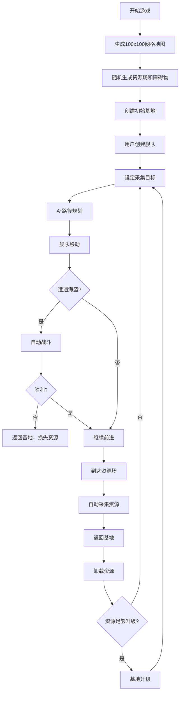

## 1. 产品概述

太空资源采集与舰队管理交互式沙盒游戏，在100x100的2D网格宇宙中，通过AI驱动的舰队自动规划最优路径采集资源、躲避障碍并升级基地。

- 核心目的：提供一个可交互的太空策略模拟环境，让用户体验资源管理、舰队调度和基地建设的乐趣
- 目标用户：策略游戏爱好者、AI算法学习者、系统模拟研究者
- 产品价值：可视化展示A*寻路算法、AI调度策略和复杂系统模拟

## 2. 核心功能

### 2.1 功能模块
1. **资源场生成系统**：100x100网格上随机生成三类资源场，显示储量、采集效率，随采集缩小并消失
2. **AI舰队调度系统**：创建多艘舰队，A*路径规划，自动采集并返回基地，平滑路径动画
3. **基地升级系统**：1-5级基地，仓库容量和建造速度升级，波纹光效，影响范围显示
4. **战斗遭遇机制**：随机遭遇太空海盗，自动战斗，伤害数字跳字动画
5. **实时统计面板**：全局统计信息，数字滚动过渡动画

### 2.2 页面详情
| 页面名称 | 模块名称 | 功能描述 |
|---------|---------|---------|
| 主游戏界面 | 地图画布 | 100x100网格地图，支持拖拽平移和滚轮缩放 |
| 主游戏界面 | 左侧控制栏 | 舰队创建、基地列表、参数配置 |
| 主游戏界面 | 右侧预览窗 | 缩略图小地图，显示全局资源和舰队分布 |
| 主游戏界面 | 统计面板 | 右下角实时统计，数字滚动动画 |
| 主游戏界面 | 战斗提示 | 战斗动画和伤害数字跳字 |

## 3. 核心流程

用户创建舰队并设定采集目标，舰队自动规划A*路径前往资源场，途中可能遭遇海盗战斗，到达后自动采集资源，完成后返回基地卸载资源，基地积累资源后可升级。

## 4. 用户界面设计

### 4.1 设计风格
- **主色调**：深空渐变（深紫#1a0a2e到墨蓝#0a1628），霓虹蓝#00d4ff描边
- **资源配色**：铁矿橙色#ff6b35，水晶蓝色#4ecdc4，气体绿色#95e883
- **UI材质**：毛玻璃半透明（backdrop-filter: blur(10px)），半透明度0.85
- **字体**：Orbitron（科幻显示字体）+ JetBrains Mono（等宽数字字体）
- **动效**：脉冲缩放、波纹扩散、粒子拖尾、数字滚动

### 4.2 视觉元素
- **背景**：深空渐变+静态星星粒子（500个随机大小和亮度的圆点）
- **网格**：半透明发光线条（rgba(0, 212, 255, 0.15)）
- **资源场**：六边形发光图标，脉冲缩放动画
- **舰队**：三角形图标，颜色渐变粒子拖尾
- **基地**：六边形图标，升级时波纹扩散光效
- **卡片**：hover时上浮(translateY(-4px))和发光(box-shadow: 0 0 20px rgba(0, 212, 255, 0.5))

### 4.3 布局结构
| 区域 | 位置 | 宽度 | 内容 |
|-----|------|------|------|
| 左侧控制栏 | 左边缘 | 280px | 舰队控制、基地列表 |
| 主画布 | 中间 | 自适应 | 100x100网格地图 |
| 右侧预览窗 | 右上角 | 200px x 200px | 缩略图小地图 |
| 统计面板 | 右下角 | 280px | 实时统计数据 |

### 4.4 响应式设计
- 桌面端优先设计，最小支持1280x720分辨率
- 主画布自适应剩余空间，侧边栏固定宽度
- 触控设备支持双指缩放和单指拖拽

## 5. 性能指标

- 帧率：稳定60fps
- 最大并发：50个资源场、10个基地、20艘舰队、100个粒子同时活动
- 优化策略：对象池复用、视口剔除、增量更新
