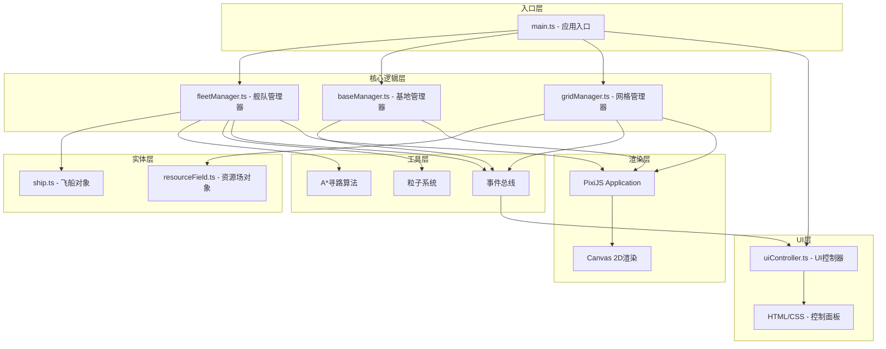
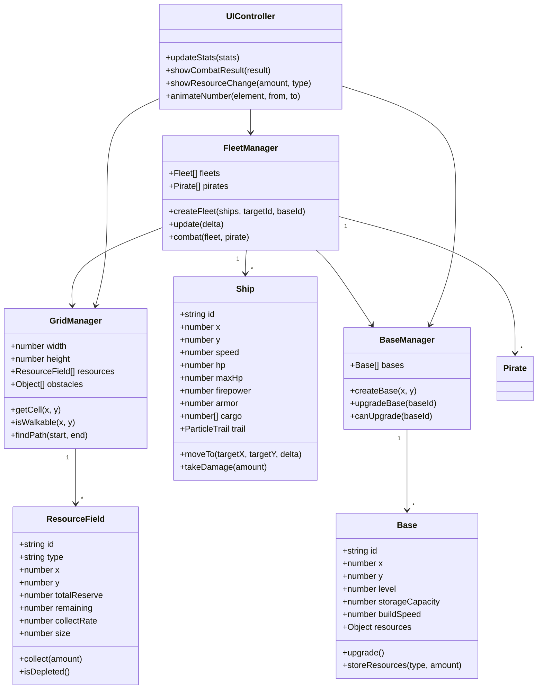

## 1. 架构设计



## 2. 技术描述

- **前端框架**：TypeScript 5.x + PixiJS 7.x + Vite 5.x
- **初始化工具**：Vite CLI
- **渲染引擎**：PixiJS 7.x（WebGL 2D渲染）
- **构建工具**：Vite 5.x
- **类型系统**：TypeScript 5.x（严格模式）
- **无后端**：纯前端应用，数据存储在内存中

### 核心依赖
- `pixi.js@7.4.0` - 2D WebGL渲染引擎
- `typescript@5.4.0` - 类型系统
- `vite@5.2.0` - 构建工具
- `@types/node@20.11.0` - Node.js类型定义

## 3. 目录结构

```
auto24/
├── index.html                 # 入口HTML
├── package.json              # 依赖配置
├── vite.config.js            # Vite配置
├── tsconfig.json             # TypeScript配置
└── src/
    ├── main.ts               # 应用入口
    ├── map/                  # 地图模块
    │   ├── gridManager.ts    # 网格管理器
    │   └── resourceField.ts  # 资源场对象
    ├── ai/                   # AI调度模块
    │   ├── fleetManager.ts   # 舰队管理器
    │   └── ship.ts           # 飞船对象
    ├── core/                 # 核心模块
    │   └── baseManager.ts    # 基地管理器
    └── ui/                   # UI模块
        └── uiController.ts   # UI控制器
```

## 4. 核心数据模型

### 4.1 数据模型定义



### 4.2 数据类型定义

```typescript
// 资源类型
type ResourceType = 'iron' | 'crystal' | 'gas';

// 坐标
interface Position {
  x: number;
  y: number;
}

// 资源场数据
interface ResourceFieldData {
  id: string;
  type: ResourceType;
  position: Position;
  totalReserve: number;
  remaining: number;
  collectRate: number;
  size: number;
}

// 飞船数据
interface ShipData {
  id: string;
  position: Position;
  speed: number;
  hp: number;
  maxHp: number;
  firepower: number;
  armor: number;
  cargo: Record<ResourceType, number>;
}

// 舰队数据
interface FleetData {
  id: string;
  ships: ShipData[];
  targetResourceId: string | null;
  homeBaseId: string;
  state: 'idle' | 'moving' | 'collecting' | 'returning' | 'combat';
  path: Position[];
}

// 基地数据
interface BaseData {
  id: string;
  position: Position;
  level: number;
  storageCapacity: number;
  buildSpeed: number;
  resources: Record<ResourceType, number>;
}

// 海盗数据
interface PirateData {
  id: string;
  position: Position;
  firepower: number;
  armor: number;
  hp: number;
}

// 全局统计
interface GameStats {
  totalResourcesCollected: Record<ResourceType, number>;
  activeFleets: number;
  totalBases: number;
  piratesDefeated: number;
  runtime: number;
}
```

## 5. 核心算法

### 5.1 A*寻路算法
- 使用曼哈顿距离作为启发函数
- 网格节点代价：普通格子1，资源场边缘2，障碍物无穷大
- 开放列表使用最小堆优化
- 路径平滑处理（去除冗余拐点）

### 5.2 碰撞检测
- 舰队间基于圆形碰撞检测（半径=舰队大小）
- 动态避障：检测到前方其他舰队时重新规划路径

### 5.3 战斗系统
- 伤害计算公式：`伤害 = max(1, 攻击力 - 防御力/2) * 随机系数(0.8-1.2)`
- 每秒进行一次攻击判定
- 舰队总战力 = Σ(飞船火力值) * 舰队数量加成

## 6. 性能优化策略

1. **对象池**：粒子、战斗数字等频繁创建销毁的对象使用对象池
2. **视口剔除**：只渲染视口范围内的网格和实体
3. **增量更新**：统计数据每帧更新，UI采用requestAnimationFrame节流
4. **空间分区**：使用网格空间分区加速碰撞检测和邻近查询
5. **渲染批处理**：同类元素使用PixiJS Container批处理渲染
