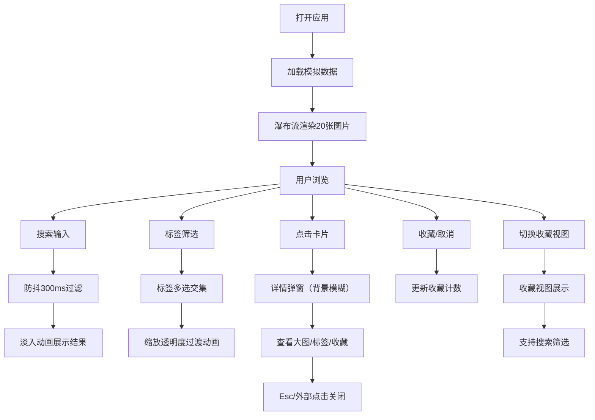

## 1. 产品概述

交互式画廊看板应用，为用户提供沉浸式图片浏览体验，支持瀑布流布局、智能搜索、标签筛选和收藏管理。目标用户是需要高效浏览和管理图片素材的设计师、内容创作者和普通用户。

产品价值：通过流畅的交互动画和极简的视觉设计，提升图片浏览效率，帮助用户快速找到并收藏心仪的图片。

## 2. 核心功能

### 2.1 用户角色

| 角色 | 注册方式 | 核心权限 |
|------|----------|----------|
| 普通用户 | 无需注册 | 浏览图片、搜索筛选、收藏管理、查看详情 |

### 2.2 功能模块

1. **首页画廊**：瀑布流网格展示、图片卡片、懒加载
2. **搜索功能**：实时搜索、防抖优化、搜索历史、自动清除
3. **标签筛选**：多标签选择、计数显示、去重排序
4. **收藏管理**：收藏切换、数量统计、收藏视图
5. **图片详情**：模态框弹窗、大图展示、信息显示

### 2.3 页面详情

| 页面名称 | 模块名称 | 功能描述 |
|---------|----------|----------|
| 首页画廊 | 瀑布流网格 | 自适应2-5列布局，卡片高度随图片比例变化 |
| 首页画廊 | 图片卡片 | 悬浮放大动画、懒加载、收藏按钮、标题遮罩 |
| 首页画廊 | 顶部导航 | Logo、搜索框、收藏计数、视图切换 |
| 收藏页面 | 收藏列表 | 展示已收藏图片，支持搜索和筛选 |
| 全局组件 | 搜索栏 | 防抖300ms、搜索历史下拉（最近5条）、清除按钮 |
| 全局组件 | 筛选面板 | 标签去重排序、多选交集、计数显示 |
| 全局组件 | 详情弹窗 | 背景模糊、缩放动画、Esc关闭、外部点击关闭 |

## 3. 核心流程

用户打开应用 → 瀑布流加载展示20张图片 → 用户可通过搜索框输入关键词（防抖300ms实时过滤）→ 或在侧边面板选择标签（多选交集筛选）→ 点击卡片查看详情（模态框弹出）→ 点击心形按钮收藏/取消收藏 → 切换到收藏视图查看已收藏图片 → 在收藏视图中同样支持搜索和筛选。

## 4. 用户界面设计

### 4.1 设计风格

- **主色调**：白色和浅灰色背景（#f8f9fa）
- **强调色**：深蓝灰（#2c3e50）用于文字和图标
- **收藏色**：渐变红色（#ff6b6b 到 #ee5a24）
- **卡片阴影**：box-shadow: 0 2px 8px rgba(0,0,0,0.08)，悬浮时加深到0.3不透明度
- **字体栈**：-apple-system, BlinkMacSystemFont, 'Segoe UI'，行高1.6
- **动画缓动**：ease-out，持续0.2-0.3秒
- **背景模糊**：下拉菜单和模态框使用 backdrop-filter: blur(4px)

### 4.2 页面设计概述

| 页面名称 | 模块名称 | UI元素 |
|---------|----------|--------|
| 首页画廊 | 瀑布流网格 | 自适应布局、卡片间距16px（移动端8px）、淡入动画 |
| 首页画廊 | 图片卡片 | 固定宽度、高度自适应、悬浮上移4px、标题渐变遮罩、右下角心形按钮 |
| 顶部导航 | 搜索栏 | 圆角输入框、清除按钮、搜索历史下拉、移动端折叠为图标 |
| 侧边面板 | 筛选面板 | 标签列表（字母排序）、计数徽章、多选高亮、移动端底部抽屉 |
| 详情弹窗 | 模态框 | 居中显示、背景模糊遮罩、缩放进入/退出动画、底部信息栏 |

### 4.3 响应式设计

- **桌面端（≥1200px）**：5列瀑布流、侧边筛选面板固定、搜索栏完整显示
- **平板（768px-1199px）**：3-4列瀑布流、侧边面板保留
- **移动端（<768px）**：2列瀑布流、搜索栏折叠为图标按钮、筛选面板变为底部抽屉、卡片间距8px

### 4.4 性能指标

- 首次渲染20张卡片：≤200ms（Chrome 120+）
- 搜索过滤响应：≤50ms
- 标签筛选响应：≤50ms
- 窗口resize布局计算：无卡顿
- 懒加载占位：纯色背景，避免布局抖动
