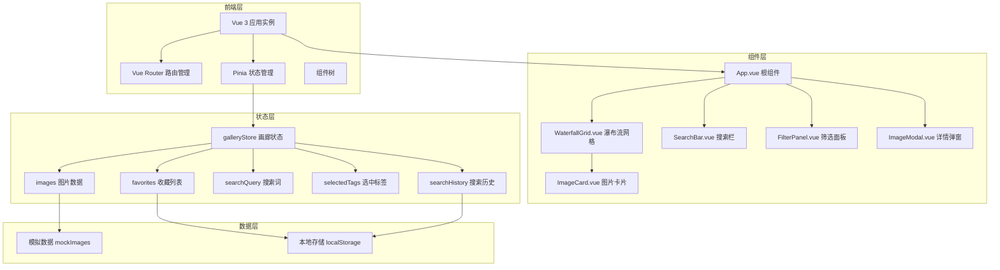

## 1. 架构设计



## 2. 技术描述

- **前端框架**：Vue@3 + TypeScript + Vite
- **路由管理**：vue-router@4
- **状态管理**：Pinia@2
- **构建工具**：Vite@5
- **TypeScript配置**：严格模式（strict: true）、ES模块、路径别名@
- **样式方案**：原生CSS（Scoped）、CSS变量、CSS过渡动画
- **数据持久化**：localStorage（收藏、搜索历史）

## 3. 路由定义

| 路由 | 页面组件 | 用途 |
|------|----------|------|
| / | GalleryView.vue | 首页画廊，展示所有图片 |
| /favorites | FavoritesView.vue | 收藏视图，展示已收藏图片 |

## 4. 数据模型

### 4.1 类型定义

```typescript
interface ImageItem {
  id: string;
  title: string;
  url: string;
  thumbnailUrl: string;
  width: number;
  height: number;
  tags: string[];
}

interface GalleryState {
  images: ImageItem[];
  favorites: string[];
  searchQuery: string;
  selectedTags: string[];
  searchHistory: string[];
}
```

### 4.2 模拟数据

- 共20张图片，每张包含id、title、url、thumbnailUrl、width、height、tags
- 标签覆盖：nature、city、portrait、architecture、abstract、animals、travel、food等
- 图片尺寸比例多样化，确保瀑布流效果

## 5. 核心模块说明

### 5.1 galleryStore (Pinia)

**State**：
- `images`: ImageItem[] - 所有图片数据
- `favorites`: string[] - 收藏的图片ID
- `searchQuery`: string - 当前搜索词
- `selectedTags`: string[] - 选中的标签数组
- `searchHistory`: string[] - 搜索历史（最多5条）

**Getters**：
- `allTags`: TagCount[] - 所有去重标签及计数，按字母排序
- `filteredImages`: ImageItem[] - 根据搜索和标签筛选后的图片
- `favoriteImages`: ImageItem[] - 已收藏的图片

**Actions**：
- `toggleFavorite(id: string)` - 切换收藏状态
- `setSearchQuery(query: string)` - 设置搜索词并更新历史
- `toggleTag(tag: string)` - 切换标签选中
- `clearAllTags()` - 清除所有选中标签
- `clearSearchHistory()` - 清除搜索历史

### 5.2 WaterfallGrid 组件

- 使用CSS Grid实现瀑布流布局（grid-auto-flow: dense）
- 根据窗口宽度动态计算列数（2-5列）
- IntersectionObserver实现图片懒加载
- transition-group实现列表动画
- 响应式列数计算逻辑：
  - ≥1200px: 5列
  - ≥992px: 4列
  - ≥768px: 3列
  - <768px: 2列

### 5.3 SearchBar 组件

- `v-model`绑定搜索词
- `useDebounceFn`实现300ms防抖
- 搜索历史下拉显示最近5条
- 清除按钮（×）重置搜索
- 移动端折叠为搜索图标

### 5.4 FilterPanel 组件

- 遍历allTags展示标签列表
- 每个标签显示名称和数量徽章
- 点击切换选中状态（高亮显示）
- 多选时展示交集结果
- 移动端抽屉式面板

### 5.5 ImageCard 组件

- 懒加载图片，显示占位背景
- 悬浮效果：上移4px、阴影加深、标题渐变遮罩淡入
- 右下角心形收藏按钮（渐变红色）
- 点击触发详情弹窗

### 5.6 ImageModal 组件

- Teleport到body
- 背景模糊遮罩（backdrop-filter: blur(4px)）
- 缩放进入/退出动画（transform: scale）
- 显示大图、标题、标签列表、收藏按钮
- 支持Esc键关闭和外部点击关闭

## 6. 性能优化策略

1. **图片懒加载**：使用IntersectionObserver，占位纯色背景避免布局抖动
2. **搜索防抖**：300ms防抖减少计算频率
3. **计算属性缓存**：Pinia getters缓存筛选结果
4. **虚拟滚动优化**：（可选）超大数据集时考虑，但20张无需
5. **CSS硬件加速**：transform和opacity动画触发GPU加速
6. **局部更新**：筛选时使用transition-group仅更新变化项
7. **内存管理**：组件卸载时清理事件监听器和Observer

## 7. 目录结构

```
src/
├── main.ts              # 应用入口
├── App.vue              # 根组件
├── router/
│   └── index.ts         # 路由配置
├── stores/
│   └── galleryStore.ts  # Pinia状态管理
├── components/
│   ├── WaterfallGrid.vue
│   ├── SearchBar.vue
│   ├── FilterPanel.vue
│   ├── ImageCard.vue
│   └── ImageModal.vue
├── views/
│   ├── GalleryView.vue
│   └── FavoritesView.vue
├── data/
│   └── mockImages.ts    # 模拟数据
├── types/
│   └── index.ts         # 类型定义
└── utils/
    └── helpers.ts       # 工具函数
```
