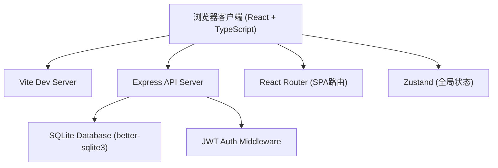
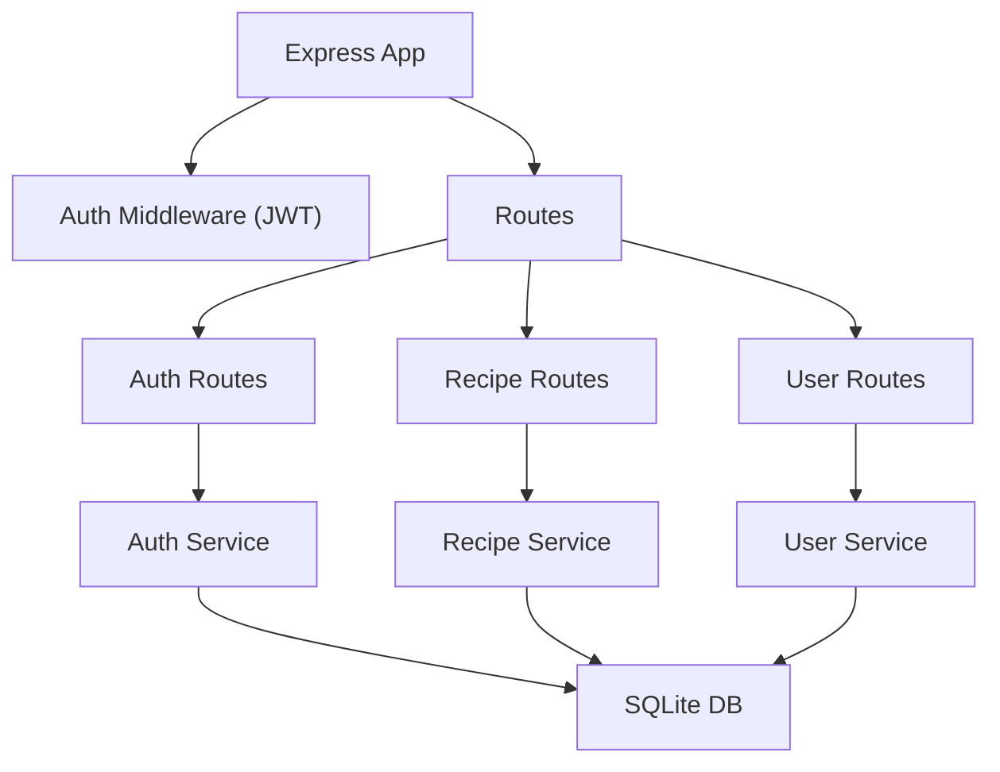
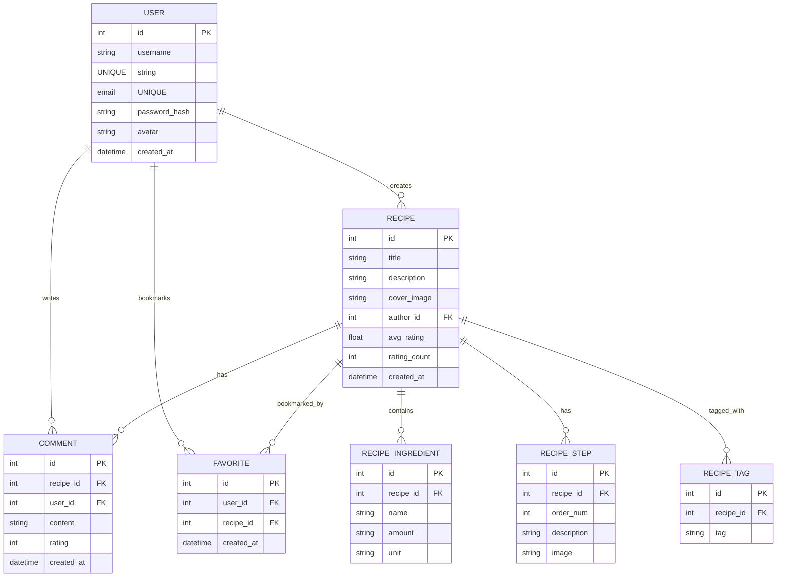

## 1. 架构设计



## 2. 技术描述
- 前端：React 18 + TypeScript + Vite
- 后端：Express 4 + TypeScript
- 数据库：SQLite (better-sqlite3 同步驱动)
- 路由：react-router-dom v6
- 状态管理：zustand
- 图标：lucide-react
- 样式：CSS Modules + CSS Variables（暖色系主题）

## 3. 路由定义

### 前端路由
| 路由 | 用途 |
|------|------|
| / | 首页（瀑布流食谱展示） |
| /recipe/:id | 食谱详情页 |
| /create | 创建食谱页（需登录） |
| /login | 登录页 |
| /register | 注册页 |
| /favorites | 我的收藏（需登录） |
| /my-recipes | 我的食谱（需登录） |

### 后端 API 路由
| 方法 | 路由 | 用途 |
|------|------|------|
| POST | /api/auth/register | 用户注册 |
| POST | /api/auth/login | 用户登录 |
| GET | /api/auth/me | 获取当前用户 |
| GET | /api/recipes | 获取食谱列表（分页、标签筛选） |
| GET | /api/recipes/:id | 获取食谱详情 |
| POST | /api/recipes | 创建食谱（需认证） |
| GET | /api/recipes/search?q= | 关键词搜索 |
| GET | /api/recipes/match?ingredients= | 食材匹配推荐 |
| POST | /api/recipes/:id/rating | 评分（需认证） |
| GET | /api/recipes/:id/comments | 获取评论 |
| POST | /api/recipes/:id/comments | 发表评论（需认证） |
| POST | /api/recipes/:id/favorite | 收藏/取消收藏（需认证） |
| GET | /api/users/favorites | 获取我的收藏（需认证） |

## 4. API 定义

```typescript
interface User {
  id: number;
  username: string;
  email: string;
  avatar?: string;
  createdAt: string;
}

interface Ingredient {
  name: string;
  amount: string;
  unit: string;
}

interface Step {
  order: number;
  description: string;
  image?: string;
}

interface Recipe {
  id: number;
  title: string;
  description: string;
  coverImage: string;
  tags: string[];
  ingredients: Ingredient[];
  steps: Step[];
  authorId: number;
  authorName: string;
  avgRating: number;
  ratingCount: number;
  createdAt: string;
}

interface Comment {
  id: number;
  recipeId: number;
  userId: number;
  username: string;
  avatar?: string;
  content: string;
  rating: number;
  createdAt: string;
}

interface MatchResult {
  recipe: Recipe;
  matchCount: number;
  matchPercent: number;
}
```

## 5. 服务器架构



## 6. 数据模型

### 6.1 ER 图



### 6.2 DDL

```sql
CREATE TABLE users (
    id INTEGER PRIMARY KEY AUTOINCREMENT,
    username TEXT UNIQUE NOT NULL,
    email TEXT UNIQUE NOT NULL,
    password_hash TEXT NOT NULL,
    avatar TEXT,
    created_at DATETIME DEFAULT CURRENT_TIMESTAMP
);

CREATE TABLE recipes (
    id INTEGER PRIMARY KEY AUTOINCREMENT,
    title TEXT NOT NULL,
    description TEXT,
    cover_image TEXT,
    author_id INTEGER NOT NULL REFERENCES users(id),
    avg_rating REAL DEFAULT 0,
    rating_count INTEGER DEFAULT 0,
    created_at DATETIME DEFAULT CURRENT_TIMESTAMP
);

CREATE TABLE recipe_ingredients (
    id INTEGER PRIMARY KEY AUTOINCREMENT,
    recipe_id INTEGER NOT NULL REFERENCES recipes(id) ON DELETE CASCADE,
    name TEXT NOT NULL,
    amount TEXT,
    unit TEXT
);

CREATE TABLE recipe_steps (
    id INTEGER PRIMARY KEY AUTOINCREMENT,
    recipe_id INTEGER NOT NULL REFERENCES recipes(id) ON DELETE CASCADE,
    order_num INTEGER NOT NULL,
    description TEXT NOT NULL,
    image TEXT
);

CREATE TABLE recipe_tags (
    id INTEGER PRIMARY KEY AUTOINCREMENT,
    recipe_id INTEGER NOT NULL REFERENCES recipes(id) ON DELETE CASCADE,
    tag TEXT NOT NULL
);

CREATE TABLE comments (
    id INTEGER PRIMARY KEY AUTOINCREMENT,
    recipe_id INTEGER NOT NULL REFERENCES recipes(id) ON DELETE CASCADE,
    user_id INTEGER NOT NULL REFERENCES users(id),
    content TEXT NOT NULL,
    rating INTEGER DEFAULT 0,
    created_at DATETIME DEFAULT CURRENT_TIMESTAMP
);

CREATE TABLE favorites (
    id INTEGER PRIMARY KEY AUTOINCREMENT,
    user_id INTEGER NOT NULL REFERENCES users(id) ON DELETE CASCADE,
    recipe_id INTEGER NOT NULL REFERENCES recipes(id) ON DELETE CASCADE,
    created_at DATETIME DEFAULT CURRENT_TIMESTAMP,
    UNIQUE(user_id, recipe_id)
);

CREATE INDEX idx_recipes_author ON recipes(author_id);
CREATE INDEX idx_recipes_tags ON recipe_tags(tag);
CREATE INDEX idx_ingredients_name ON recipe_ingredients(name);
CREATE INDEX idx_comments_recipe ON comments(recipe_id);
CREATE INDEX idx_favorites_user ON favorites(user_id);
```
