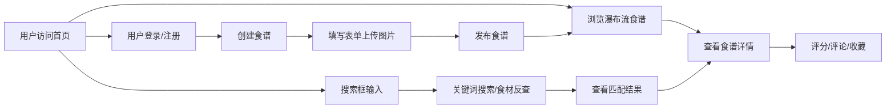

## 1. 产品概述
美食食谱管理平台，让用户创建、搜索、分享烹饪食谱，并根据现有食材智能推荐菜式。
- 核心目标：降低烹饪决策成本，促进美食爱好者交流分享
- 目标用户：家庭主妇、烹饪爱好者、健康饮食追求者

## 2. 核心功能

### 2.1 用户角色
| 角色 | 注册方式 | 核心权限 |
|------|----------|----------|
| 普通用户 | 邮箱/用户名注册 | 创建食谱、搜索浏览、评分评论、收藏书签 |

### 2.2 功能模块
1. **首页/发现页**：导航栏、搜索框、食谱瀑布流展示、标签分类筛选
2. **食谱详情页**：步骤展示、配料清单、评分评论区、相关推荐、收藏功能
3. **创建食谱页**：表单填写、步骤编辑、配料输入、图片上传
4. **个人中心**：我的收藏、我的食谱、浏览历史

### 2.3 页面详情
| 页面名称 | 模块名称 | 功能描述 |
|----------|----------|----------|
| 首页 | 导航栏 | 固定顶部、毛玻璃效果、logo、搜索框快捷入口、用户头像 |
| 首页 | 搜索框 | 防抖自动补全、食材反查模式、打字动画效果 |
| 首页 | 瀑布流网格 | 响应式布局（桌面多列、移动两列）、懒加载、无限滚动 |
| 首页 | 标签筛选栏 | 中餐、甜点、低卡等标签快速分类 |
| 食谱详情 | 食谱信息卡 | 大图、标题、作者、评分、收藏按钮 |
| 食谱详情 | 配料清单 | 食材列表、用量展示 |
| 食谱详情 | 步骤区域 | 分步展示、图文混排 |
| 食谱详情 | 评分评论 | 星级评分、多行评论、表情选择、评论列表 |
| 食谱详情 | 相关推荐 | 基于标签和历史的推荐卡片 |
| 创建食谱 | 表单编辑 | 标题、描述、标签、图片上传 |
| 创建食谱 | 配料输入 | 动态添加食材和用量 |
| 创建食谱 | 步骤编辑 | 动态添加步骤说明和图片 |

## 3. 核心流程

用户访问首页 → 浏览瀑布流食谱 → 点击查看详情 → 评分/评论/收藏
                                    ↓
                            通过搜索框输入关键词/食材 → 查看匹配结果
                                    ↓
                            用户登录 → 创建食谱 → 填写表单 → 发布

## 4. 用户界面设计

### 4.1 设计风格
- **主色调**：陶土橙 (#D96C4B)，米白底色 (#FAF6F1)
- **辅助色**：焦糖棕 (#8B5A3C)，奶油黄 (#F5E6C8)，深灰文字 (#3D3530)
- **按钮风格**：圆角 12px，hover 时轻微上浮 + 暖色发光阴影
- **字体**：标题使用 Playfair Display（衬线优雅），正文使用 Noto Sans SC
- **布局风格**：卡片式设计，圆角 16px，柔和阴影，瀑布流网格
- **图标风格**：Lucide 线性图标，暖色调

### 4.2 页面设计概述
| 页面名称 | 模块名称 | UI 元素 |
|----------|----------|----------|
| 首页 | 导航栏 | 毛玻璃背景 (backdrop-blur)，半透明，固定顶部，陶土橙强调色 |
| 首页 | 食谱卡片 | 圆角 16px，图片顶部，标题标签底部，hover 上浮 + 发光 |
| 首页 | 搜索框 | 圆角 24px，边框淡橙，focus 时发光，自动补全下拉带打字动画 |
| 首页 | 标签按钮 | 圆角胶囊，米白底，选中陶土橙填充 |
| 食谱详情 | 大图区域 | 顶部全宽，圆角下沿，渐变遮罩叠加标题 |
| 食谱详情 | 配料卡片 | 米白底，左侧食材图标，分隔线清晰 |
| 食谱详情 | 步骤卡片 | 编号圆点陶土橙，步骤内容卡片化 |
| 食谱详情 | 评论区 | 气泡式评论，头像圆形，多行文本框 + 表情选择器 |

### 4.3 响应式
- 桌面端：瀑布流 3-4 列，侧边栏可选
- 平板端：瀑布流 2-3 列
- 移动端：瀑布流 2 列，导航栏简化，触摸优化（48px 最小点击区域）

### 4.4 动效与性能
- 卡片 hover：translateY(-4px) + 暖色 box-shadow 发光
- 页面加载：stagger 渐入动画
- 搜索响应：< 500ms，防抖 200ms
- 滚动帧率：稳定 60fps，使用 IntersectionObserver 懒加载
- 图片：按尺寸自适应，懒加载，低分辨率占位
